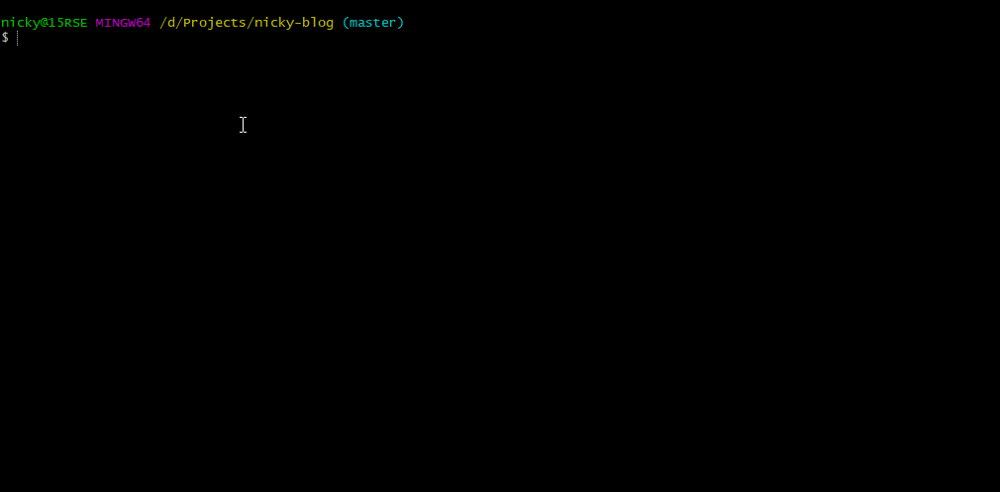

This is part 2, please also check out [part 1](/blog/fresh-development-environment-part-1)

## VSCode extensions

The extension support VSCode has is very powerful.
We are able to improve our workflow massively by taking advantage of this.
I'll list a few of my favourites here. **Let's go!**

### [ESLint](https://marketplace.visualstudio.com/items?itemName=dbaeumer.vscode-eslint)

Linters are a must-have tool for every programmer.
Having a linter find errors in your code before you run it is invaluable and will save you a large amount of time.
As most things I use, ESLint is focussed on JavaScript, but linters exist for nearly every programming language.

### [Prettier](https://marketplace.visualstudio.com/items?itemName=esbenp.prettier-vscode)

Everybody dislikes [bikeshedding](https://en.wikipedia.org/wiki/Law_of_triviality).
Good news, because no longer do you have to hold long debates with yourself over spaces, indentation and other code style decisions.
Prettier is an opinionated code formatter that makes those choices for you.

Read my guide on [how to integrate Prettier into ESLint](/blog/automagically-lint)

### [Bracket Pair Colorizer](https://marketplace.visualstudio.com/items?itemName=CoenraadS.bracket-pair-colorizer)

Keeping track of matching brackets is hard.
Bracket Pair Colorizer makes it easier by allowing you to identify matching brackets by color.

### [GraphQL for VSCode](https://marketplace.visualstudio.com/items?itemName=kumar-harsh.graphql-for-vscode)

Among other neat features, this extension will add syntax-highlighting, linting and autocomplete to your GraphQL code!

### [vscode-styled-components](https://marketplace.visualstudio.com/items?itemName=jpoissonnier.vscode-styled-components)

Similar to the GraphQL pick, this adds syntax highlighting for styled-components.

### [DotENV](https://marketplace.visualstudio.com/items?itemName=mikestead.dotenv)

DotEnv adds syntax highlighting for `.env` files (are you noticing a pattern?)

### [ES7 React/Redux/GraphQL/React-Native snippets](https://marketplace.visualstudio.com/items?itemName=dsznajder.es7-react-js-snippets)

Using code snippets is a great way to speed up development.
Of course the best snippet-library will always be the one you wrote yourself, but this one has so many useful contractions in it!
_I'll never get tired of writing `rcc`, tabbing and having the complete boilerplate for a class-based React component appear_

### [GitLens](https://marketplace.visualstudio.com/items?itemName=eamodio.gitlens)

GitLens allows you to see the history of files easily and gives you a git blame for every line.
This extension does much more and is very configurable.

### [Auto Close Tag](https://marketplace.visualstudio.com/items?itemName=formulahendry.auto-close-tag)

Continuing with extensions that are nice to have. Auto close tag does exactly what it says on the box. It generates the closing pair of a tag when you type the opening tag.

### [Auto Rename Tag](https://marketplace.visualstudio.com/items?itemName=formulahendry.auto-rename-tag)

Found hand in hand with Auto Close tag is Auto Rename Tag.
No more having to type a tagname 2 times (opening and closing) when you want to swap it.

### [Polacode](https://marketplace.visualstudio.com/items?itemName=pnp.polacode)

Taking screenshots of your code has been harder than it needs to be for a long time. Polacode, inspired by [Carbon](https://carbon.now.sh/) makes it easy to take beautiful screenshots of your code right in the editor.

### [Material Icon Theme](https://marketplace.visualstudio.com/items?itemName=PKief.material-icon-theme)

Those icons in front of your files can be nice to recognize what type of file it is at a glance.

### [Night Owl](https://marketplace.visualstudio.com/items?itemName=sdras.night-owl)

[Sarah Drasner](https://twitter.com/sarah_edo)'s new theme ticks all the right boxes. It looks good, isn't hard on the eyes (even after a long coding session), stays out of your way and lets you focus on the code.
She also paid special attention to accessibility for people with colorblindness and to optimal readability, especially in low-light circumstances.
I used the default Dark+ theme for a long time, this theme might just make me switch permanently.

### [VS Live Share](https://marketplace.visualstudio.com/items?itemName=MS-vsliveshare.vsliveshare)

Helping/getting help with code in VSCode has never been easier!
With the VSLiveShare extension, you don't just see a snippet of code in your partner's editor, but you get access to their whole workspace in your own install of VSC!

## installing Yarn

Lots of projects use the [Yarn](https://yarnpkg.com/) package manager.
To install it head to the [install section in their docs](https://yarnpkg.com/en/docs/install) and follow the instructions for you operating system.

I'm on Windows, so I downloaded the latest stable installer and ran it.
The reason I didn't install it through `npm` is because [they discourage it](https://yarnpkg.com/lang/en/docs/install/#install-via-npm)

Confirm the installation by checking the installed version

```bash
yarn --version
# 1.6.0
```

## More quality of life improvements

We can already do most of the things we want by this point.
What if we could do these things faster/easier/...

### Git

#### configuration

Let's start with the basics again and configure a few global settings.

```bash
git config --global user.name "Daniel Ricciardo"
git config --global user.email "john@doe.com"
```

You can look at your configuration like this:

```bash
git config --global --list
```

You can even look at and edit that configuration file (located at `~/.gitconfig`) using a text editor.

Did it ever look like someone changed every single line in a file, but when you looked closer at the files, you couldn't see any changes? This can happen when people are working on different operating systems.
Windows uses CRLF where Unix uses LF to signal the end of a line.
That is why we are going to configure the `autocrlf` setting

```bash
# for Windows:
git config --global core.autocrlf true
# for Linux/Mac
git config --global core.autocrlf input
```

When you do a `git pull` you are actually doing a `git fetch` and a `git merge`. This creates merge-commits that add no value to the repository.
We want to rebase on pull instead of merge, so `git pull --rebase`.
Luckily, there's a configuration option to do that automatically so you don't have to remember the --rebase part every time.

```bash
git config --global pull.rebase true
```

#### git aliases

You can configure a few git aliases to execute some commands you use often in a more convenient way.
The options are nearly limitless (and go beyond git itself).
Here is my favourite:

- `git s` to run git status in short mode.
  The standard output you get from `git status` is very verbose. The output from short mode is a lot cleaner!

```bash
git config --global alias.s "status -s"
```



More in [part 3](/blog/fresh-development-environment-part-3)
