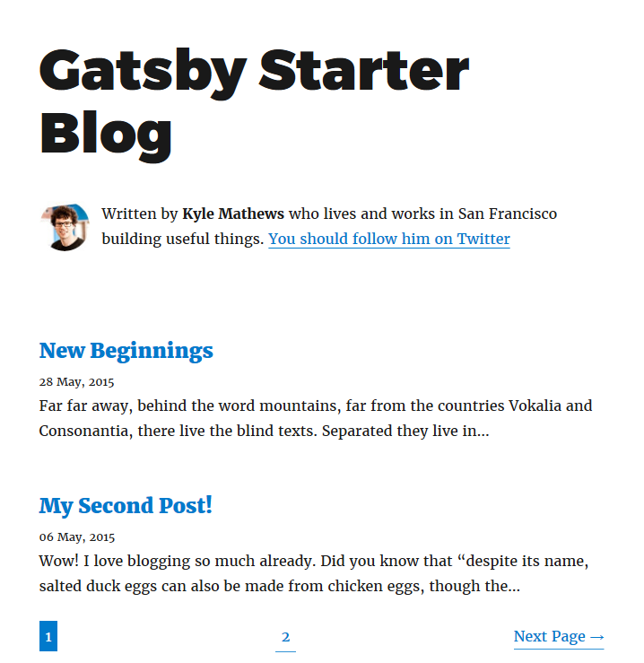

<!-- Photo by Austris Augusts on Unsplash -->

A page that lists all your posts can get incredibly long as more posts are added.

Pagination offers a solution to that problem.
You can break up that single, long page into multiple, smaller pages.

This article will show you **how to add pagination** to your [GatsbyJS](https://www.gatsbyjs.org/) site.

## Create listing pages

Create a new file in `src/templates/` that will serve as a blueprint for every page that lists a few posts.

If you already have one, the current component you use to list all the posts can often fulfill this role.

Calculate the amount of pages you need to display all posts (`numPages`), with `postsPerPage` as a maximum amount of posts to display on a single page.

In `gatsby-node.js` create that amount of pages with your template.

The path for each page will be `/<number>`, with an exception for `/1`, that page will use `/` instead.

```js
// file: gatsby-node.js

// Create blog post list pages
const postsPerPage = 2;
const numPages = Math.ceil(posts.length / postsPerPage);

Array.from({ length: numPages }).forEach((_, i) => {
  createPage({
    path: i === 0 ? `/` : `/${i + 1}`,
    component: path.resolve('./src/templates/blog-list.js')
  });
});
```

## Get data to those listing pages

You can pass data to the pages you created via `context`.

```js
// file: gatsby-node.js

Array.from({ length: numPages }).forEach((_, i) => {
  createPage({
    path: i === 0 ? `/` : `/${i + 1}`,
    component: path.resolve('./src/templates/blog-list.js'),
    context: {
      limit: postsPerPage,
      skip: i * postsPerPage,
      numPages,
      currentPage: i + 1
    }
  });
});
```

The `context` object will be available in the created pages on the `pageContext` prop in React. You will also be able to access the keys in your GraphQL query for those pages.

```jsx
// file: src/templates/blog-list.js

import React from 'react'

class BlogList extends React.component {
  console.log(this.props.pageContext)
  render() {
    return ( /* your code to display a list of posts */)
  }
}
```

## Query GraphQL for wanted posts

Use `limit` and `skip` to only fetch data for the posts you want to show.

```js
// file: src/templates/blog-list.js

export const pageQuery = graphql`
  query blogPageQuery($skip: Int!, $limit: Int!) {
    allMarkdownRemark(
      sort: { fields: [frontmatter___date], order: DESC }
      limit: $limit
      skip: $skip
    ) {
      edges {
        node {
          excerpt
          frontmatter {
            date(formatString: "DD MMMM, YYYY")
            title
          }
        }
      }
    }
  }
`;
```

## Navigate to previous/next page

You can use `currentPage` and `numPages` to determine the routes to the previous/next page.
They also make it possible to only show those links if they exist.

```jsx
// file: src/templates/blog-list.js

import React from 'react'
import { Link } from 'gatsby'

class BlogList extends React.component {
  render() {
    const { currentPage, numPages } = this.props.pageContext
    const isFirst = currentPage === 1
    const isLast = currentPage === numPages
    const prevPage = currentPage - 1 === 1 ? "/" : (currentPage - 1).toString()
    const nextPage = (currentPage + 1).toString()

    return (
       /* your code to display a list of posts */
      {!isFirst && (
        <Link to={prevPage} rel="prev">
          ← Previous Page
        </Link>
      )}
      {!isLast && (
        <Link to={nextPage} rel="next">
          Next Page →
        </Link>
      )}
    )
  }
}
```

## Add numbering

Iterate over `numPages` and output a number with the relevant link.

```jsx
// file: src/templates/blog-list.js

class BlogList extends React.component {
  // ...
  render() {
    const { currentPage, numPages } = this.props.pageContext

    return (
      // ...
      {Array.from({ length: numPages }, (_, i) => (
        <Link key={`pagination-number${i + 1}`} to={`/${i === 0 ? "" : i + 1}`}>
          {i + 1}
        </Link>
      ))}
      // ...
    )
  }
}
```

> Thanks to Wes Bos for [the hot tip](https://twitter.com/wesbos/status/993883756162404354) about `Array.from()`

## Example

As an example, I converted the standard [gatsby-starter-blog](https://github.com/gatsbyjs/gatsby-starter-blog) [(demo)](http://gatsbyjs.github.io/gatsby-starter-blog/) to work with pagination.
[gatsby-paginated-blog](https://github.com/NickyMeuleman/gatsby-paginated-blog) [(demo)](https://nickymeuleman.github.io/gatsby-paginated-blog/)


