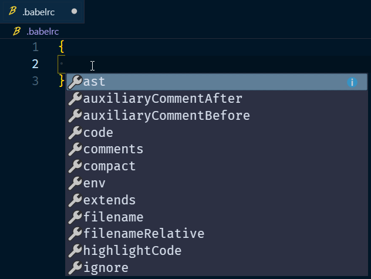
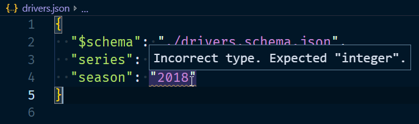
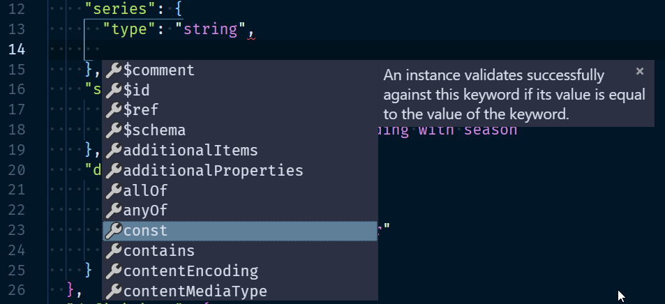
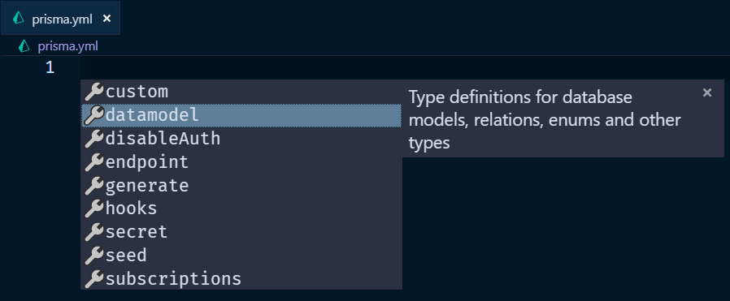

## _**Configuration files**_

Did those words make you feel (a bit of) dread?

You are not alone, writing configuration files is pretty low on most developers' list of favorite pastimes.

When writing these files (for example a `.eslintrc.json`) spelling is one of your greatest enemies.  
_Was it `no-unused-vars`, `noUnusedVars`, `no-unused-var` or something else?_

**Many hours of devtime have been lost to spelling**

Remembering what a certain key expects to receive as value is another one of those enemies.  
_Does this expect an array or an object, I don't remember_ 😰

One will work, the other grants a one way ticket to crypticError town.  
For those reasons (and more), having the docs open while you write your configuration is an absolute _must_

## There is a better way

The solution? Laziness

I'm kidding, partly. The solution is a JSON-schema.
Leveraging one of those means you can rely on the intelligent autocompletion and error detection to do the heavy lifting!

To get started with the least amount of effort, you can use [VSCode](https://code.visualstudio.com/), which has [builtin support for JSON-schema](https://json-schema.org/implementations.html#editors). Create a file that is listed at [schemastore.org](http://schemastore.org/json/) and trigger the autocomplete in the editor (ctrl/cmd + space)



Hitting `tab` on an option in that list and automatically getting empty straight brackets if that key expects an array as value is **so helpful**.
Play around with your configuration file of choice. If the schema supports it, the amount of nesting doesn't matter, your editor will know what can fit there.

You can define the exact schema you want to use in your editor's workspace settings.
When I wrote this, I knew you _could_ do that, but not _how_.
Luckily for me the autocomplete powered by, you guessed it, a JSON-schema, told me exactly what it expected.

```json
// in VSCode workspace settings .json file (ctrl/cmd+shift+p to search for it)
{
  "json.schemas": [
    {
      "fileMatch": ["/.babelrc"],
      "url": "http://json.schemastore.org/babelrc"
    }
  ]
}
```

## Your own schema

A schema doesn't need to be remote. You can also link your file of choice to a self written and/or local schema.

In this `json` file, we point to the schema used to validate against.

> Many (but not all) editors support this way of linking a file to a schema

```json
// drivers.json
{
  "$schema": "./drivers.schema.json"
}
```

The `$schema` value points to a schema file in the same directory

```json
// drivers.schema.json
{
  "$schema": "http://json-schema.org/draft-07/schema"
}
```

The `$schema` value here defines which version of the JSON-schema spec is being used.

A bare-bones file is boring, the code beneath adds a few contraints to `driver.json`

```json
// drivers.schema.json
{
  "$schema": "http://json-schema.org/draft-07/schema",
  "title": "Drivers",
  "description": "Formula 1 drivers",
  "type": "object",
  "additionalProperties": false,
  "properties": {
    "$schema": {
      "type": "string"
    },
    "series": {
      "type": "string"
    },
    "season": {
      "type": "integer"
    }
  }
}
```

- Title and description are meant to describe the file that follows this schema.
- The entire file should be of the type `object` (which isn't a problem, since it's `json`)
- Only the (top-level) properties/keys we declare are accepted.
- Each one of those properties should be of the specified type.

Here I tried to define the season as `"2018"`



Now: something more complex.

```json
// drivers.schema.json
{
  // ...
  "properties": {
    // ...
    "driverList": {
      "type": "array",
      "items": {
        "$ref": "#/definitions/driver"
      }
    }
  },
  "definitions": {
    "driver": {
      "type": "object",
      "additionalProperties": false,
      "properties": {
        "raceNumber": {
          "type": "integer",
          "minimum": 0,
          "maximum": 99,
          "description": "number this driver races with"
        },
        "code": {
          "type": "string",
          "minLength": 3,
          "maxLength": 3,
          "description": "3 letter abbreviation"
        },
        // ...,
        "team": {
          "$ref": "#/definitions/team"
        }
        // ...
      },
      "required": ["raceNumber", "code", "team"]
    },
    "team": {
      "enum": [
        // ...
      ]
    }
  }
}
```

The entire file is available [in this gist](https://gist.github.com/NickyMeuleman/f18b70684e12697d71b4178ad1403988#file-drivers-schema-json)

This is an example of a file that would satisfy that schema

```json
// drivers.json
{
  "$schema": "./drivers.schema.json",
  "series": "f1",
  "season": 2018,
  "driverList": [
    {
      "raceNumber": 14,
      "code": "ALO",
      "firstName": "Fernando",
      "lastName": "Alonso",
      "dateOfBirth": "1981-07-29",
      "team": "MCLAREN",
      "quotes": ["GP2 engine, GP2", "5 second penalty? Issa yoke"]
    },
    {
      "raceNumber": 3,
      "code": "RIC",
      "firstName": "Daniel",
      "lastName": "Ricciardo",
      "dateOfBirth": "1989-07-01",
      "nationality": "Australian",
      "team": "REDBULL"
    }
  ]
}
```

All information can be found in the [official specification docs](https://json-schema.org/specification.html).  
The various options you can provide are listed in [their schema validation document](https://json-schema.org/latest/json-schema-validation.html) specifically.

That's a tough read.
No need to worry if that isn't your cup of tea, because JSON-schema has that intelligent autocompletion and error handling itself!
The information you get in your editor while working on a schema-file is excellent.



The [understanding JSON schema](https://json-schema.org/understanding-json-schema/) is also an excellent way to get the information you're looking for. It's based on version 6 of the spec currently and will get an update soon!

## Not just JSON

These JSON-schemas can also apply to other filetypes, like `YML`

Install the [YML support extension](https://marketplace.visualstudio.com/items?itemName=redhat.vscode-yaml) by Red Hat.

Linking a remote schema to a file can be done in your workspace settings.

```json
{
  "yaml.schemas": {
    "http://json.schemastore.org/prisma": "prisma.yml"
  }
}
```

Now my `prisma.yml` file is ready to go!



The top level `"type": "object"` we had in our `drivers.schema.json` can be another value now.
For example `"array"` for a `drivers.yml` that contains one big top level list.
