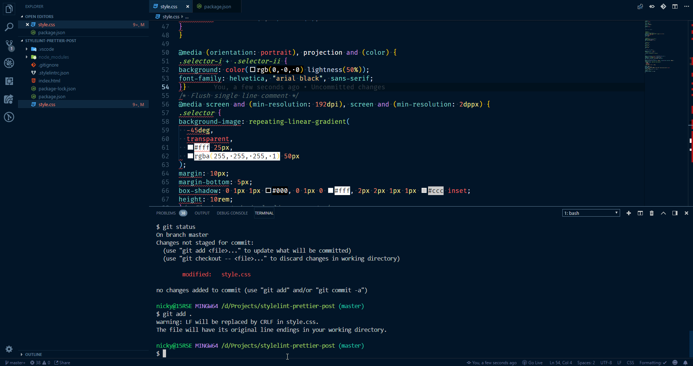

We'll set up linting and formatting for our styles.

In a previous post I went over [how to lint and format your JavaScript](/blog/automagically-lint). Now, we'll obtain similar superpowers for our styles (CSS, SCSS, Less, sss, ...).
We'll use [Stylelint](https://stylelint.io) as our linting tool and [Prettier](https://prettier.io) as our (main) formatting tool.

## Initial Setup

You don't need any fancy setup to start linting your styles.
The tools we'll use are on [npm](https://www.npmjs.com/), we'll define those in a `package.json` file. The rest of the demo-application I'm using for this consists of a single `index.html`, a `styles.css` and a configuration file for Stylelint.

We'll generate a basic `package.json` so we can install the tools we want to use.

```bash
npm init -y
```

```bash
npm i -D stylelint prettier
```

We'll install a [popular set of rules for stylelint](https://github.com/stylelint/stylelint-config-standard)

```bash
npm i -D stylelint-config-standard
```

To configure StyleLint to use those rules,
create a `.stylelintrc.json` file in the root directory and tell it which ruleset to extend.

```json
{
  "extends": ["stylelint-config-standard"]
}
```

It works! 🎉
Don't take my word for it, let's see.
Add this line to your `package.json`

```json{3}
  "scripts": {
    "test": "echo \"Error: no test specified\" && exit 1",
    "lint:css": "stylelint *.css"
  }
```

You can now run `npm run lint:css` in the terminal and stylelint will run for every `.css` file it finds.
If it finds errors, you will see a bunch of `npm ERR!`s in the console, don't worry, that's expected, the linting errors it found are above them.
If you would prefer not to see all those npm errors, you could also run that command without using that script we just declared.

```bash
./node_modules/.bin/stylelint *.css
```

## Add Prettier

Our styles should have consistent formatting, that will make them easier to read.
We'll set up Stylelint to report formatting issues that Prettier picks up.
[stylelint-prettier](https://github.com/BPScott/stylelint-prettier) does exactly that.

```bash
npm i -D stylelint-prettier
```

And add it to `.stylelintrc`

```json{2-5}
{
  "plugins": ["stylelint-prettier"],
  "rules": {
    "prettier/prettier": true
  },
  "extends": ["stylelint-config-standard"]
}
```

When you run `lint:css` now you'll see additional errors reported by the `prettier/prettier` rule.

It's possible that the rules inside your `extends` array, or rules you define explicitly conflict with Prettier, causing a catch-22 situation.

We'll turn off all Stylelint rules specific to formatting and let Prettier handle them, by adding [`stylelint-config-prettier`](https://github.com/prettier/stylelint-config-prettier).

```bash
npm i -D stylelint-config-prettier
```

```json{6}
{
  "plugins": ["stylelint-prettier"],
  "rules": {
    "prettier/prettier": true
  },
  "extends": ["stylelint-config-standard", "stylelint-config-prettier"]
}
```

## Displaying those errors in your editor (in realtime!)

Everybody loves red squiggly lines in their code editor (somewhere else, and you probably typed a word your dictionary doesn't know. Like "hello" or something stupid like that.)

Install a [Stylelint plugin for your editor](https://stylelint.io/user-guide/complementary-tools/#editor-plugins).
I'm using VSCode, so I picked [the aptly named sylelint](https://marketplace.visualstudio.com/items?itemName=shinnn.stylelint) one.

You will now see the errors listed inside the PROBLEMS tab and there will be red lines underneath each one right in your code.


## Automatically fix problems

Many issues (especially the formatting ones) are able to be fixed automatically.
The only thing that's needed is to add the `--fix` flag to our script.

```json{3}
"scripts": {
    "test": "echo \"Error: no test specified\" && exit 1",
    "lint:css": "stylelint *.css --fix"
  }
```

When we run `lint:css` now, stylelint will automatically try to fix every issue it can.
This won't result in the PROBLEMS tab being empty now, but the list of problems will be much smaller.

While it absolutely isn't, to me this feels like

.

## Never forget to fix problems

Very neat, but if you're anything like me, you'll forget to do this from time to time.
That's why we'll set up a way to automatically run the command above.

> This section assumes the project uses the git version control manager.

We'll hook into git using a package called `husky` and tell it to run our command before each commit.
This has the added benefit of that command running for _everyone_ that commits code.

To minimize the time this takes, we only run the command for files that are currently staged in git.
This is a huge time-saver (especially for larger projects).

```bash
npm i -D husky@next lint-staged
```

in `package.json`
Tell `husky` to run `lint-staged` right before you commit code to your git-repository.
Configure `lint-staged` to run `stylelint --fix` on any `.css` file that is going to be committed.
This will (potentially) change that file, so remember to add it to `git` again afterwards!

```json
"husky": {
  "hooks": {
    "pre-commit": "lint-staged"
  }
},
"lint-staged": {
  "*.css*": [
    "stylelint --fix",
    "git add"
  ]
}
```


