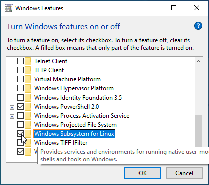
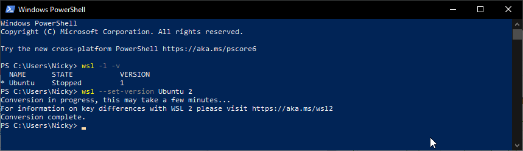
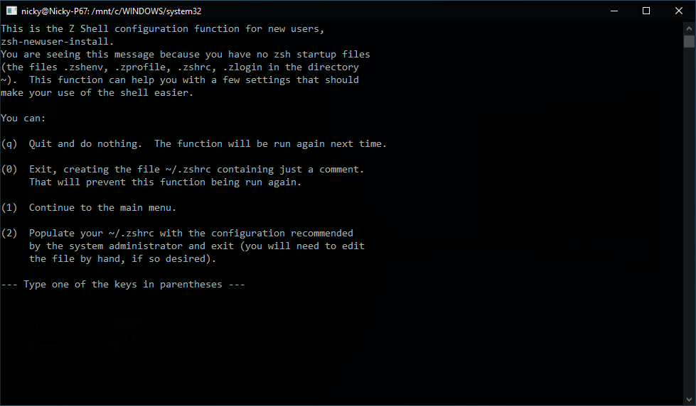

<!-- Photo by Javier Allegue Barros on Unsplash -->

Compromises are great. When it comes to technology, having your cake and eating it too is better.

The machine I normally use for development broke.
The [Windows Subsystem for Linux version 2](https://devblogs.microsoft.com/commandline/announcing-wsl-2/) just came out, so I decided to set up another machine with that. When all was said and done, it was nothing short of awesome. I just booted a full-stack application that uses [docker](https://www.docker.com/) from an [Oh My ZSH](https://ohmyz.sh/) terminal window inside of [VSCode](https://code.visualstudio.com/). It booted faster than it ever had natively on Windows. I'm using Windows 10 Home, that means the [hyper-V](https://en.wikipedia.org/wiki/Hyper-V) virtualization technology normally isn't available. But <abbr title="Windows Subsystem for Linux version 2">WSL2</abbr> lets you take advantage of it anyway (if your hardware supports it).

This post describes the steps I went through to set that up.  
It's going to be a long one, so buckle up! 💪

## Install the Insider preview

As of writing, WSL2 is available in the latest release of the insider preview.
If it's not installed, doing so is fairly straightforward.

- Look for the insider programme and follow the steps to activate it.

> As of writing, you will have to choose the fast ring of updates when prompted.


- Run Windows update


After a minor test of your patience and a few reboots. A watermark that displays the version you just installed is visible in the lower right corner of your desktop.


## Activate optional features

WSL and WSL2 use some features that aren't activated by default, so enabling those is necessary.

This is possible through a <abbr title="Graphical User Interface">GUI</abbr>, by going to "turn Windows features on or off" or through an elevated Powershell prompt.

- The GUI option:


To use WSL, enable the aptly named "Windows Subsystem for Linux" feature.



- Through Powershell:

```sh
Enable-WindowsOptionalFeature -Online -FeatureName Microsoft-Windows-Subsystem-Linux
```

Regardless of the option you chose, a reboot is required.

### Feature for WSL2

That was enough for WSL1.
To use WSL2, first make sure virtualization is enabled in your <abbr title="Basic input/output system">BIOS</abbr>.  
WSL2 uses the hyper-V technology. That technology is normally only available on Windows 10 pro, but Windows 10 home can also use it for WSL2.

Enabling virtualization in the BIOS looks different for most motherboard brands.  
On my MSI board the option was called "Virtualization Technology" and was hidden in the overclocking settings.

Next: enabling another optional feature in Windows!

Same story here, either use the GUI or an elevated Powershell window.  
The option to enable is called the "virtual machine platform".

- GUI


- Powershell

```sh
Enable-WindowsOptionalFeature -Online -FeatureName VirtualMachinePlatform
```

## Install a distro

Once that reboot is done, you can go to the Microsoft store and install your favourite Linux distribution. I went with Ubuntu, because a lot of install instructions and other documentation are written for that distro.


On the first boot of the distro you just installed (which presents itself as a terminal window), you'll be asked to enter a password for when you want to _do_ stuff as a \_su_per user (`sudo`).

## WSL1 to WSL2

To check which version of WSL is installed you can run a command in Powershell.

```sh
wsl --list --verbose
# or
wsl -l -v
```

If the number for the version is 2, all systems go!

If not, convert that puppy from 1 to 2.

```sh
wsl --set-version <distro-name> 2
# in my case
wsl --set-version Ubuntu 2
```

The output will tell you that this operation might take a while.  
It's not one of those that says that only to finish 5 seconds later. It took about 10 minutes here.



At this point, WSL2 is ready to go.  
Opening the distro you installed will show a bash prompt.

Windows Subsystem for Linux 2 comes with a real Linux kernel.  
Previously there was a kernel compatibility layer that could not do quite as much.

In the words of a certain wooden puppet, it is now a _real boy_.


Users of WSL2 are encouraged to place their files inside the Linux root file system.  
That way they benefit from file performance increases compared to WSL1.

In WSL2 you can now access files from Linux in Windows and the other way around.  
Modifying Linux files from from Windows in WSL1 was always warned against, as this could cause _bad things_ to happen. Whoooo, spooky 👻 (but, really, it was a bad idea.)

More details on changes are available in Microsoft's [WSL2 release blogpost](https://devblogs.microsoft.com/commandline/wsl-2-is-now-available-in-windows-insiders/)

## Installing tools

Let's start loading up our environment with some needed tools.
A few tools still need to be installed on the Windows side, the rest are all Linux tools.

The two I'll install for Windows are: [VSCode](https://code.visualstudio.com/) and [git for Windows](https://git-scm.com/).
Remember to set the autocrlf setting to input for git. VSCode handles it well.

> Open a terminal in Windows!

```sh
git config --global core.autocrlf input
```

Before beginning to install Linux tools, we'll update our already installed packages.

> From this point on, the action happens in your Linux terminal!

```sh
sudo apt update
sudo apt upgrade
```

More preparation, installing build tools for [node-gyp](https://github.com/nodejs/node-gyp)

```sh
sudo apt install build-essential
```

### Git

This one should also be installed on the Linux side.

```sh
sudo apt install git
```

After installing git, remember to [configure it](/blog/fresh-development-environment-part-2/#configuration).  
Especially setting the autocrlf setting to input is important here.

```sh
git config --global core.autocrlf input
```

### Node & NPM

You can install it as a standalone package.  
Now we can harness all those Linux-y tools, I'll use <abbr title="node version manager">nvm</abbr> instead to make using different versions easier.

[The nvm repo](https://github.com/nvm-sh/nvm) has excellent installation instructions.

```sh
curl -o- https://raw.githubusercontent.com/nvm-sh/nvm/v0.34.0/install.sh | bash
```

Restart your terminal after the install.  
To confirm the installation was successfull:

```sh
command -v nvm
```

It should return: `nvm`  
That's all, no version number, just that string.

To install the latest the latest stable version of node:

```sh
nvm install node # "node" is an alias for the latest version
```

When node releases a new version, you can run that same command again.

You'll need to tell nvm which version of node you want to use.  
So next time you boot your Linux distro, you'll have to use.

```sh
nvm use node
```

When the project you are working on requires a different version of node, specify that one.

```sh
nvm use v<version number>
# or if the project has a valid .nvmrc file
nvm use
```

Having to do that manually seems annoying right?  
Many solutions to this annoyance exist. Later in this post the annoyance will be "fixed".

### Docker

- Kick things off by updating the packages index and installing dependencies.

```sh
sudo apt update
sudo apt install apt-transport-https ca-certificates curl software-properties-common
```

- Add Dockers's official GPG-key.

```sh
curl -fsSL https://download.docker.com/linux/ubuntu/gpg | sudo apt-key add -
```

- Verify this by running:

```sh
sudo apt-key fingerprint 0EBFCD88
```

You should see the full key in the output.

```sh
9DC8 5822 9FC7 DD38 854A E2D8 8D81 803C 0EBF CD88
```

- Add the Docker repository to your list of repositories.

```sh
sudo add-apt-repository "deb [arch=amd64] https://download.docker.com/linux/ubuntu $(lsb_release -cs) stable"
```

- Update the list of repositories again and install Docker CE.

```sh
sudo apt update
sudo apt install docker-ce
```

Normally, the docker engine starts automatically after the install.  
For me that was not the case so I started it manually.

```sh
sudo service docker start
```

- Verify Docker CE was installed correcly by booting up their hello-world container.

```sh
sudo docker run hello-world
```

### Docker Compose

As a handy tool for managing docker containers, `docker-compose` is frequently installed alongside `docker-ce`.

- Download the current stable release and place it in the `/usr/local/bin` folder.

```sh
sudo curl -L "https://github.com/docker/compose/releases/download/1.24.0/docker-compose-$(uname -s)-$(uname -m)" -o /usr/local/bin/docker-compose
```

- Make the file executable.

```sh
sudo chmod +x /usr/local/bin/docker-compose
```

- Verify the installation.

```sh
docker-compose --version
# output: docker-compose version 1.24.0, build 0aa59064
```

### Yarn

Yarn is a package manager for JavaScript made by Facebook.

- Add their gpg key.

```sh
curl -sS https://dl.yarnpkg.com/debian/pubkey.gpg | sudo apt-key add -
```

- Add their repository.

```sh
echo "deb https://dl.yarnpkg.com/debian/ stable main" | sudo tee /etc/apt/sources.list.d/yarn.list
```

- Update the list of repositories and install Yarn.

> Skip installing node with `--no-install-recommends` when using `nvm`

```sh
sudo apt update
sudo apt install --no-install-recommends yarn
```

- Verify the installation.

```sh
yarn --version
```

## A better terminal

When you open your terminal there are actually 2 sides at work.  
The thing you see and type into, **the terminal**.  
The thing that terminal communicates with and does most of the work, **the shell**.

Let's face it, the terminal that ships with Windows is pretty lackluster.  
Good news: they are coming out with [a new one](https://youtu.be/8gw0rXPMMPE) and it looks really awesome!

In anticipation of that release, I'm not going to change much there. I'll use the one that's integrated into VSCode most of the time anyway.

### Change integrated VSCode terminal

VSCode's integrated terminal is a great productivity booster.  
Let's use the brand new Linux shell in there.

When opening the integrated terminal, you can choose wich one to use as the default one.  
Select WSL from the resulting list of options and you are done!


Alternatively, edit the `settings.json` to point to the correct location.

```json
"terminal.integrated.shell.windows": "C:\\WINDOWS\\System32\\wsl.exe"
```

### ZSH

I chose [ZSH](https://en.wikipedia.org/wiki/Z_shell) to replace the standard bash shell that opens when clicking the Ubuntu icon in the start menu.

Installing it is a oneliner thanks to the package manager in Ubuntu.

```sh
sudo apt install zsh
```

When you launch Ubuntu, you'll still see the usual bash prompt.  
To enter the zsh shell from that familiar bash prompt:

```sh
zsh
```

The first time this launches a quick configuration wizard will be shown.  
The choice here doesn't matter all that much, sinc the resulting file `.zshrc` will be overwritten when we install oh-my-zsh. I chose the option `2` anyway and went with the defaults.



Typing `zsh` into bash every time we launch it gets old quick.

```sh
cd $home #navigate to your home directory on Linux
code .bashrc #open the bash configuration file in visual studio code
```

To automatically launch `zsh` when you open the terminal, add this to your `.bashrc`

```sh
# Launch Zsh
if test -t 1; then
exec zsh
fi
```

### Oh My ZSH

This extension to zsh has one of the best URLs out there: [ohmyz.sh](https://ohmyz.sh/)  
It will also enable a huge list of nice features, which is more important.

Installing oh-my-zsh is a oneliner.

```sh
sh -c "$(curl -fsSL https://raw.github.com/robbyrussell/oh-my-zsh/master/tools/install.sh)"
```

This will also replace that `.zshrc` file we initialised earlier.

Enjoy the cool ASCII art signalling a successful installation!

#### Theme oh-my-zsh

oh-my-zsh comes with lots of fancy themes, so let's install a pretty one!  
Take a look at [a list of them](https://github.com/robbyrussell/oh-my-zsh/wiki/Themes).

I like the agnoster one, so that's what I'll go with.

Edit the `.zshrc` file to enable it.  
This file is also located in your Linux home directory (`cd $home` to go there).

```sh
# .zshrc
# change the default theme
ZSH_THEME="robbyrussell"
# to the chosen theme
ZSH_THEME="agnoster"
```

restart your terminal for it to take effect.

#### Powerline fonts

Aaaaaaaaaah, it's ... broken. 😥


That's partly because this is a fancy prompt that needs a [Powerline-patched font](https://github.com/powerline/fonts) to render correctly.

You can either download the specific font you want and install it that way (double clicking on the file and hitting the install button), or use the install script to install them all at once.

To install them all at once first clone that repo.  
Then open an elevated Powershell window.  
To be able to execute the `install.ps1` file, we need to open up the execution policy temporarily.

```sh
Set-ExecutionPolicy Bypass
```

Now navigate to the cloned repo and execute the install script.

```sh
.\install.ps1
```

You'll see the same thing happening as you would when downloading and installing each font seperatly, but of course much quicker.

Don't forget to close down the execution policy again immediately after!

```sh
Set-ExecutionPolicy Default
```

After installing the fonts, setting them in your terminal application changes the weird boxes to icons.

Note that the standard terminal in Windows still doesn't work quite right after that. It has many limitations, this not working completely is just one of them.  
As stated before, I'm mainly going to use the terminal inside VSCode anyway, so I'm leaving the standard terminal behind.  
After setting the terminal font in VSCode, all icons show up beautifully.

The colors when listing directories and files with the `ls` command still look, euuuhm, suboptimal.

#### dircolors

To replace those ugly colors, something called dircolors may be used.  
I'll install the popular [solarized dircolors](https://github.com/seebi/dircolors-solarized)

Pick the theme you want and download the file to your home directory.

```sh
curl https://raw.githubusercontent.com/seebi/dircolors-solarized/master/dircolors.ansi-dark --output ~/.dircolors
```

Add a line to the bottom of your zsh configuration file to use what you just downloaded.

```sh
# load dircolors
eval `dircolors ~/.dircolors`
```

Much better, it looks great now!


### Plugins for oh-my-zsh

By itself, oh-my-zsh is already feature-rich. For further productivity increases, plugins are there to help.

Many of those plugins ship alongside oh-my-zsh, making installing them as easy as adding a line to `.zshrc`.  
Others require a bit more effort, let's start with those!

#### Syntax Highlighting

[zsh-syntax-highlighting](https://github.com/zsh-users/zsh-syntax-highlighting) is a handy plugin that prevents syntax errors by highlighting valid commands in green and invalid ones in red.

To install the plugin first clone [the repo](https://github.com/zsh-users/zsh-syntax-highlighting).  
Then add the script to your `.zshrc`.

```sh
# inside .zshrc add
source <path-to-the-script>
# I cloned the repo to the .zsh folder, so for me it was
source ~/.zsh/zsh-syntax-highlighting/zsh-syntax-highlighting.zsh
```

#### Auto Suggestions

[zsh-autosuggestions](https://github.com/zsh-users/zsh-autosuggestions) makes typing the same command over and over much quicker by suggesting what you could type next. These suggestions are based on command history.

Installing it follows the same pattern as the plugin we installed above.

First clone the repo, then add a line to `.zshrc`

```sh
# .zshrc
source <path-to-the-script>
# I cloned the repo to the .zsh folder, so for me it was
source ~/.zsh/zsh-autosuggestions/zsh-autosuggestions.zsh
```

#### pre-installed plugins

A list of the plugins that ship with oh-my-zsh can be viewed on this [Github page](https://github.com/robbyrussell/oh-my-zsh/tree/master/plugins).

Each one should have a `README.md` that tells you more about what it does and how to activate the plugin.  
Most of the time, activating the plugin requires you to add it to the list of plugins in `.zshrc`.

This is what I ended up with:

```sh
plugins=(
    git
    node
    npm
    npx
    nvm
    z
)
```

The plugin I would like to call out here is [z](https://github.com/robbyrussell/oh-my-zsh/tree/master/plugins/z).  
It make navigating to _frecent_ folders easy.

You read that right, it's not a typo.  
It's a contraction of frequent and recent.

For example, my blog is located at `~/projects/nicky-blog`  
If I type `z blog`, z will take me there.

## Result

Whew! That was quite the journey 😅💦  
The result is very powerful, and it looks good too! 🎊🎉🎉🎉🎊


