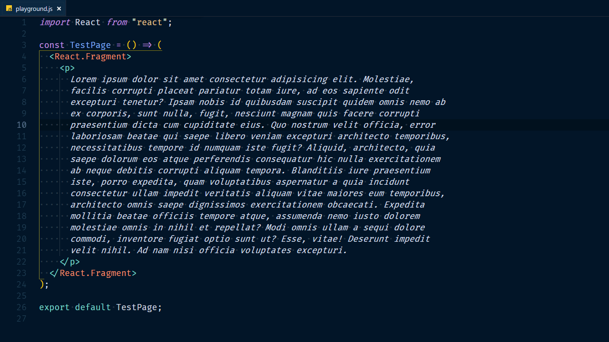
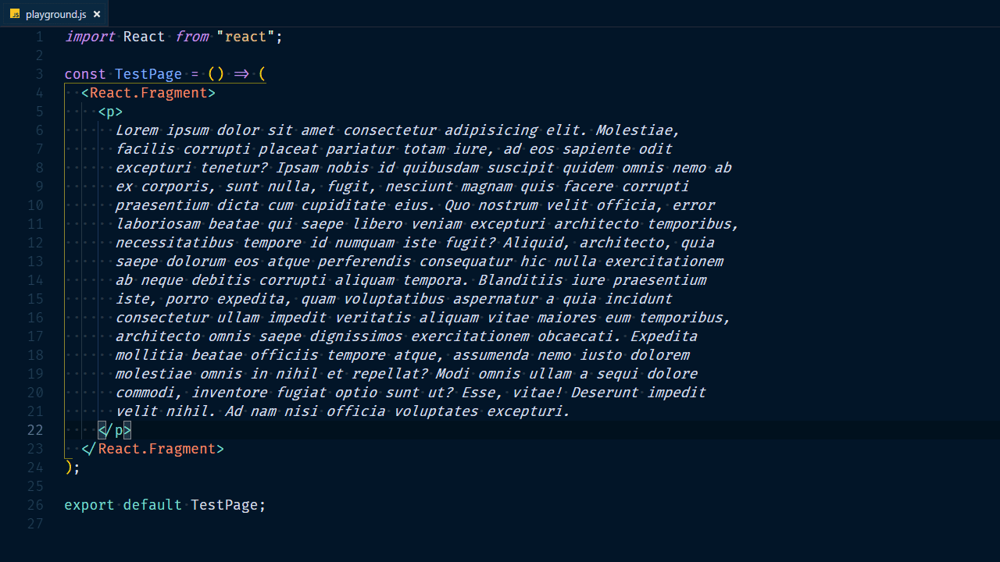
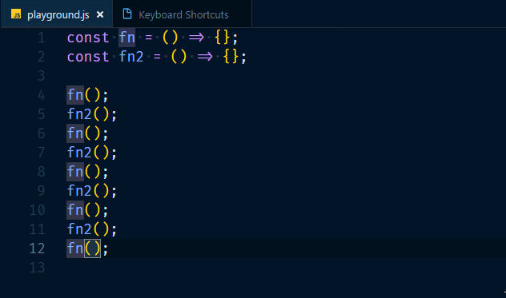
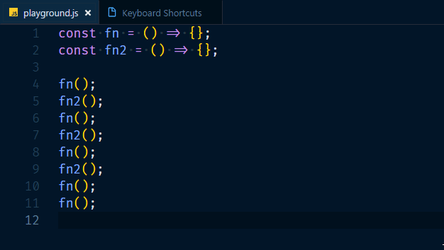

<!-- Photo by dylan nolte on Unsplash -->

<!-- TODO: find better way to show shortcuts in action.
the gifs load immediately on page load/are big now-->

When listening to the Syntax podcast [episode](https://syntax.fm/show/048/vs-code-round-two) on VSCode, using keyboard shortcuts came up. That inspired me to dig a little deeper and write about it!

When you spend a lot of time with text, moving around and manipulating that text takes up time that adds up quickly.
Keyboard shorcuts go a long way in speeding up your text-related workflow.

I'm not advocating you ditch your mouse entirely and become a [vim-wizard/witch](https://twitter.com/noopkat). Spend some time learning how to do operations you often repeat by using keyboard shortcuts instead of your mouse. The investment you make now will be paid back tenfold in no time.

## The basics

I wish someone told me to get **really** comfortable with these when I started learning how to code. They are not talked about often, because many people consider them _too_ basic.
I was used to navigating text a single character at a time with the arrow keys. Knowing about most of these shortcuts didn't translate into using them, I was still using my mouse out of habit for most of these operations until recently.
Using these until you can activate them from muscle memory will save you a lot of time.

> Mac users: substitute ctrl for command

Keep the `ctrl` key pressed to affect words instead of characters.

- `ctrl+left` Move cursor to the beginning of the previous word.
- `ctrl+right` Move cursor to the beginning of the next word.
- `home` Move cursor to the beginning of the line.
- `end` Move cursor to the end of the line.
- `ctrl+home` Move cursor to the beginning of the file.
- `ctrl+end` Move cursor to the end of the file.
- `ctrl+backspace` Erase previous word.
- `ctrl+del` Erase next word.

Use `shift` to select while your cursor moves.

- `shift+left/right` Select character
- `shift+up/down` Move cursor line up/down and select everything in between
- `ctrl+shift+arrows` Select word
- `shift+home/end` Select till beginning/end of line

## Level up

You can use the shortcuts above nearly everywhere.
The next ones are more specific to the code editor.

> The shortcuts listed here are the default ones, they might be different for you.

I'm using [VSCode](https://code.visualstudio.com/)(on Windows), but many of them are also available in other editors. You can view your keyboard shortcuts in VSCode by opening the command palette (`ctrl+shift+p`) and choosing "Preferences: open keyboard shortcuts".
Here you can search for and edit every keyboard shortcut for VSCode.

There is a treasure trove of useful one right here for [Windows](https://code.visualstudio.com/shortcuts/keyboard-shortcuts-windows.pdf), [Mac](https://code.visualstudio.com/shortcuts/keyboard-shortcuts-macos.pdf) and [Linux](https://code.visualstudio.com/shortcuts/keyboard-shortcuts-linux.pdf)
.

What follows are the ones I use frequently.

### Line bubbling

Moving/copying a line up or down. (sick name [@wesbos](https://twitter.com/wesbos))

- `alt+up/down` moves your current line.
- `shift+alt+up/down` duplicates your current line.

> NOTE: You don't have to select the entire line for these to work.

### Expand/shrink selection

Expand/shrink your selection to the next logical point

- `alt+shift+right` expands the selection.
- `alt+shift+left` shrinks the selection.

### Rename symbol

Renaming a function/variable/... can be a chore, you don't want to miss a single instance, it could break your whole project and make puppies sad!

- `F2` rename the highlighted symbol.

### Other favorites

- `ctrl+d`  
  Add selection to next find match.  
  Selects the next matching text when you have text selected.  
  Selects the next matching symbol when your cursor is in one.

  

- `ctrl+/` (`ctrl+:` on azerty-keyboards)  
  Toggle comment(s) for the current line/lines.

- `ctrl+i`  
  Select the current line.

- `ctrl+shift+k`  
  Delete the current line.

- `ctrl+enter`  
  Insert line below.
- `ctrl+shift+enter`  
  Insert line above.  
  Useful when your caret is in the middle of a line.

- `` ctrl+` ``  
  Toggle the integrated terminal. (`ctrl+ù` on azerty-keyboards)

- `ctrl+b`  
  Toggle sidebar visibility.  
  Save some screenspace, toggle that sidebar.
  `ctrl+0` Will open the sidebar and focus it (`ctrl+à` on azerty-keyboards)
  

## Getting around VSCode

### Command Palette

A great feature many might know from [Sublime Text](https://www.sublimetext.com/).  
Access available commands based on your current context.
If you forget some shortcuts, don't worry. This feature has your back and will show the shortcut next to the command.
I really like driving `git` from here.

- `ctrl+shift+p`

### Go to file

Quickly search for and open a file.

- `ctrl+p`

### Editor groups

Editor groups are what you might refer to as windows within the main VSCode window. They can hold a group of items (tabs).

#### Open to side

You can immediately open a new file in a new editor group. This works from the sidebar, or from the quick-open feature.

- `ctrl+enter`

#### Cycle through editor tabs

- `ctrl+tab` open next recently used tab in this editor group
- `ctrl+shift+tab` open previous recently used tab in this editor group

#### Focus on an editor group

You can change the currently focussed editor group with `ctrl` and the number keys

- `ctrl+1/2/3` (`ctrl+&/é/"` on azerty-keyboards)

#### Move editor to an editor group

Move an editor to a spcific group by using `shift+alt` and the number keys.
Move the editor to the previous/next group by using `ctrl/alt` and the arrow keys.

- `shift+alt+1/2/3` (`ctrl+&/é/"` on azerty-keyboards)
- `ctrl+alt+left/right`

#### Toggle horizontal/vertical splitting of editor groups

- `alt+shift+0`

I'm sure I left out a lot of your favorites, please let me know about them on [twitter](https://twitter.com/nmeuleman)!
