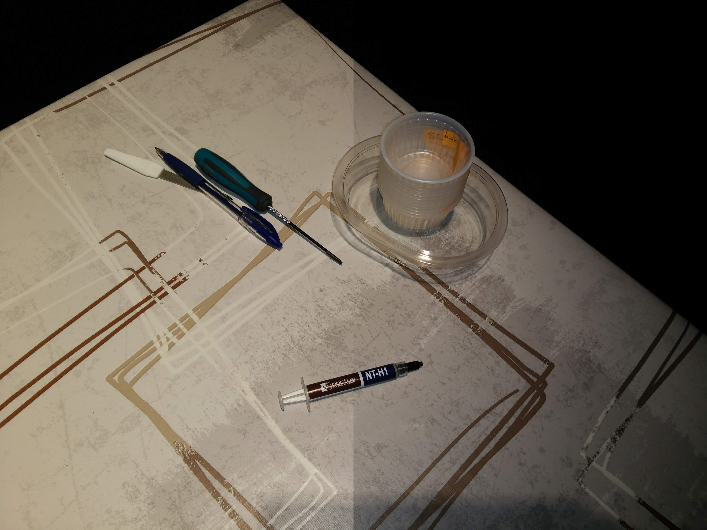
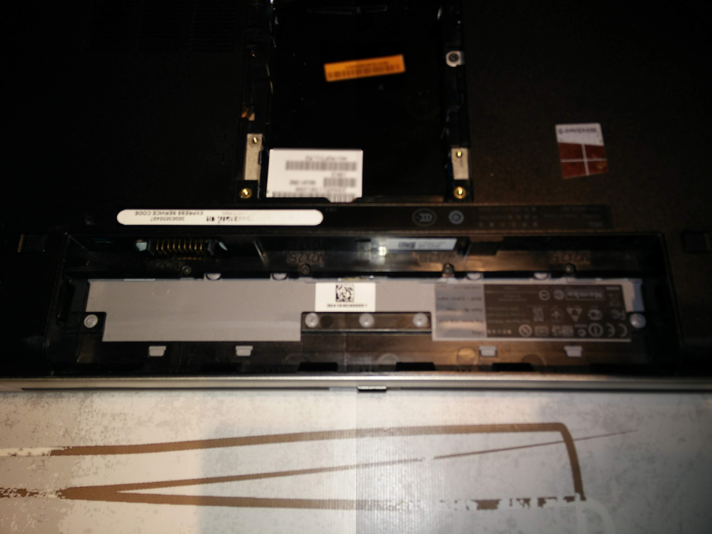
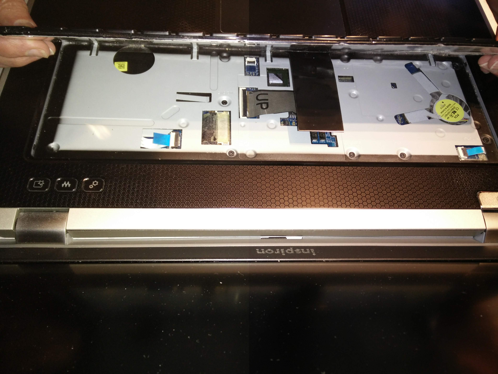
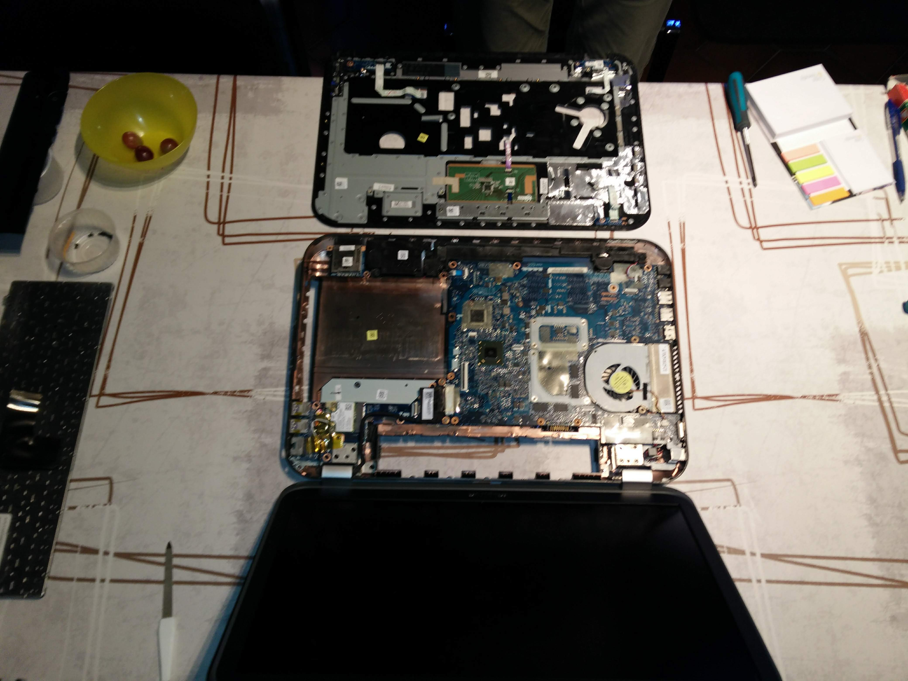
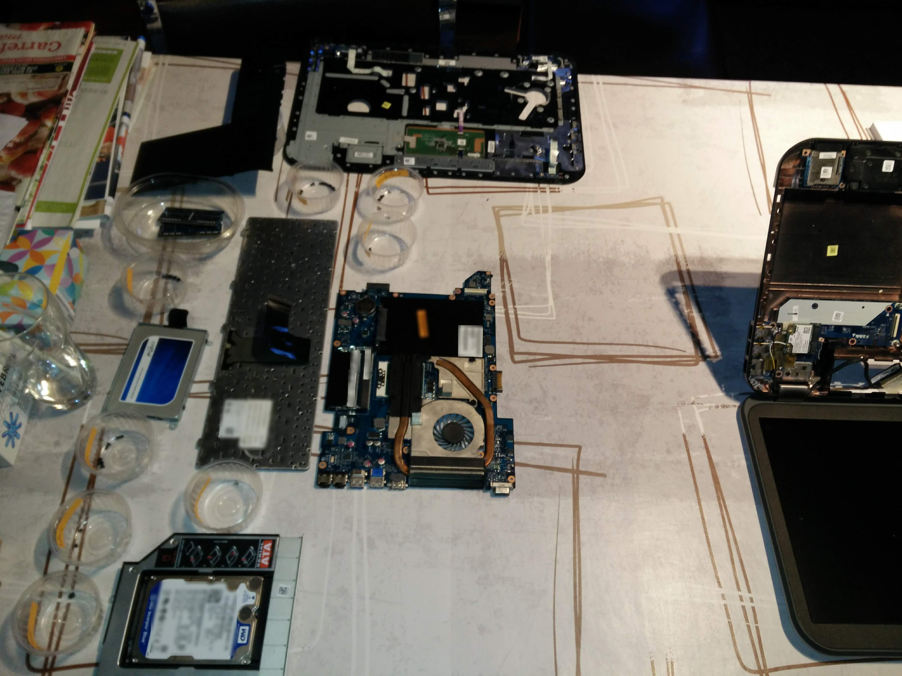
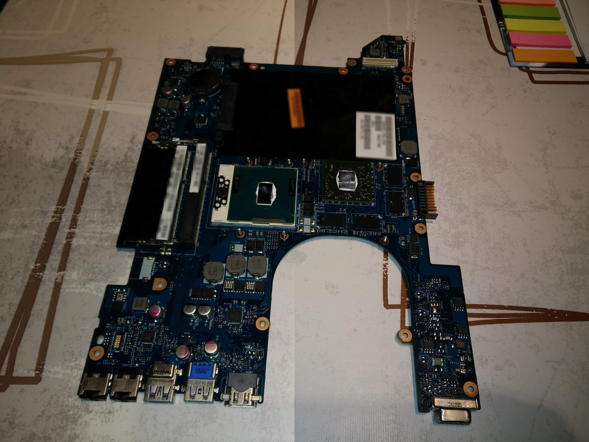

A while ago I decided to start fresh and completely reïnstall this computer.
Three blog posts about me setting up my trusty machine for development again came out of that. _read [part1](/blog/fresh-development-environment-part-1/)_

I would like to tell you that decision was made just because I felt like it but it wasn't.  
My laptop was getting hot, **very** hot.  
After a while you collect a slew of cruft on your computer you'd be happier without. (looking at you, sponsor offers that install a toolbar when you don't uncheck that tiny box hiding in the corner of the installer)

I hoped that would help this laptop's thermal situation. It got so bad that it would throttle when only watching YouTube.
Reïnstalling only helped a bit, I could now use this machine for about an hour before I had to stop and do something else because I couldn't stand the heat anymore.

That's why I decided to completely disassemble this laptop and apply fresh thermal paste.
Luckily, I only needed a few tools.

I used:

- A screwdriver
- A prying tool (it was a nail file, but shhhh)
- Thermal paste
- Cups to organize all the screws
  - a pen to write labels for all those cups
- Microfiber cloth to clean the old paste (I used coffee filters)
- Pure alcohol to clean the old paste (I used some from the pharmacy)

First I removed the battery and opened up the service-panel on the back.

That gave me easy access to remove the parts that are supposed to be user-servicable: the hard drive and the memory modules.
After those (and some more screws) were neatly placed aside. It was time for the first tricky part: removing the keyboard (and making sure you don't scratch your laptop too much or rip the ribbon cable when removing it.)

Only some more fragile ribbon cables and a bit of prywork were left before I could see the the guts of my laptop, that ~~green~~ blue PCB.

Some more screws were removed and I could take out what makes this laptop tick: the motherboard assembly.

What I was after was under those pieces of metal connected to the fan.
Before continuing, I took the time to carefully dust each part. Blowing some compressed air through the heatsink-fins while keeping the fan from spinning resulted in the biggest dustcloud of the day.

Removing the heatsink revealed the CPU and confirmed my suspicions. The thermal paste was completely dried out.
To clean off the old dried-up gunk I used pieces of coffee filter made wet by a bit of pure alcohol.
The CPU and GPU chips are very small, so only a tiny amount of new thermal paste was needed.
There is a lot of debate about the best way to apply new paste, I used the pea method in both places.

Now the same proccess described above began in reverse, reassembling the laptop.
Here is where all those little labelled pots for screws really paid off, I only had to remember where everything went.
My memory is still better than that of a goldfish so putting everything back the way it was didn't cause any trouble.

That's it! Time for a nerve-racking moment, plugging in the charger and hitting the power-key.

**Everything worked** 🎉🎉🎉

The reported CPU-temperatures under moderate load went down from 90°C+ to around 60°C.
