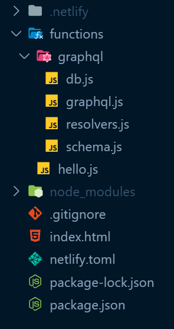
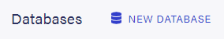
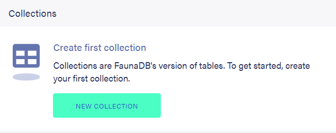
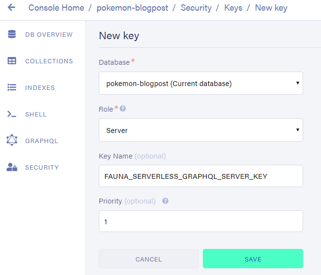

This is the third post in a series of blogposts about serverless GraphQL. It is not strictly necessary to read the previous parts to follow along with this blogpost.

That being said, I would appreciate it if you checked them out first.
To get up to speed completely, please start at [From zero to a serverless GraphQL endpoint in a flash](/blog/serverless-graphql).

Ready? Let's go! 🚀

## A real database

Up until this point. The database was a literal JavaScript array.
That's neat, but far from optimal. Aside from the scaling issues. Every change made would disappear after a while, once the serverless-function shuts down.

Keeping a database working, let alone working _efficiently_ is a LOT of work.
Not having much knowledge in the realm of databases and [DevOps](https://en.wikipedia.org/wiki/DevOps) complicates this even further.

Is it even possible to have a database if I'm not equipped to do all that work? To pile on even more requirements, I don't want to have a machine running 24/7 _at all_.

Yes! Serverless databases exist and they check all of those boxes!

[Chris Coyier](https://twitter.com/chriscoyier) created a great site that houses a [compilation of serverles resources](https://serverless.css-tricks.com/services/data/). And it just happens to have an orderly list of databases.

I chose [Fauna](https://fauna.com/).

## Adding the database connection to the GraphQL context

As a quick reminder, this is the folder structure we are working with.



Fauna has a handy way to interact with the database in many coding languages, their [drivers](https://docs.fauna.com/fauna/current/drivers/). Our severless-function is written in [node.js](https://nodejs.org/en/), which is essentially JavaScript, so for our purposes the [JavaScript driver](https://docs.fauna.com/fauna/current/drivers/javascript) is the one we want.

```bash
npm install --save faunadb
```

Instead of storing the entire database in the GraphQL context, like we did with the `pokemons` array. We will store the connection to, and method to interact with, the database in the `context`.

> I know the plural is pokemon, don't judge me.

### Preparation

After creating a [Fauna](https://fauna.com/) account, log into their dashboard and create a database.



Our data will consist of a bunch of Pokemon, so create a [Collection](https://docs.fauna.com/fauna/current/concepts/glossary#Collection) called `Pokemon`.



Leave all the default options and save.

The `Pokemon` Collection will hold all our individual Pokemon.

An example of a single, _very interesting_, `Pokemon`:

```json
{
  "id": 122,
  "name": "mr-mime"
}
```

When creating that Collection, something called an [Index](https://docs.fauna.com/fauna/current/concepts/glossary#Index) was also created if you left the defaults.

That Index helps you browse all the `Pokemon` inside that Collection.

By default, Fauna uses [snake_case](https://en.wikipedia.org/wiki/Snake_case) to name things.
That's perfectly fine. To keep things uniform with the JavaScript code, my first order of business was to rename the created `all_pokemon` index to `allPokemon` by going to Settings when that index is selected.


### Connecting to the database

To make the connection to the database, Fauna requires us to provide a secret key.
In the Fauna dashboard, add a new key.

This is found under the security tab.
A Server-key is what we want here, it will allow us to manipulate the database we just created, but not other.



Save this key somewhere safe, it will only be shown once!

You could absolutely provide this key as a literal string whenever it is required.

It is considered good practice, however, to store secrets like this in their own `.env` file and reference them from there.

This will allow the code in which those secrets are used to be public, while the actual secrets are not shared and kept private.

Create a new file called `.env` and add the key you just created under a descriptive name.

```
FAUNADB_SERVER_SECRET=fnADcc6pGYACAkNS77iyW0_3LRlgTj-jq7pkZli1
```

> Don't get any ideas about using this particular key, it's already been revoked

To reference that secret key in our code, we'll use a small package called [dotenv](https://github.com/motdotla/dotenv)

```bash
npm install dotenv
```

Time to finally write some code.

In `db.js`, we will export our connection to the database, our `client`, and all the functions we will use to communicate over that connection, the `query`.

```js
require('dotenv').config();
const faunadb = require('faunadb');

const query = faunadb.query;

function createClient() {
  if (!process.env.FAUNADB_SERVER_SECRET) {
    throw new Error(
      `No FAUNADB_SERVER_SECRET in environment, skipping client creation`
    );
  }
  const client = new faunadb.Client({
    secret: process.env.FAUNADB_SERVER_SECRET
  });
  return client;
}

exports.client = createClient();
exports.query = query;
```

The next step is to add these things to our GraphQL context. That way, they will be easily accessible from our resolvers.

```js
// in graphql.js

const { ApolloServer } = require('apollo-server-lambda');
const { typeDefs } = require('./schema.js');
const { resolvers } = require('./resolvers.js');
const { client, query } = require('./db.js');

const server = new ApolloServer({
  typeDefs,
  resolvers,
  context: function() {
    return { client, query };
  },
  playground: true,
  introspection: true
});

exports.handler = server.createHandler();
```

THIS POST IS A WORK IN PROGRESS
