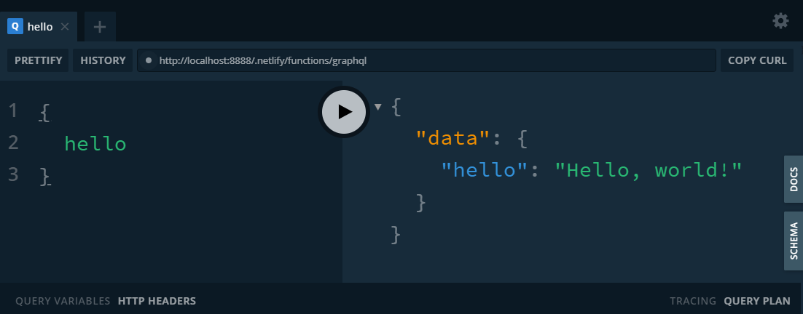
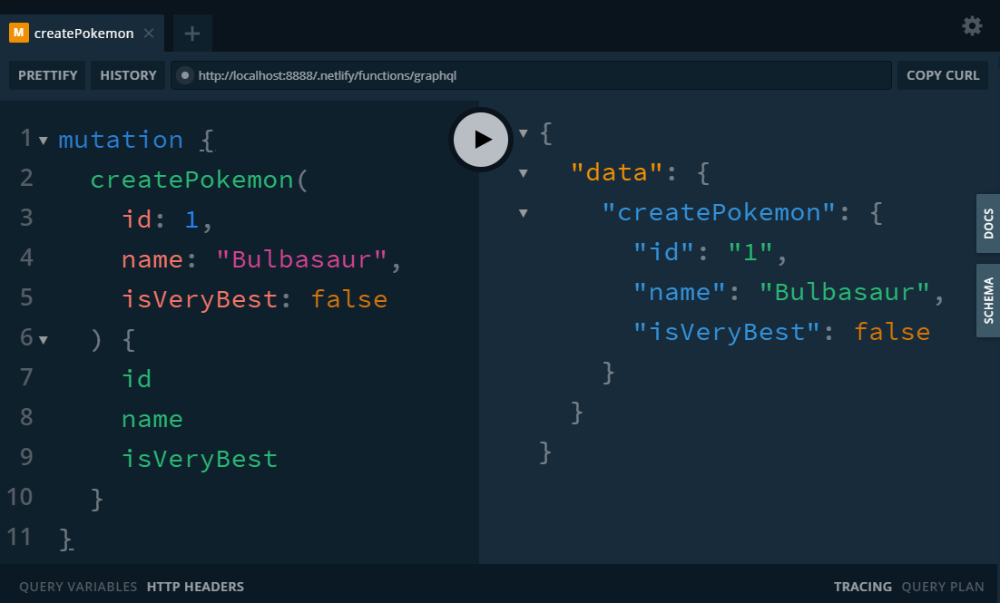

<!-- Cover photo by Jay on Unsplash -->

Serverless GraphQL.

Does the combinatiton of those 2 words set off your _buzzword detector_?
That must be hard, right?

I'm here to tell you it's not!
We'll set one up during this blogpost and I promise, it's easier to do than you might think.

## Preparation

We'll use [Netlify](https://www.netlify.com/) to host the GraphQL endpoint.
They make it quick and painless to host sites. They also provide a way to work with serverless functions, which is what we're really interested in. Those functions will be deployed on [AWS Lambda](https://aws.amazon.com/lambda/), but you don't have to worry about how to accomplish that, Netlify will do it for you.

Start by installing the [Netlify CLI tool](https://www.netlify.com/docs/cli/#installation)

```bash
npm install netlify-cli -g
```

Create a new directory for this new, awesome project and do some ~~busywork~~ initial setup

```bsg
git init
npm init -y
```

Optionally create a repository on [GitHub](https://github.com/) to help Netlify automatically deploy every time you publish an update to the code.

```bash
netlify login
netlify init
```

Choose the "Create & Configure a new site" option and enter through the other options to pick the default settings.


A `.gitignore` file, `netlify.toml` file and `.netlify` folder are created.

The `netlify.toml` holds your config for the Netlify site.
In there you will see a `functions = "functions"` line.
The `"functions"` is the path where your serverless-functions go that will be deployed to [AWS Lambda](https://aws.amazon.com/lambda/)

Create an `index.html` file so something is displayed when you go to the site.

At this point, you have a functioning website, let's add a first serverless function.

## First serverless function

Create a `functions` folder (or whatever you changed that path in the `netlify.toml` to).

Every `.js` file in here is a serverless function.
The name of the file will also be the name of the serverless function.
They will become accessible at `/.netlify/functions/{function_name}`

Every file should export a `handler` function.

```js
exports.handler = function(event, context, callback) {
  // Hey, I'm lighter than a server, I'm server~~less~~ 🥁💥
};
```

Use the `callback` parameter to either return an error or a response from the function.

Inside the `functions` directory create a `hello.js` file.

```js
exports.handler = (event, context, callback) => {
  const response = {
    statusCode: 200,
    body: JSON.stringify({
      msg: `Mr. Mime is the best Pokemon`
    })
  };
  callback(undefined, response);
};
```

You could pick another Pokemon here, but you'd be wrong 🤷‍♂

To see it in action, run `netlify dev`

```bash
netlify dev
```

Open the URL and go to `/.netlify/functions/hello`

🎉 TADA, there is the response.

## Serverless GraphQL using a single file

Time to create another serverless function, _the reason for this article_, a GraphQL endpoint!

We'll use the `apollo-server-lambda` package for this.

```bash
npm install apollo-server-lambda
```

Don't forget to add the `node_modules` folder to the `.gitignore` to prevent committing the code from that package to git.

Inside the `functions` directory create a `graphql.js` file.

Start off that file by importing the things you are going to need.

```js
const { ApolloServer, gql } = require('apollo-server-lambda');
```

There are 2 big parts to the GraphQL server that will live in this file.
The schema (or typeDefs) and the resolvers.

The **schema** defines **WHAT** the operations you can do are, and WHAT the data that's used looks like.  
The **resolvers** are functions that define **HOW** those operations are done.

[Schema: WHAT, resolvers: HOW](https://twitter.com/NMeuleman/status/1163554727952564224)

As a result, these 2 parts have to be in sync. If they are not, the apollo server will yell at you and your GraphQL endpoint will not work!

For more information on the schema, apollo has [a great schema step](https://www.apollographql.com/docs/tutorial/schema/) in their tutorial, which is what we're doing here, only this time, we're going serverless while those docs use an "old-school" server.

```js
const typeDefs = gql`
  type Query {
    hello: String!
  }
`;
```

With a minimal schema done, it's time to move on to the resolvers!

A resolver is a function with the following signature

```js
fieldName(obj, args, context, info) { result }
```

For more information on resolvers, [the apollo docs](https://www.apollographql.com/docs/graphql-tools/resolvers/#resolver-function-signature) have a wealth of information.

In that `graphql.js` file, define an object called `resolvers` that corresponds with your schema.  
In this case, that means a single function under the `Query` key named `hello`.
The schema calls for a `string` type as result, so that's what we'll return from the resolver.

```js
const resolvers = {
  Query: {
    hello: (obj, args, context) => {
      return 'Hello, world!';
    }
  }
};
```

Great! The file now holds 2 variables, but they are not being used yet.  
This is where you feed the variables you just created to the `ApolloServer` you imported from `apollo-server-lambda` at the top of the file.

For illustration purposes, add `playground: true, introspection: true` to open it up and make sure you see something useful when you visit `/.netlify/functions/graphql`.

```js
const server = new ApolloServer({
  typeDefs,
  resolvers,
  playground: true,
  introspection: true
});
```

Almost done. Remember how our serverless function should export a `handler`?

Thankfully, a convenient method on `server` exists that does this for you.

```js
exports.handler = server.createHandler();
```

Ready for liftoff 🚀.

Run `netlify dev` and visit `/.netlify/functions/graphql` to interact with the serverless GraphQL endpoint you just created using the [GraphQL playground](https://github.com/prisma-labs/graphql-playground) at that URL!



### Expanding the GraphQL enpoint

Only being able to query for `hello` and that query always returning the same string is boring, let's add some Pokemon.

#### Schema

A schema could look like this now

```js
const typeDefs = gql`
  type Query {
    hello: String!
    allPokemon: [Pokemon]!
    pokemonById(id: Int!): Pokemon
    pokemonByName(name: String!): Pokemon
  }
  type Mutation {
    createPokemon(id: Int!, name: String!, isVeryBest: Boolean!): Pokemon
    deletePokemon(id: Int!): Pokemon
    updatePokemon(id: Int!, name: String, isVeryBest: Boolean): Pokemon
  }
  type Pokemon {
    id: ID!
    name: String!
    isVeryBest: Boolean!
  }
`;
```

Notice how we not only defined fields we can ask for under `Query`, but also fields that represent actions we can take under the `Mutation` key and the format of how the data for a single `Pokemon` looks.

I'll refer back to [those apollo schema docs](https://www.apollographql.com/docs/tutorial/schema/) for more information. For information that's even more detailed, have a look at [the official GraphQL schema docs](https://graphql.org/learn/schema/).

#### Database

To support what we want to do, a database is needed!

To keep things simple, we'll add a JavaScript array to our file.

```js
// I know the plural is Pokemon, don't judge me
const pokemons = [
  { id: 122, name: 'Mr. Mime', isVeryBest: true },
  { id: 25, name: 'Pikachu', isVeryBest: false },
  { id: 7, name: 'Squirtle', isVeryBest: false }
];
```

#### Resolvers

Our resolvers should match our schema, so that part of the file now looks like this:

```js
const resolvers = {
  Query: {
    hello: (obj, args, context) => {
      return 'Hello, world!';
    },
    allPokemon: (obj, args, context) => {
      return pokemons;
    },
    pokemonById: (obj, args, context) => {
      return pokemons.find(pokemon => pokemon.id === args.id);
    },
    pokemonByName: (obj, args, context) => {
      return pokemons.find(pokemon => pokemon.name === args.name);
    }
  },
  Mutation: {
    createPokemon: (obj, args, context) => {
      const pokemon = {
        id: args.id,
        name: args.name,
        isVeryBest: args.isVeryBest
      };
      pokemons.push(pokemon);
      return pokemon;
    },
    updatePokemon: (obj, args, context) => {
      const pokemon = pokemons.find(pokemon => pokemon.id === args.id);
      if (args.name) pokemon.name = args.name;
      if (args.isVeryBest) pokemon.isVeryBest = args.isVeryBest;
      return pokemon;
    },
    deletePokemon: (obj, args, context) => {
      const index = pokemons.findIndex(pokemon => pokemon.id === args.id);
      const pokemon = pokemons[index];
      pokemons.splice(index, 1);
      return pokemon;
    }
  }
};
```

#### Trying out the additions

Running `netlify dev` and visiting the GraphQL playground again, you can interact with a GraphQL endpoint that's a little more fleshed out.



Remember, since that super hightech database is a JavaScript array, any changes you make to it will disappear when the serverless-function shuts down and boots up again!

## Conclusion

This really excited me, so I used it in a sideproject that's basically a runaway joke.

It has a serverless GraphQL endpoint talks to [FaunaDB](https://fauna.com/), is written in [TypeScript](https://www.typescriptlang.org/) and has a small [Gatsby](https://www.gatsbyjs.org/) frontend.

[The JaSON API](https://twitter.com/NMeuleman/status/1180164722466971648)

In the next part of this blogpost, we'll explore how to use multiple files to create our GraphQL endpoint and replace our placeholder database with [FaunaDB](https://fauna.com/).

For a sneak peak, feel free to look at [the code for the examples](https://github.com/NickyMeuleman/serverless-graphql).
