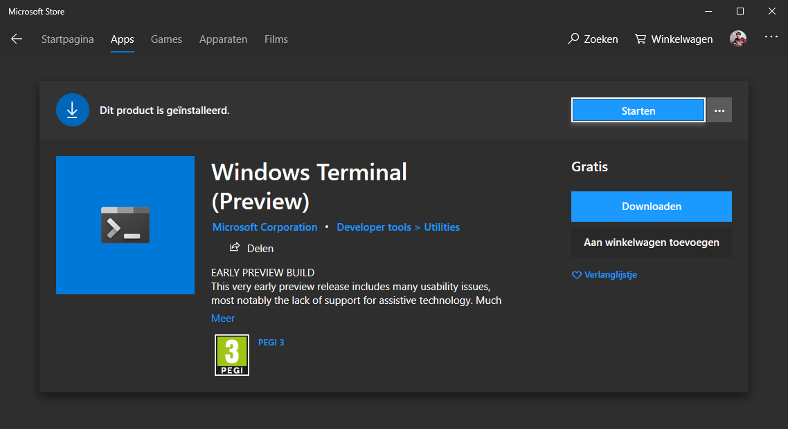
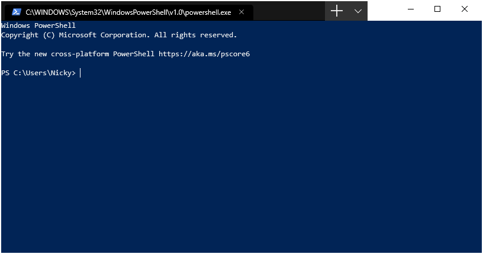
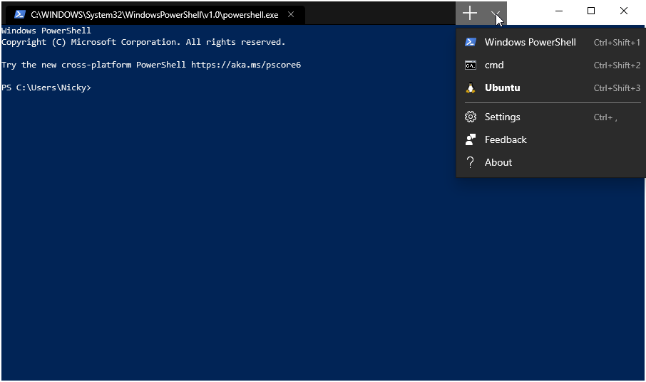

Microsoft is working on new command line application called [Windows Terminal](https://devblogs.microsoft.com/commandline/introducing-windows-terminal/).

[The promo video](https://www.youtube.com/watch?v=8gw0rXPMMPE) looks very promising, let's hope it lives up to expectations.

The Windows Terminal recently got released in a preview version on the [Windows Store](https://www.microsoft.com/en-us/p/windows-terminal-preview/9n0dx20hk701).



The old, well known, often despised, `cmd` application is not very feature rich. It's main goal is to remain backwards compatible, preventing many features from being added.

The new Windows Terminal, however, has a lot of bells and whistles.

It's a central location to access many different shells like the good 'ol cmd, Powershell, [your fancy WSL shell](/blog/linux-on-windows-wsl2-zsh-docker), ...

The project is open-source, take a look at the, mainly C++ [repository](https://github.com/microsoft/terminal).

From their `README.md`:

> Windows Terminal is a new, modern, feature-rich, productive terminal application for command-line users. It includes many of the features most frequently requested by the Windows command-line community including support for tabs, rich text, globalization, configurability, theming & styling, and more.

> The Terminal will also need to meet our goals and measures to ensure it remains fast, and efficient, and doesn't consume vast amounts of memory or power.

Many additional features _are_ coming.

f.e: [keybinding like copy&paste](https://github.com/microsoft/terminal/pull/1093#event-2438652452), [panes like tmux](https://github.com/microsoft/terminal/pull/825), ...
For a full(ler) of what they have planned and should be there for the 1.0 release, have a gander at the [milestones](https://github.com/microsoft/terminal/milestone/6).

Even more features are on the developers' nice-to-have list and _may_ be coming.

Like a dev that [thinks supporting themes with `.itermscolors` files would be cool](https://github.com/microsoft/terminal/issues/711#issuecomment-493087463).
Will that become a reality? No idea.
Would it be cool? Absolutely! 🤩

## Configuration

There are many configuration options to make the overall application, and each shell act/look like you want.
This happens in a `profiles.json` file.

While not as fancy as using a <abbr title="Graphical user interface">GUI</abbr>, it is quite an enjoyable method.
Especially if that file has a JSON-schema attached to it.
I hope they add one soon, because [JSON-schemas are awesome](/blog/json-schema/).

When you first install the application, it will present you with a Powershell window.



Having recently put in some time to get the Windows subsystem for Linux 2 [up and running](/blog/linux-on-windows-wsl2-zsh-docker), that's what I want it to show when I launch the terminal.

Luckily, the Ubuntu terminal from <abbr title="Windows subsystem for Linux 2">WSL2</abbr> was already in the list of available shells.



Open the `profiles.json` file by clicking settings option in the dropdown, or by hitting the `ctrl+,` shortcut.

Changing it to be the default shell meant finding the <abbr title="globally unique identifier">GUID</abbr> of that Ubuntu profile under the `profiles` key and placing that in the `defaultProfile` under `globals`.

```json
// profiles.json
{
  "globals": {
    // ...
    "defaultProfile": "the GUID of your chosen profile"
    // ...
  },
  "profiles": [
    {
      // ...
      "GUID": "a GUID string"
      // ...
    }
    // more profiles
  ]
}
```

By default, that shell opens in your user-directory on Windows.
My projects are located on the Linux side, so I want the shell to open in my Ubuntu home directory.

```json
// in a profile-object
{
  "startingDirectory": "//wsl$/Ubuntu/home/nicky"
}
```

After some more tweaking my terminal now looks pretty sweet.
I saved my `profiles.json` to a public [gist](https://gist.github.com/NickyMeuleman/42c032b0991202864160faec57886954).


A developer named [Chris Duck](https://twitter.com/gpduck) made a PowerShell module to control this: [MSTerminalSettings](https://github.com/gpduck/MSTerminalSettings).

Remember the dev that thought using iTerm color scheme files would be neat? Yeah, this module makes that possible. 🤯
He lists using schemes from [iterm2colorschemes.com](https://iterm2colorschemes.com/) as an [example](https://github.com/gpduck/MSTerminalSettings?WT.mc_id=-blog-scottha#examples) of what this module can do.

[Scott Hanselman](https://twitter.com/shanselman) and [Tyler Leonhardt](https://twitter.com/TylerLeonhardt) immediately used it for the best of reasons, shannanigans.

They made [Terminal Attract Mode](https://github.com/shanselman/TerminalAttractMode). The self proclaimed "greatest PowerShell script ever written, today." places animated gifs as the background of your terminal. It's glorious. 🤣


