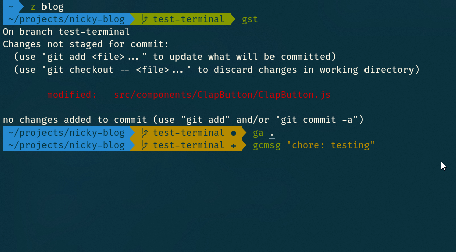

Microsoft is working on new command line application called [Windows Terminal](https://devblogs.microsoft.com/commandline/introducing-windows-terminal/).

[The promo video](https://www.youtube.com/watch?v=8gw0rXPMMPE) looks very promising, let's hope it lives up to expectations.

The Windows Terminal recently got released in a preview version on the [Windows Store](https://www.microsoft.com/en-us/p/windows-terminal-preview/9n0dx20hk701).

The old, well known, often despised, `cmd` application is not very feature rich. It's main goal is to remain backwards compatible, preventing many features from being added.

The new Windows Terminal, however, has a lot of bells and whistles.

It's a central location to access many different shells like the good 'ol cmd, Powershell, [your fancy WSL shell](/blog/linux-on-windows-wsl2-zsh-docker), ...

The project is open-source, take a look at the, mainly C++ [repository](https://github.com/microsoft/terminal).

From their `README.md`:
> Windows Terminal is a new, modern, feature-rich, productive terminal application for command-line users. It includes many of the features most frequently requested by the Windows command-line community including support for tabs, rich text, globalization, configurability, theming & styling, and more.

> The Terminal will also need to meet our goals and measures to ensure it remains fast, and efficient, and doesn't consume vast amounts of memory or power.

Many additional features _are_ coming.

f.e: [keybinding like copy&paste](https://github.com/microsoft/terminal/pull/1093#event-2438652452), [panes like tmux](https://github.com/microsoft/terminal/pull/825), ...
For a full(ler) of what they have planned and should be there for the 1.0 release, have a gander at the [milestones](https://github.com/microsoft/terminal/milestone/6).

Even more features are on the developers' nice-to-have list and _may_ be coming.

Like a dev that [thinks supporting themes with `.itermscolors` files would be cool](https://github.com/microsoft/terminal/issues/711#issuecomment-493087463).
Will that become a reality? No idea.
Would it be cool? Absolutely! 🤩

# settings, json
# more configuration
mention dumb things, like Scott Hanselman's gif-thing
so, that iterm2 schemes thing that would be cool? Yeaaaah, someone already made that possible.

