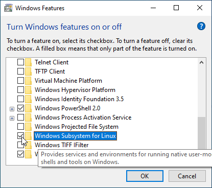
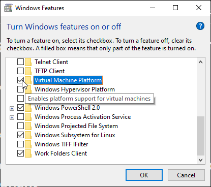

Compromises are great. When it comes to technology, having your cake and eating it too is better.

The machine I normally use for development broke.
The Windows Subsystem for Linux version 2 just came out, so I decided to set up another machine with that. When all is said and done, it was nothing short of awesome. I just booted a full-stack application that uses docker from an Oh My ZSH terminal window inside of VSCode. It booted faster than it ever has natively on Windows. I'm using Windows 10 Home, that means the hyper-V virtualization technology normally isn't available. But WSL2 lets you take advantage of it anyway (if your hardware supports it).

## Install the Insider preview

As of writing, WSL2 is available in the latest release of the insider preview fast ring.
If it's not installed, doing so is fairly straightforward.

Look for the insider programma and follow the steps to activate it.

> As of writing, choose the fast ring of updates when prompted for a choice.


Run Windows update


After a minor test of your patience and a few reboots. A watermark that displays the version you just installed is visible in the lower right of your desktop


## Activate optional features

WSL and WSL2 use some features that aren't activated by default, so enabling those is necessary.

This is possible through a GUI, by going to "turn Windows features on or off" or through an elevated Powershell prompt.

- For the GUI option:


To use WSL, enable the aptly-named "Windows Subsystem for Linux" feature.



- Through Powershell:

```sh
Enable-WindowsOptionalFeature -Online -FeatureName Microsoft-Windows-Subsystem-Linux
```

Irregardless of the option you chose, a reboot is required.

### WSL2

That was enough for WSL1.
To use WSL2, first make sure virtualization is enabled in your BIOS.
It uses the hyper-V technology. That is normally only available on Windows 10 pro, but Windows 10 home can also use it for WSL2.

Enabling virtualization in the BIOS looks different for most motherboard brands.
On my MSI board the option called "Virtualization Technology" and was hidden in the overclocking settings.

Next: enabling another optional feature in Windows!

Same story here, either use the GUI or an elevated Powershell window.
The option to enable is called the "virtual machine platform".

- GUI



- Powershell

```sh
Enable-WindowsOptionalFeature -Online -FeatureName VirtualMachinePlatform
```
