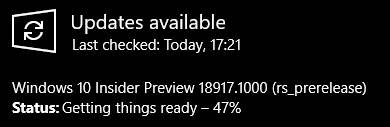
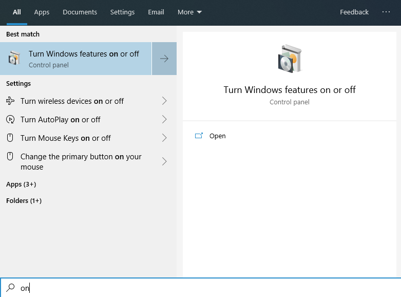

Compromises are great. When it comes to technology, having your cake and eating it too is better.

The machine I normally use for development broke.
The Windows Subsystem for Linux version 2 just came out, so I decided to set up another machine with that. When all was said and done, it was nothing short of awesome. I just booted a full-stack application that uses docker from an Oh My ZSH terminal window inside of VSCode. It booted faster than it ever had natively on Windows. I'm using Windows 10 Home, that means the hyper-V virtualization technology normally isn't available. But WSL2 lets you take advantage of it anyway (if your hardware supports it).

## Install the Insider preview

As of writing, WSL2 is available in the latest release of the insider preview.
If it's not installed, doing so is fairly straightforward.

Look for the insider programma and follow the steps to activate it.

> As of writing, choose the fast ring of updates when prompted for a choice.


Run Windows update



After a minor test of your patience and a few reboots. A watermark that displays the version you just installed is visible in the lower right of your desktop


## Activate optional features

WSL and WSL2 use some features that aren't activated by default, so enabling those is necessary.

This is possible through a GUI, by going to "turn Windows features on or off" or through an elevated Powershell prompt.

- The GUI option:



To use WSL, enable the aptly-named "Windows Subsystem for Linux" feature.


- Through Powershell:

```sh
Enable-WindowsOptionalFeature -Online -FeatureName Microsoft-Windows-Subsystem-Linux
```

Irregardless of the option you chose, a reboot is required.

### WSL2 features

That was enough for WSL1.
To use WSL2, first make sure virtualization is enabled in your BIOS.
It uses the hyper-V technology. That is normally only available on Windows 10 pro, but Windows 10 home can also use it for WSL2.

Enabling virtualization in the BIOS looks different for most motherboard brands.
On my MSI board the option was called "Virtualization Technology" and was hidden in the overclocking settings.

Next: enabling another optional feature in Windows!

Same story here, either use the GUI or an elevated Powershell window.
The option to enable is called the "virtual machine platform".

- GUI


- Powershell

```sh
Enable-WindowsOptionalFeature -Online -FeatureName VirtualMachinePlatform
```

## Install a distro

Once that reboot is done, you can go to the Microsoft store and install your favourite linux distribution. I went with Ubuntu, because a lot of install instructions and other documentation are written for that distro.


On the first boot of the distro you just installed (which presents itself as a terminal window), you'll be asked to enter a password for when you want to do stuff as a super user (sudo).

## WSL2

To check which version of WSL is installed you can run a command in Powershell

```sh
wsl --list --verbose
# or
wsl -l -v
```

If the number for the version is 2, all systems go!

If not, convert that puppy from 1 to 2

```
wsl --set-version <distro-name> 2
# in my case
wsl --set-version Ubuntu 2
```

The output will tell you that this operation might take a while.
It's not one of those that says that only to finish 5 seconds later. It took about 10 minutes here.


At this point, WSL2 is ready to go.
Opening the distro you installed will show a bash prompt.

> list WSL2 features here -IO speed, files from windows, real kernel, docker, zsh,...

## Installing tools

Let's start loading up the linux environment with all the needed tools.
A few tools still need to be installed on the Windows side, the rest are all linux tools.

The two I'll install for Windows are: [VSCode](https://code.visualstudio.com/) and [git for Windows](https://git-scm.com/)
Remember to set the autocrlf setting to input for git. VSCode handles it well.

> open a terminal from Windows!

```sh
git config --global core.autocrlf input
```

To kick off the process of installing linux tools, we'll start by updating it.
From this point, the action happens in your linux terminal!

```sh
sudo apt update
sudo apt upgrade
```

More preparation, installing build tools for [node-gyp](https://github.com/nodejs/node-gyp)

```sh
sudo apt install build-essential
```

### git

This one should also be installed on the linux side.

```sh
sudo apt install git
```

After installing git, remember to [configure it](/blog/fresh-development-environment-part-2/#configuration).
Especially setting the autocrlf setting to input is important here.

```sh
git config --global core.autocrlf input
```

## node

You can install it as a standalone package.
Now we can harness all those linux-y tools, I'll use `nvm` to make using different versions easier.

[The nvm repo](https://github.com/nvm-sh/nvm) has excellent installation instructions.

```sh
curl -o- https://raw.githubusercontent.com/nvm-sh/nvm/v0.34.0/install.sh | bash
```

Restart your terminal after install.
To confirm the installation was successfull, run

```sh
command -v nvm
```

It should return `nvm`

To install the latest the latest stable version of node

```sh
nvm install node # "node" is an alias for the latest version
```

When node releases a new version, you can run that same command again.

You'll need to tell NVM which version of node you want to use.
So next time you boot your linux distro, you'll have to use.

```sh
nvm use node
```

When the project you are working on requires a different version of node, specify that one

```sh
nvm use v<version number>
# or if the project has a valid .nvmrc file
nvm use
```

Having to do that manually seems annoying right?
Many solutions to this annoyance exist, later in this post that will be "fixed".

## A better terminal

When you open your terminal there are actually 2 sides at work.
The thing you see and type into, **the terminal**.  
The thing that terminal communicates with and does most of the work, **the shell**.

Let's face it, the terminal that ships with Windows is pretty lackluster.
Good news: they are coming out with [a new one](https://youtu.be/8gw0rXPMMPE) and it looks really awesome!

In anticipation of that release, I'm not going to change much there. I'll use the one that's integrated into VSCode most of the time anyway.

### ZSH

I chose ZSH to replace the standard bash shell that opens when clicking the ubuntu icon in the start menu.

Installing it is a oneliner thanks to the package manager in Ubuntu

```sh
sudo apt install zsh
```

When you launch Ubuntu, you'll still see the usual bash prompt.
To enter the zsh shell

```sh
zsh
```

The first time this launches a quick configuration wizard will be shown.
The choice here doesn't matter all that much, sinc the resulting file `.zshrc` will be overwritten when we install oh-my-zsh. I chose the option `2` anyway and went with the defaults.


Typing `zsh` into bash every time we launch it gets old quick.

```sh
cd $home #navigate to your home directory on linux
code .bashrc #open the bash configuration file in visual studio code
```

To automatically launch `zsh` when you open the terminal, add this to your `.bashrc`

```sh
# Launch Zsh
if test -t 1; then
exec zsh
fi
```

### Oh My ZSH

This extension to zsh has one of the best URLs out there: [ohmyz.sh](https://ohmyz.sh/)
It will also enable a huge list of nice features, which is more important.

Installing oh-my-zsh is also a oneliner.

```sh
sh -c "$(curl -fsSL https://raw.github.com/robbyrussell/oh-my-zsh/master/tools/install.sh)"
```

This will also replace that `.zshrc` file we initialised earlier.
Enjoy the cool ASCII art signalling a successful installation!

#### Theme oh-my-zsh

oh-my-zsh comes with lots of fancy themes, so let's install a pretty one!
Take a look at [a list of them](https://github.com/robbyrussell/oh-my-zsh/wiki/Themes).

I like the agnoster one, so that's what I'll go with.

Edit the `.zshrc` file to enable it.
This file is also located in your linux home directory (`cd $home` to go there).

```sh
# .zshrc
# change the default theme
ZSH_THEME="robbyrussell"
# to the chosen theme
ZSH_THEME="agnoster"
```

restart your terminal for it to take effect.

Aaaaaaaaaah, it's ... broken.


That's partly because this is a fancy prompt that needs a [Powerline-patched font](https://github.com/powerline/fonts) to render correctly.

You can either download the specific font you want and install it that way (double clicking on the file and hitting the install button) or use the install script to install them all at once.

To install them all first clone that repo (through windows or linux, doesn't matter).
Then open an elevated Powershell window.
To be able to execute the `install.ps1` file, we need to open up the execution policy temporarily.

```sh
Set-ExecutionPolicy Bypass
```

now navigate to the cloned repo and execute the install script

```sh
.\install.ps1
```

You'll see the same thing happening as you would when downloading and installing each font seperatly, but of course much quicker.

Don't forget to close down the execution policy again immediately after!

```sh
et-ExecutionPolicy Default
```
