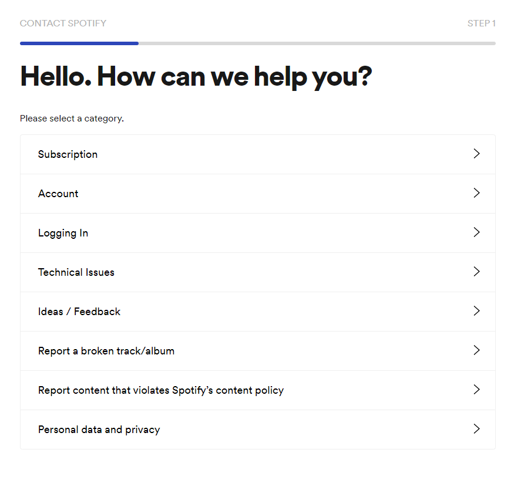
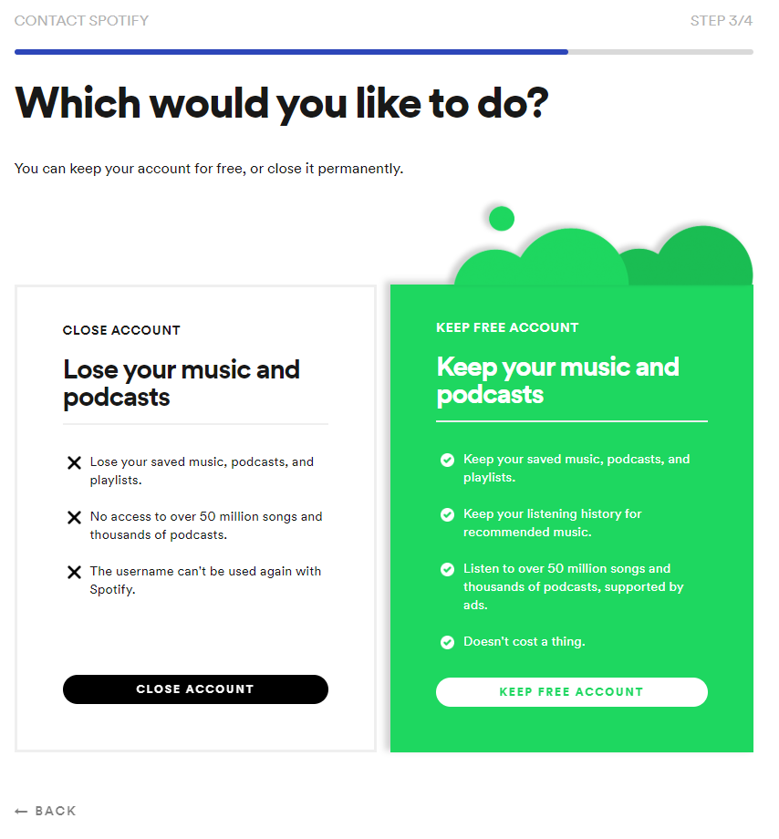
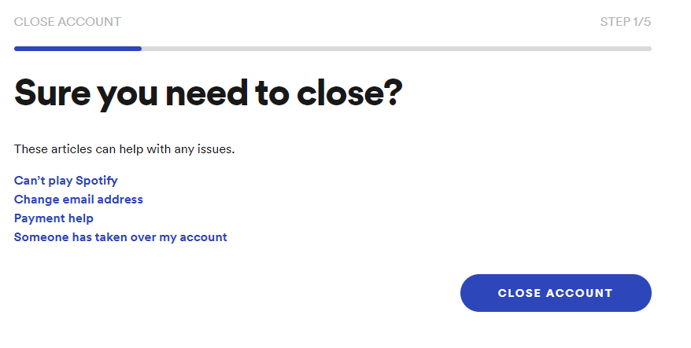
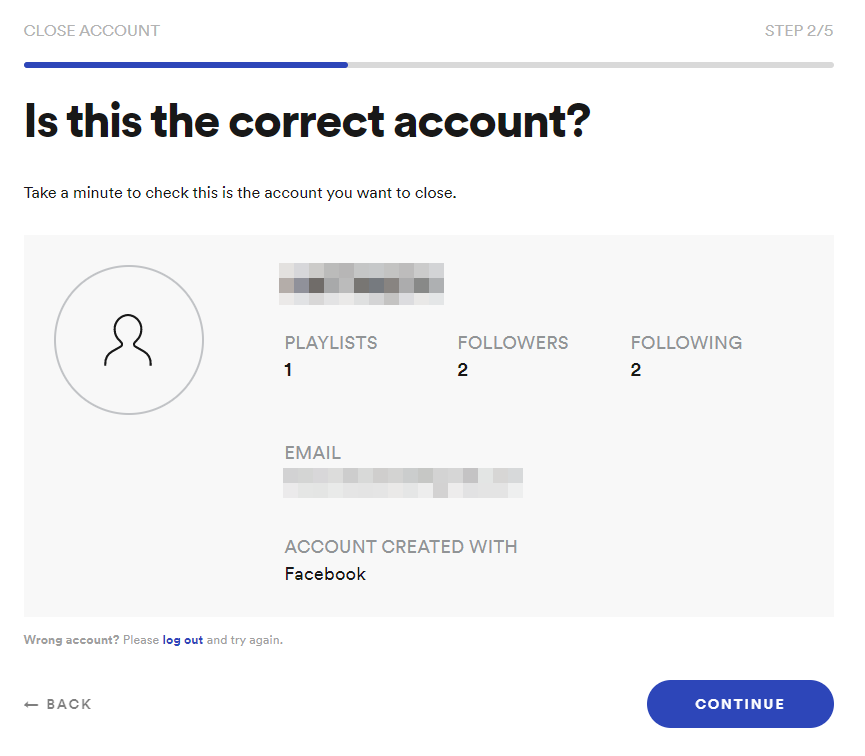
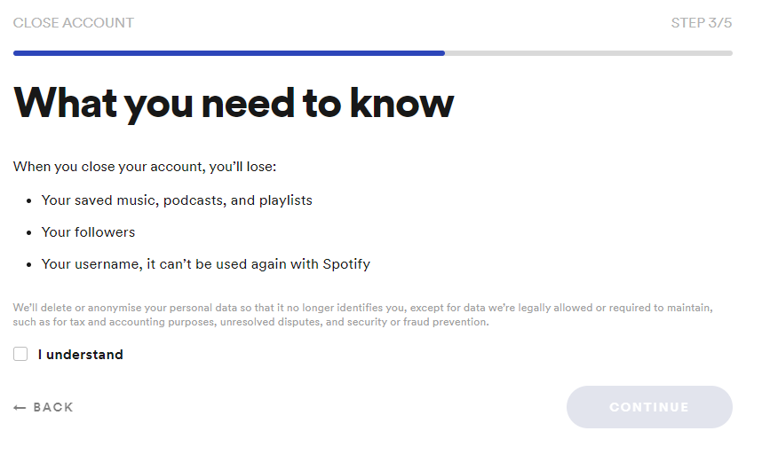
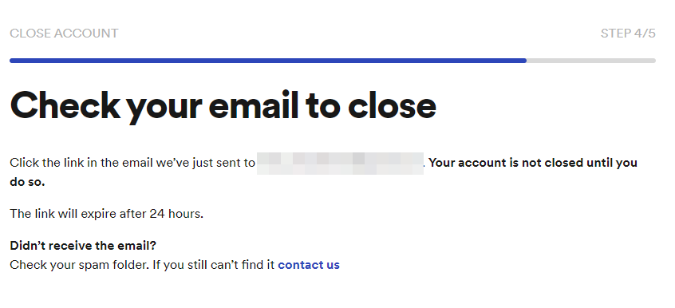
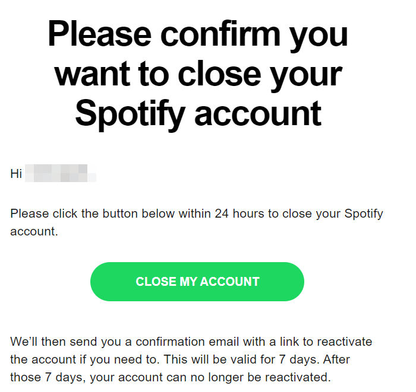

A few years ago, I signed up for Spotify through Facebook.
I wanted to break that link and sign up with a regular email and password.

Turns out, this was way harder than I thought.
Spotify **really** doesn't want you to close your account with them.

Now this is a story all about how [~~my life got flip turned upside down~~](https://youtu.be/1nCqRmx3Dnw) I closed my Spotify account.

The journey starts by going to the [contact support page](https://support.spotify.com/contact-spotify-support).

I picked "Account" and on the following page picked "I want to close my account.".

After picking "I want to close my account", I got sent to a page with 2 options.
A playful one colored in the typical Spotify-green with some extra shapes on top and a boring black and white one.
I wanted the boring one.

In all fairness, this page _does_ have some good info.
For instance it tells you the username of this account can not be used again.

Since I created the account with Facebook login, my username was a bunch of numbers and I didn't care about that.

After clicking the button labelled "close account" I got sent to a page that asked if I was sure.

So, in a slightly annoyed fashion, I clicked the "close account" button on _that_ page.

This wasn't the ending! Oh no, it was the first step in a new sequence of steps.

The next page showed some details about my acount, like the username and the account creation method that was used.

I confirmed that, yes, this was indeed, my Spotify accound and clicked "continue".

The next page repeated some information from the black and white option from a few steps ago.
It also told me the data they gathered will be anonymised, except for the data they are legally allowed to keep.

So I checked the "I understand" checkbox and clicked the "continue" button.

The last step in _that_ sequence told me to check my email.
The account wouldn't be closed until I confirmed it by clicking the link they sent to me.

Fair enough, this is a reasonable step.
I went to the email linked to that account and clicked another "close my account" button.

Victory! 🎉 That sent me to a page that notified me I had closed my account.
It also mentions: "If you want to use the same email address, you need to wait 14 days."

Bummer, I did this to change login methods and want to use the same email to signup. Only this time, not through Facebook but directly.

<Aside variant="info">

An email alias works.

This means if you signed up with `john@doe.com`, you won't be able to use the same email within 14 days.  
`john+spotify@doe.com` is not counted as the same email and will work without the 14 day restriction 😉.

</Aside>

Another email arrived with the confirmation of closing the account and a link I could click within 7 days if I changed my mind and wanted to keep the account.

<Aside>

More than 7 days passed. I did not change my mind.

</Aside>
