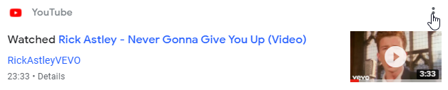
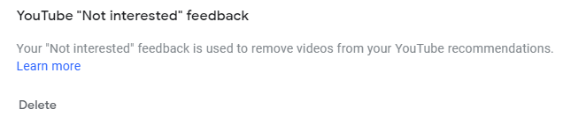
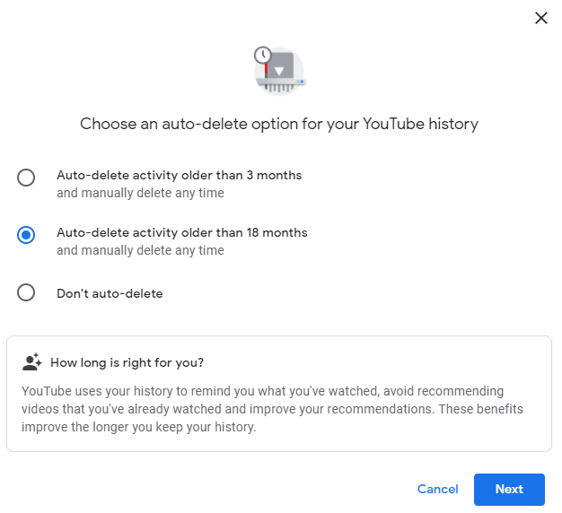
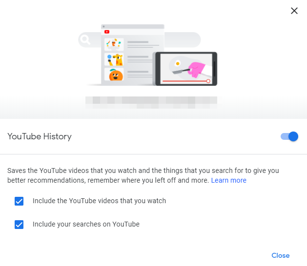

I'm currently looking at an exact list of videos I watched on YouTube, going back over 10 years to the day I signed up.
While that list includes [absolute gems](https://www.youtube.com/watch?v=dQw4w9WgXcQ), it also includes a lot of PC building and general tech videos.

So many of them that the YouTube algorithm seems to think that's all I'm interested in and recommends similar videos all the time.

The YouTube recommendation algorithm is complex and nobody really knows _how_ it works.
There are some things we know affect it, and we'll use them to "reset" (partially) the recommendations.

The algorithm thrives on data, the more accurate data you put in, the more accurate recommendations it spits out.

That's why the first step is mass deletion of data, to get rid of those data points that cause faulty conclusions.
The things to delete are **watch history** and **search history**.
If you really want to, it's possible to curate it one-by-one. But doing that for over 10 years worth of watching videos? No thank you.

## YouTube History

To explore and manipulate the watch and search history, open the "Your data in YouTube" page.
It can be accessed by opening the profile dropdown on the webapp and clicking the button with the same name.
Scroll to, and click the "Manage your YouTube Watch History" link.

<Aside variant="info">

There is a "Manage your YouTube Search History" link below it, that link leads to the same page as "Manage your YouTube Watch History", 🤷‍♂️.

</Aside>

Here you'll be able to search and view the exact videos you watched and searches you did while logged in, even the embarrassing ones you don't want anyone to know about.

Depending on how much time you'd like to spend, you can either delete single entries, the results of a search, or everything in a certain timeframe.

### Single entries

To delete a single result click the three dots for that result, followed by "Delete".

Here, I am hiding my shame by deleting a video I watched yesterday.

<Aside variant="info">

I love that song and always let it play whenever I stumble across it.

</Aside>

### Search results

To speed the proccess of deleting used searchterms and watched videos, while still being specific about it, utilize the power of the searchbox.
It's Google, it's a good one, search is their forte.

Recently, [Nick DeJesus](https://twitter.com/Dayhaysoos) mentioned an overload of Tekken videos filling his recommendations.

Because I'm unimaginative, in this example I searched for "Tekken", clicked the three dots next to the searchbar and deleted all results by clicking "Delete results".

### Everything

The quickest method to delete the stored YouTube history is to delete all of it by timeframe.

With an empty searchbar:

- Click the three dots next to the searchbar and choose "Delete activity by".
- You'll be presented with various timeframes, including "Always" and "Custom range".

Choosing one of those 2 options will first pop up a confirmation dialogue that lists which entries will be deleted and a confirmation button labelled "delete".

## Moving forward

If you chose to delete everything, your YouTube recommendations will surely be bad for a while.
You can now start with a fresh slate however.

> The algorithm thrives on data, the more accurate data you put in, the more accurate recommendations it spits out.

The best method to get relevant recommendations is to _feed the machine_.

- Watch videos you are interested in, like or dislike videos.
- If you see videos being recommended that you are not interested in, click the three dots next to that recommendation and choose "Not interested".  
  On places like the front page the options hiding behind the three dots will also include a "Don't recommend channel" option.

<Aside variant="info">

To delete existing feedback, visit [myactivity.google.com](https://myactivity.google.com/), click "Other Google activity".
There, an option called "YouTube Not interested feedback" will let you delete it.

</Aside>

- Watching a video while you are logged out or while in incognito mode is a good way to not let that specific video influence that algorithm.
- If someone else is using your computer to watch YouTube, remember to log out first.

### Rolling deletions

By default, Google will keep your entire YouTube history.
Luckily, there's an option to enable rolling deletions for entries older than 3, or 18 months.

This will let you keep the advantages of the YouTube algorithm recommending relevant videos, while old data doesn't influence them _forever_.

On the same page as before look for an option labelled "Auto-delete".

## Bonus: turn it all off

If you'd prefer, the ability exists to turn off further collection of YouTube History partially or completely.

That option will prevent either your YouTube watch history, search history, or both from affecting the recommendation algorithm going forward.
