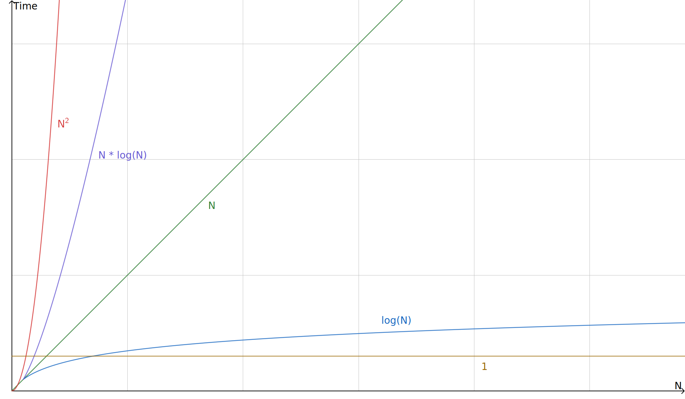

<!-- Cover photo by <a href="https://unsplash.com/@pedroplus?utm_source=unsplash&utm_medium=referral&utm_content=creditCopyText">Pedro da Silva</a> on <a href="https://unsplash.com/s/photos/hoop?utm_source=unsplash&utm_medium=referral&utm_content=creditCopyText">Unsplash</a> -->

<Aside>

TL;DR:

Big O expresses the performance of algorithms in relation to the size of their input.

</Aside>

Big O notation is used to talk about how code behaves as the size of its input grows.
That's a pretty vague statement, and I hope this post will make it clearer.

## 2 main types

There are two main types of Big O that are often used:

1. time
2. space

Both are expressed relative to the size of the input to the algorithm.

Big O stands for "order of (growth)".

- For the variant that talks about time complexity, it tells you how much longer a function will take to complete if you increase the size of the input.
- For the variant that talks about space complexity, it makes a statement about how much more space the algorithm will need if the input grows.

It is labeling a piece of code as having a certain growth pattern.

The syntax is: `O()` with something between the brackets that is a math function expressed in the size of the input.
The input size is typically represented by a variable called `n`.

<Aside>

Why `n` and not something else? I have no idea 🤷‍♂️.  
If it makes you happy, you can use the banana emoji instead. 🍌

</Aside>

- `O(n)` is most commonly read as: The algorithm has a big oh of `n`.
- `O(n)` can also be read as: The order of this algorithm is `n`.
- `O(n)` also means: The relationship between the size of the input and the time this algorithm takes to complete is linear.

About that "order" word in that second example.
It refers to the mathematical order of growth.

There are a couple of very common ones for algorithms which we'll go over later.
The order of `n` is one of them that means linear growth.
If `n` increases, the time the algorithm takes to complete increases at [roughly](#roughly) the same rate.

If an algorithm has an order of `n²`, in big o notation: `O(n²)`.
That means that for every increase in the input size, the time the algorithm takes to complete grows by a factor of 2.

That notation might look like a function call to `O`, but it's not.
Smart people decided that's the way that notation looks.

### Time

This is the most common version of Big O you'll see.
So much so that when people talk about big O without context, you can assume they're talking about the time complexity variant.
I even did it in the previous section!

Time big O is about the relationship between the size of the data you put into a function, and the time that function takes to complete.
It's about how that completion time changes as the amount of data you put in changes.

This time isn't the absolute time!
My desktop computer might complete an algorithm with a worse big O in less time than my smartphone can complete an algorithm with a better big O.

Big O lets you reason about the runtime of an algorithm seperate from the environment it runs in.

An example is a standard for loop.
The loop executes a piece of code once for every item in an array.
If the amount of items in the array is called `n`, the big O is `O(n)`:

```javascript
function boop(array) {
  for (item of array) {
    console.log("BOOP!");
  }
}
```

We don't know if that function will take a nanosecond or an hour to complete.
All `O(n)` tells us is that if `n` gets 10 times as large, the runtime will do the same. [Roughly](#roughly).

### Space

How much **additional** space in memory executing this algorithm requires.
If, when given an array of size `n`, an algorithm creates a new array of size `n` and copies every element to the new array, that's a space Big `O(n)`.

- sum up numbers example of O1 -

## The worst case

Big O tells us how that _at most_, the relationship between input size and runtime will change.

Most algorithms don't have the exact same efficiency every time they are executed.
Big O represents the **worst case** scenario.

Sometimes an algorithm takes `n` steps to complete, but in a specific case it might be less.
An example is searching for something in an array by going through every element in that array one by one and asking : "is this the thing I'm searching for?".

```js title:linearSearch.js
function linearSearch(target, array) {
  for (item of array) {
    if item === target {
      return true;
    }
    return false;
  }
}
```

This linear search function will execute `n` steps if the `target` is the last element of the array.
If the `target` was in the middle, if would execute `n/2` steps,
and if the `target` was the first element, it would only execute `1` step.

Big O tells us that the running time grows at most this much, but it could grow more slowly.
That's why early returns are ignored, they don't represent the worst case.

In more mathy terms, big O is an upper bound.
The runtime will never be worse.
It might be equal to the big O notation, but never worse.

<Aside variant="info">

It's useful to define the upper bound of an algorithm.
It's also useful to define the lower bound: the algorithm will never perform better than this.
A special case is when that upper bound and that lower bound are one and the same.

- O(). Big O is an upper bound.
- 𝛀 (). Big omega is a lower bound.
- 𝛉(). Theta is used when those 2 are the same.

</Aside>

## Orders



[The same graph with some more options, with a differently scaled x and y axes](https://i.stack.imgur.com/WcBRI.png).

Some common orders of growth, listed by increasing speed of growth:

- `1`, constant
- `logn`, logarithmic
- `n`, linear
- `n * logn`, pseudolinear
- `n²`, polynomial (n² is quadratic, n³ is cubed etc).
- `2ⁿ`, exponential (also any other number raised to the n-th power)
- `n!`, factorial

## Roughly

- For time: Big O is an expression in `n` that says roughly how many steps the code will take to execute.
- For space: Big O is an expression in `n` that says roughly how much **additional** memory the code will need to execute.

Key word here being **roughly**.

Big O notation doesn't care about the exact relation between `n` and the time (or space).
It only cares about the order of that relationship. (there's that word again! order!)

The "amount of steps" and that "additional memory" are intentionally vague.
Some steps take longer to complete than others.
As long as the time to complete a step isn't dependant on the `n`, we say it's `O(1)`, or "constant".

A step is usually chosen as a basic code operation. Like doing some math, assigning a variable, ...
It doesn't matter what it is, as long as you're consistent.
A line of code is often the right choice for a step.

Anything that takes a contant amount of time is a step.

### 1 + 1 = 1

A bunch of constant time steps don't have a big O equal to the amount of steps.

```js
function thereWillBeMath(number) {
  let result = number + 50;
  result = result / 2;
  return result;
}
```

You might think the piece of code above has a big O of 3.
There are 3 lines of code in that function, each has `O(1)`.
And 1 + 1 + 1 = 3, so the big O must be 3, right?
Well, the big O is 1. It's `O(1)`.

It doesn't matter how much constant steps there are, as long as the overall algorithm takes a constant time to complete, it's `O(1)`.

<Aside>

Big O is a mathematical notation that requires you to accept that 1 + 1 = 1

</Aside>

### 2 \* 1 = 1

If a function has an order or `n`, that means the amount of steps required to complete that function grows in the same way `n` grows.
If you give an `O(n)` function ten times more data, it _might_ take 10 times longer to complete.
We don't know that for sure, all we know is that the relationship between the runtime and the input size is linear: `O(n)`.
That same function might also take 20 times longer if you gave it 10 times more data.

Multiplying an order by a constant amount is irrelevant for big O notation.
It does not change type of growth for that algorithm.
Big O is interested in the type of growth, multiplication by a constant does not change the type of growth.

Coeffecients are thrown away.

To illustrate this point, I want you to draw a graph for `y = x`.
Leave off the scale for the `x` and `y` axes.
That same graph could also have been for `y = 2 * x`, `y = 10 * x`, or `y = some-number * x`.

<Aside variant="info">

Like in math, both `y = x` and `y = 2 * x` are linear.

</Aside>

## Only the highest order

A lower order equation with a huge coefficient will still grow slower than a higher order one without a big coefficient.
When the value for `n` gets large enough, the higher order function will always have a bigger result.

[Check out this graph for `10,000n`, and `n²`](https://www.wolframalpha.com/input/?i=plot+x%5E2%2C+10000x%2C+x+from+x%3D5000+to+15000).
Shoutout to [@justinabrahms](https://twitter.com/justinabrahms) for this example.

As `n` gets large, the highest order term in an equation will dominate all other terms.
That is why only the highest order term is kept for big O notation.

A "term" is a part of the equation that typically gets added to, or subtracted from, an other part.

As example, if you have an algorithm that takes exactly `n² + 4 * n + 10` steps to complete.
When `n` gets large enough, the `n²` will always dominate the lower order terms.

|         | n²     | 4 \* n | 10  | total  |
| ------- | ------ | ------ | --- | ------ |
| n = 1   | 1      | 4      | 10  | 15     |
| n = 10  | 100    | 40     | 10  | 150    |
| n = 100 | 10,000 | 400    | 10  | 10,410 |

The equation above would have a `O(n²)`.

An other example:
O of `n + log n` becomes O of `n`. Because as the size of `n` increases, the higher order part dominate the result.
The lower order term (`log n`) becomes insignificant.

But O of `n * log n` stays O of `n * log n`. Because both parts stay significant as `n` gets larger.

## How to determine big O

<Aside variant="info">

TL;DR:

1. Determine what `n` is
2. Determine the equation
3. Take the highest order term in that equation
4. Yeet coefficients

</Aside>

Each line has a big O, those are used to determine the big O of a larger part of code.
The big O of those parts are used to determine the big O of the entire algorithm (typically, this will be a function).

To determine the big O of a line, ask yourself how the input size affects _this_ line.
If the answer is "it doesn't", then it's `O(1)`, or contant

### Determine what n is

`n` is an arbitrarily named variable that represents the size of the input to the algorithm.

For collections of data, like an array, or an object, `n` is commonly the amount of items in that collection.

For certain algorithms, `n` might be the size of an item (eg. how many key-value pairs a single object has).
There are also cases where the algorithm take a number as input, and the size of that number is chosen as `n`.

### Determine the equation

If you want to determine the big O for a piece of code, first determining the equation that describes the exact growth (of time/space) in terms of `n` is helpful.
For this part, I'm using the time variant of big O again and I'll use `t` as a variable to represent the result of this equation.

<Aside variant="info">

I'm not very imaginative, and if I'm determining time big O, I'll use `t` for time/amount of steps.

</Aside>

Start by determining the big O of every piece of code first.
Later, determine how many times that piece of code gets executed.

#### Multiply

The equation of code **within** other code is multiplied by how many times that inner code runs.

An example:

```js
for (let i = 0; i < arr.len; i++) {
  console.log(i);
}
```

The big O of `console.log(i)` is `1`.
It is executed `n` times.
The total amount of times that `console.log` is executed can be described by this equation:
`t = 1 * n`.

#### Add

The big O of code **next to** other code is added to each other.

An example:

```js
for (let i = 0; i < arr.len; i++) {
  console.log(i);
}
for (let j = 0; j < arr.len; j++) {
  console.log(j);
}
```

The big O of every individual line here is `1`.

- `console.log(i)` gets executed `n` times.
- `console.log(j)` gets executed `n` times.

The total amount of steps that are executed can be described by this equation:
`t = n + n`.

<Aside variant="info">

In these examples, initializing the loops has a constant cost that is paid once.
Checking the condition of the loop also has a constant cost, but is done `n` times.

</Aside>

### Throw away details

Only take the highest order term of that equation.
Determining what that is might be confusing, and honestly, I just remember which ones are higher.
If you have trouble with this, doing some quick maths and replacing `n` with a large number will show you.

Then, throw away any coefficient if there is one.
Is that term multiplied by something? Irrelevant, throw that number in the trash.

### Verbose example

Let's determine the big O of this function in a very verbose way.

Determine the big O of individual lines first.
Then convert that into big O of pieces of code by first defining an equation in terms of `n`, and then applying the simplification rules.
Finally convert that into the big O of the entire function.

After doing this a few times, you will start to skip steps you know ultimately won't matter to the overall big O.

```js
function importantLogic(array) {
  let a = 1;
  let b = 2;
  let c = 3;
  for (let i = 0; i < array.len; i++) {
    console.log(i);
  }
  for (let j = 0; j < array.len; j++) {
    console.log(j);
    for (let k = 0; k < array.len / 2; k++) {
      console.log(k);
    }
  }
}
```

First, determine what `n` is:
It's the length of the `array` parameter.

Then, mark the big O of every individual line.
In this case, they're all `O(1)`.

<!-- prettier-ignore -->
```js
function importantLogic(array) {
  let a = 1; // 1
  let b = 2; // 1
  let c = 3; // 1
  for (let i = 0; i < array.len; i++) { // 1
    console.log(i); // 1
  }
  for (let j = 0; j < array.len; j++) { // 1
    console.log(j); // 1
    for (let k = 0; k < array.len / 2; k++) { // 1
      console.log(k); // 1
    }
  }
}
```

Then, determine the big O of the deepest nested loops.

For the `i` loop:

Because it gets initialized once, we add `1` to the equation.
The `i < arr.len` check, and the incrementing of `i` happen `n` times, we add `1 * n` two times.
Inside the loop, the `console.log` gets executed `n` times, we add `1 * n`.

The equation for the first loop is `t = 1 + n + n + n`.
Simplified that's `t = 3 * n + 1`.
We take the highest term, `3 * n`, and throw away the coefficient, leaving `n`.
That's the big O of that entire loop, `O(n)`.

The same logic applies to all other deepest nested loops in this example.
In this example, that means the `k` loop is also `O(n)`.

<Aside variant="info">

The `k` loop only executes half as many times as the `i` loop, how can it have the same big O?

The equation that describes time in terms of input size does divide by 2, but that coefficient is thrown away.

- `t = 1 + n/2 + n/2 + n/2`
- `t = 3/2 * n + 1`
- `3/2 * n`
- `O(n)`

</Aside>

<!-- prettier-ignore -->
```js hl=5,8,10
function importantLogic(array) {
  let a = 1; // 1
  let b = 2; // 1
  let c = 3; // 1
  for (let i = 0; i < array.len; i++) { // n
    // something inside
  }
  for (let j = 0; j < array.len; j++) { // ??
    console.log(j); // 1
    for (let k = 0; k < array.len / 2; k++) { // n
      // something inside
    }
  }
}
```

What about that `j` loop?
Using the same logic, we can move up levels and calculate the big O of bigger and bigger blocks of code.

For the `j` loop:

Because it gets initialized once, we add `1` to the equation.
The `j < arr.len` check, and the incrementing of `j` happen `n` times, we add `n + n`.
Inside the loop, we multiply the big O of a step with the amount of times it is executed.
The `console.log` gets executed `n` times, we add `1 * n`.
The `k`-loop gets executed `n` times, it is `O(n)`, so we add `n * n`.

The equation for the `j` loop is `t = 1 + n + n + 1 * n + n * n`.
Simplified that's `t = n² + 3 * n + 1`.
We take the highest term, `n²`, and throw away the coefficient.
That coefficient happens to be 1, which means there is no change.
That's the big O of that single loop, it's `O(n²)`.

<!-- prettier-ignore -->
```js hl=4,7,9
let a = 1; // 1
let b = 2; // 1
let c = 3; // 1
for (let i = 0; i < arr.len; i++) { // n
  // something inside
}
for (let j = 0; j < arr.len; j++) { // n²
    // something inside
}
```

Overall, the equation for the entire algorithm is `t = 1 + 1 + 1 + n + n²`.
Keeping only the highest order term (and throwing away the coefficient) that leaves `n²`.
This algorithm is `O(n²)`.

## Update your resume

<Aside variant="success">

Guess what?
You just leared how to do asymptotic analysis.
Yay math jargon!

</Aside>

## The real world

About those details we threw away.
In practise, those constants matter, sometimes.

If an algorithm has a `O(n)`, but also has a huge constant cost.
The constant time of that algorithm might be so large that an `O(n²)` one without that big constant cost will be faster for inputs of a certain size.
When the input gets big enough, the one with the large constant time will be significantly better.

> Fancy algorithms are slow when n is small, and n is usually small
>
> <footer>
>
> [Rob Pike](https://users.ece.utexas.edu/~adnan/pike.html). Member of the Unix team, co-creator of UTF-8, works on golang.
>
> </footer>

An `O(2 * n)` algorithm is still worse than an `O(n)` one.
But big O notation lists both as `O(n)`.

### Shorter doesn't mean better

Making things shorter by writing different code does not magically change the big O, it _can_, but not necessarily.
That shorter version can hide some complexity you will still pay for.

As an example, take these 2 algorithms, which one is better?

```js
let result = 0;
for (number of array) {
  result += number;
}

// vs

array.reduce((acc, number) => acc + number);
```

Both are functionally identical and are `O(n)`, even if the reduce is a one liner as opposed to our for loop above.
The code now calls a different function, and the big O of that function counts too!

## Bonus content

My notes for this post were still full of neat stuff and I didn't want to throw them away, so here are some bonus tidbits!

### Exponential growth

This type of growth is _bad_ if you have a decently sized input.

This is why bruteforce cracking of a password is so hard.
There are exponentially more possibilities as the password gets longer.

Let's limit ourselves to a password that consists of only numbers.
There are 10 options for every position.
If `n` is the length of the password, there are `10ⁿ` total possibilities.

|        | 10ⁿ            |
| ------ | -------------- |
| n = 1  | 10             |
| n = 2  | 1,000          |
| n = 10 | 10,000,000,000 |

So please, [use a long password](/garden/accounts-and-passwords)

An example of an algorithm with exponential growth is the recursive calculation of a number in the fibonacci sequence:

```js title=fibonacci.js
function fibonacci(num) {
  if (num <= 1) {
    return num;
  }
  return fibonacci(num - 2) + fibonacci(n - 1);
}
```

This is `O(2ⁿ)`.
The amount of steps doubles with each increase by 1 of the `num` parameter.

### Logarithm bases don't matter

This is the section where I explain logarithms. 😅 _starts sweating_

[This explanation](https://www.mathsisfun.com/algebra/logarithms.html) is great.
I'll try to summarize here.

A logarithm is like the inverse of an exponent.
`2 * 2 * 2 = 8`
written differently:
2 to the power of 3 is 8.
`2³ = 8`

That also means that:
log base 2 of 8 is 3
`log₂8 = 3`

An algorithm with logarithmic growth is an algorithm where if the input grows by a factor, the running time only goes up slightly.
A way to recognize them is if at every step of the algorithm, it operates on a fraction of the amount the previous step operated on.

In computer programs, that fraction is often half.
That would be expressed by log base 2.
Because that's so common, computer scientists have taken to not even mentioning the base if it's 2.

Leaving off the base of a logarithm is extremely confusing.
Depending on the context you see the logarithm in, it might be in a different base!

- Computer scientists often leave off the base when they mean base 2
- Engineers often leave off the base when they mean base 10
- Mathematicians often leave off the base when they mean base [Euler's number](<https://en.wikipedia.org/wiki/E_(mathematical_constant)>).

Luckily for big O notation, the base doesn't matter.
Changing the base of a logarithm corresponds to multiplication by a constant.
That's a coefficient, and those are ignored.

<Aside variant="info">

[randerson112358 proves this mathematically](https://randerson112358.medium.com/omitting-bases-in-logs-in-big-o-a619a46740ca)

</Aside>

### More is more

I thought that, with the same logic, the big O of `n²` and `n³` would also be essentially the same.

Because I stated that exponents and logarithms are the inverse of each other.
As a base of a log gets larger, the function gets better.
The opposite is true for exponents, as it is raised to a higher power, the function gets worse.

That is why the constant exponent is often _not_ ignored in Big O notation.
As big O is used as an upper bound.
Stating that "it will never be worse than this" and `n³` is worse than `n²`.
But log base 3 of `n` is better than log base 2 of `n`.

<Aside variant="info">

Strictly speaking it's
`cn^m = O(n^k)` for any constant `c` and any `m ≤ k`.

</Aside>

That means that when an algorithm has a big O of a certain order, it also has a big O of higher orders.
That's true, but not helpful.

For example:
You could say an algorithm that's `O(n)` is `O(n²)` and you would be [technically correct](https://youtu.be/hou0lU8WMgo).

### The constant loop

While a loop often means operations within that loop are executed `n` times, that is not always the case!
Don't see a `for` loop and jump to the conclusion of "that's `n`".

```js
function ohOfOne(array)
  for (num of [1, 2, 3, 4]) {
    console.log(num);
    console.log(array.len);
  }
```

That's `O(1)`.
While the `console.log` gets executed in a loop, it's not proportional to the input size, to `n`.

The amount of operations is `t = 2 + 2 + 2 + 2`.
4 times, but that doesn't matter, it's still a constant number no matter what the input to that function was.

### Multiple input sizes

Looping over the input size,
and nesting another loop within that loops over the input size will lead to the code inside that inner loop being executed `n²` times.

Looping over something else in the inner loop is not the same thing!

```js
function ohOfAB(array1, array2) {
  for (num1 of array1) {
    for (num2 of array2) {
      console.log(num1 + num2);
    }
  }
}
```

What if `array1` and `array2` have different lengths, let's call them `a` and `b`?

The big O would be `O(a * b)`.

<Aside variant="info">

Why `a` and `b`?
Because those are 2 arbitrarily named variables.

Since there are 2 of then, mathematicians decided not to use `n` anymore, but use `a` and `b` instead.

Why? Because! 🤷‍♂️

If `array1` and `array2` did have the same length, the same thing could be expressed with a single variable and the big O would be `O(a * a)`.

Since that's one variable again, the `n` makes its return! Hooray! 🎉 (I don't care, but whatever)
`O(n * n)` or `O(n²)`.

Also consider the case where `array2` is not an input that changes, but an array of fixed length.
Then the big O would turn into `O(n)`, since the inner loop is executed a constant amount of times, regardless of the `n` (the length of `array1`)

</Aside>

### Factorials

[Factorial](https://en.wikipedia.org/wiki/Factorial) growth, `O(n!)` is an example of a really bad order of an algorithm.
It starts off ok when `n` is really small, but quickly gets huge.
Really quickly, and really huge.

A function to calculate the factorial of a number has a factorial time big O (how meta)

```js
function factorial(n) {
  let num = n;

  if (n === 0) return 1;
  for (let i = 0; i < n; i++) {
    num = n * factorial(n - 1);
  }

  return num;
}
```

For small values of `n`, it's still doable.
Using higher values of `n` will quickly freeze most computers if you try to run it.

### Sorting

You can't have a sorting algorithm with a big O that's less than `n`.
How would that even work?

That's like saying _"I sorted this list, but I didn't look at every element."_

It's impossible to know if the list is sorted correctly before you looked at everything.
You can guess and you might be correct, but you can't be certain.

[Bubble sort](https://en.wikipedia.org/wiki/Bubble_sort) and [selection sort](https://en.wikipedia.org/wiki/Selection_sort)
do not have identical runtimes for identical inputs, but they're both `O(n²)`.

In the best case, when the list is already sorted:
You walk the list and if you don't have to make any swaps, you're done.
That's `n` steps.
Bubble sort is Omega of n, `𝛀(n)`.

Selection sort is Omega of n², `𝛀(n²)`.
For every element in the list, you have to walk the list to pick the next element,
even if that element is the first one you come across, you still have to check every remaining element.
