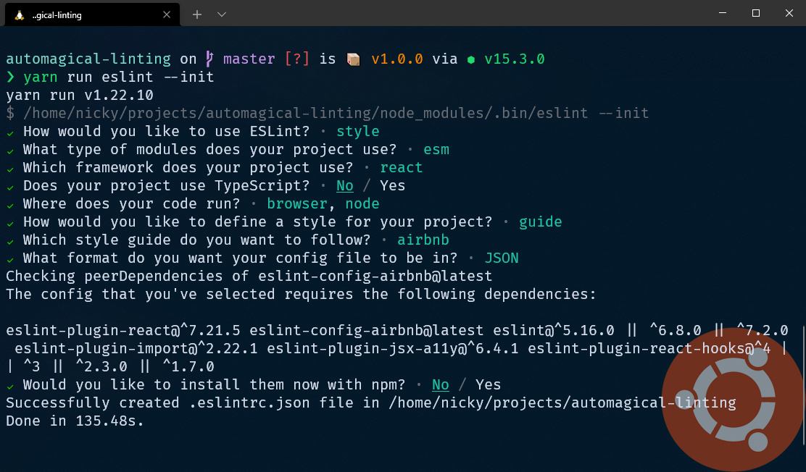

Setting up your editor to [lint](<https://en.wikipedia.org/wiki/Lint_(software)>) and format our code automatically leaves you free to think about the functionality of your code. Not whether or not a variable is defined or if you should insert more whitespace.

To achieve this goal for a JavaScript project, you can use 2 powerful tools.

- The linting part can be handled by [ESLint](https://eslint.org/)
- The formatting part can be handled by [Prettier](https://prettier.io/)

On their own, those tools are very powerful.  
Combined, they will make you feel like you have superpowers.

## Initial Setup

If you want to follow along and try this on a new project, this guide will use a [Gatsby](https://www.gatsbyjs.org/) site.

```sh
npx gatsby new automagical-linting
cd automagical-linting
```

After bootstrapping the project, open an editor in the newly created directory and delete some files you won't use: `yarn.lock` (or `package-lock.json`) and `.prettierrc` (those options can live inside another configuration file).

We'll install everything we need locally, as a devDependency.
That way the machine we develop on doesn't matter and we avoid the _"works on my machine"_-factor.
Don't worry, there's no magic here, I'll briefly explain what each package does.

<Aside>
  "devDependencies": Packages that are only needed for local development and
  testing.
</Aside>

## Starting with ESLint

Start with installing the main linting package, [ESLint](https://www.npmjs.com/package/eslint).

```bash
npm i eslint -D
# or
yarn add eslint -D
```

Follow that up by installing the main formatting package, [Prettier](https://www.npmjs.com/package/prettier).

```bash
npm i prettier -D
# or
yarn add prettier -D
```

The Gatsby project comes with `prettier` pre-installed.
That means, if you are following along, that last step was optional. Totally fine, we just made _really_ sure it's there.

<Aside>For non-Gatsby projects, installing prettier is not optional.</Aside>

Next, initialize ESLint.
The initialization will ask you a couple of questions and set up a configuration file that reflects your answers.

```bash
npx eslint --init
# or
yarn eslint --init
```



Here are the choices I made:

- How would you like to use ESLint?  
  To check syntax, find problems, and enforce code style
- What type of modules does your project use?  
  JavaScript modules (import/export)
- Which framework does your project use?  
  React
- Does your project use TypeScript?  
  No
- Where does your code run?  
  Browser, Node
- How would you like to define a style for your project?  
  Use a popular style guide
- Which style guide do you want to follow?  
  Airbnb: https://github.com/airbnb/javascript
- What format do you want your config file to be in?  
  JSON
- Would you like to install them now with npm?  
  No

This process will create a `.eslintrc.json` file in the root folder of the project.

Because I used `yarn` instead of `npm`, I chose not to install the extra needed packages with npm.

If you also answered no, install the needed packages manually.
In my case that meant installing everything `eslint-config-airbnb` needs with `yarn`.

```sh
npx install-peerdeps --dev --yarn eslint-config-airbnb
```

### Running ESLint

Any JavaScript file can now by linted by running `eslint <path>`.
The rules to follow are determined by that `.eslintrc` file.

To check every file in the `src` folder against the rules set by that config file:

```sh
npx eslint src
# or
yarn eslint src
```

Lots of errors! Oh no!

These are all related to rules the `airbnb` styleguide sets.
Since the project was bootstrapped as a default Gatsby project, everything works and the errors are mainly related to formatting.

We'll configure the rules to our liking later.
First, it's time to add the main formatting package to the mix!

### Adding the power of Prettier

#### Using Prettier through ESLint

Next up is the [Prettier plugin package for ESLint](https://github.com/prettier/eslint-plugin-prettier)

```bash
npm i eslint-plugin-prettier -D
# or
yarn add eslint-plugin-prettier -D
```

This will run Prettier as an ESLint rule and reports differences as individual ESLint issues.

To use it we'll add `"prettier"` to the `"plugins"` array and report any differences as an error by setting the `prettier/prettier" rule.

```json
"plugins": [
  "react",
  "prettier"
],
"rules": {
  "prettier/prettier": "error"
}
```

#### Prevent conflicts between ESLint and Prettier

The problem we are faced with if we combine ESLint and Prettier is: both tools have significant overlap.
Some rules exist in both packages, causing conflicts between the two.

To prevent the conflicts we'll install and configure the [Prettier config package for ESLint](https://github.com/prettier/eslint-config-prettier).
This package disables all formatting-related ESLint rules.

```bash
npm i eslint-config-prettier -D
# or
yarn add eslint-config-prettier -D
```

To use it, add `"prettier"` to the `"extends"` array in the `eslintrc` file.
Since this project uses React, and the AirBnb styleguide we installed uses `eslint-plugin-react`, we also want to disable formatting rules that are specific to React.

Some more extra configurations are listed in the [README](https://github.com/prettier/eslint-config-prettier#installation) for this package. (e.g. vue/flowtype/unicorn)

The `.eslintrc.json` now has this `"extends"` array.

```json
  "extends": [
    "plugin:react/recommended",
    "airbnb",
    "prettier",
    "prettier/react"
  ],
```

<Aside>
  Make sure the "prettier" rules are last, that way they overwrite previous
  configurations.
</Aside>

### Dictating our own rules

While the Airbnb configuration contains an excellent set of rules, we'll make this linting/formatting setup our own and use the existing configuation as a starting point.

#### Prettier configuration

Let's add some rules specific to Prettier to our ESLint configuration.

```json
"prettier/prettier": [
  "error",
  {
    "endOfLine": "lf",
    "semi": false,
    "singleQuote": false,
    "tabWidth": 2,
    "trailingComma": "es5"
  }
]
```

<Aside>
  If you prefer to set these rules via a `.prettierrc` file, that's possible
  too.
</Aside>
<Aside>
  Prettier rules specified in the `.eslintrc` file like this will overwrite ones
  in a `.prettierrc` file.
</Aside>

#### More ESLint configuration

If you are planning to use React hooks in your project, adding `"airbnb/hooks"` to the `"extends"` array enforces the [Rules of Hooks](https://reactjs.org/docs/hooks-rules.html).

Next we'll override some of the rules set by the Airbnb styleguide by adding some entries to the `"rules"` object.

```json
"react/jsx-filename-extension": [
  "error",
  {
    "extensions": [
        ".js",
        ".jsx"
    ]
  }
],
"react/prop-types": 0,
"no-unused-vars": [
  "error",
  {
    "vars": "local",
    "args": "none"
  }
]
```

The code snippets above are examples of what you could do, check out the configuration options for [Prettier](https://prettier.io/docs/en/options.html) and for [ESLint](https://eslint.org/docs/user-guide/configuring) for more information.

## Run the linting setup

If we try to run ESLint on the `src` directory again, all those errors we saw before are now gone!

```sh
npx eslint src
# or
yarn eslint src
```

We set up the rules to be compatible with the style the Gatsby project was bootstrapped with. Let's introduce some differences!

I like semicolons, so I changed the `"prettier/prettier"` rule to require them.

Running the same command now reports a bunch of errors.
Fixing them all manually is a chore, luckily this is something that is automatically fixable.

```sh
npx eslint src --fix
# or
yarn eslint src --fix
```

BOOM, all done!
This was a rule specific to Prettier, but many errors originating from ESLint-specific rules are also automatically fixable!

## A tighter feedback loop: editor configuration

While this is very powerful, faster feedback would be very useful.
I'm using [Visual Studio Code](https://code.visualstudio.com/) as editor, so that's the one I'll cover here.
The same result can be achieved in many other editors.

### Editor plugin

Install the [VSCode ESLint extension](https://marketplace.visualstudio.com/items?itemName=dbaeumer.vscode-eslint).

This extension will display those errors right inside the editor, with squiggly lines underneath the detected problems.
A huge step up from the output we saw in the terminal!


### Automatically fix issues on save

We can take it a step further and make VSCode perform linting and formatting tasks each time a file is saved.

Go to the user-settings (`file > preferences > settings`)

<Aside>
  I prefer to keep these settings in the "workspace" tab so they are specific to
  this project.
</Aside>

- Tell VSCode to format the document every time we save a file.
- Explicitly disable fomatting for javascript files, as we will format through ESLint.
- Run ESLint on each save (with the `--fix` flag).
- Tell ESLint to always show us its status to stay informed.

```json
"editor.formatOnSave": true,
"[javascript]": {
  "editor.formatOnSave": false
},
"editor.codeActionsOnSave": {
  "source.fixAll.eslint": true
},
"eslint.alwaysShowStatus": true,
```

After reloading the editor, go to a `.js` file and try out your fancy new setup!

Try writing the follow snippet and save the file.

<!-- prettier-ignore -->
```js
var num=1
var newNum=num+5;;
```

It will turn into

```js
const num = 1;
const newNum = num + 5;
```

The whitespace and semicolons were handled by the Prettier plugin.
The `var`s turned into `const`s because of the [no-var rule](https://eslint.org/docs/rules/no-var) that was enabled.

#### Bonus: Prettier VSCode extension

Prettier is now integrated into our ESLint setup.
That only applies to `.js` files.

Prettier also supports other languages!

To use the formatting power of Prettier on other languages, you can install an editor extension for Prettier.

[VSCode Prettier extension](https://marketplace.visualstudio.com/items?itemName=esbenp.prettier-vscode)

Since we set up Prettier to run through that ESLint plugin we installed previously, disable the editor extension for `.js`.
Otherwise, the editor extension and the ESLint plugin might have a fight ~~for world domination~~.

That can be done by adding this line to the VSCode settings

```json
"prettier.disableLanguages": [
  "js"
]
```

Now Prettier wil run on all file formats it supports except for JavaScript, those files will be handled by our ESLint setup.

Try writing a `.css` file that's badly formatted.
I went into the `index.css` that came with this Gatsby project and changed the first lines to:

<!-- prettier-ignore -->
```css
html {  font-family: sans-serif; -ms-text-size-adjust: 100%;
  -webkit-text-size-adjust:100%
}
```

Save the file and POW, automatic formatting.

```css
html {
  font-family: sans-serif;
  -ms-text-size-adjust: 100%;
  -webkit-text-size-adjust: 100%;
}
```

## Automagical linting

We successfully set up ESLint to work together with Prettier.
We get notified in our editor about linting problems that ESLint picks up and about formatting problems that Prettier picks up.
Each time we save a `.js` file those 2 packages will work together and fix all the issues that they can (as it turns out, that's quite a lot of them).

Go and write some beautiful code!
