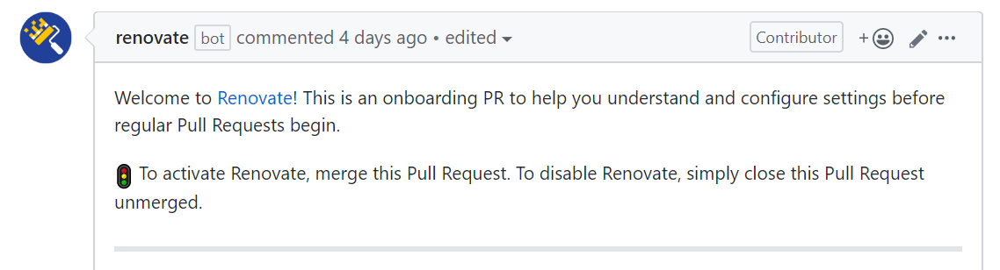
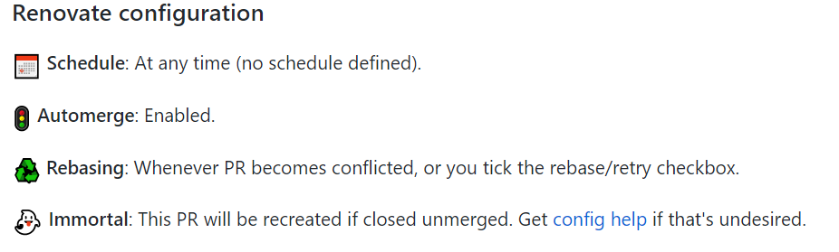
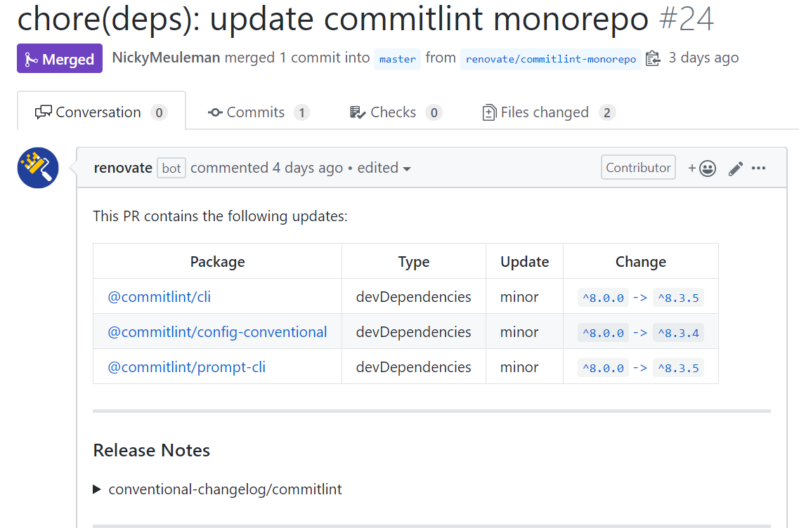

<!-- Photo credit: Kalexanderson on Visualhunt / CC BY-NC-ND -->

Staying up to date with every dependency your project uses quickly turns into a chore.
It's a never-ending stream of new releases. Some of them will *just work*™️, while others need certain changes in order not to break everything.

For that reason, a lot of projects get stuck using outdated versions of dependencies. A compounding problem, because updating package `B` is often not possible because package `A` uses an old version.

The solution? **Automation**.

Getting as many updates as possible done without human intervention.
That way, when an update does require some manual changes, those humans are less likely to be sick and tired ~~of always being sick and tired~~ of updating packages.

<YouTube youTubeId="HzfyCuPVpCY" skipTo={{ h: 0, m: 1, s: 4 }} />

Kent C. Dodds wrote an awesome blog post that [makes a case for automation](https://kentcdodds.com/blog/automation).

## Renovate bot

[Renovate](https://github.com/renovatebot/renovate) is a tool that handles that automation.

## Add the Renovate App

The most straightforward way to start using Renovate is to use one of their hosted apps.
They have a [GitHub app](https://github.com/marketplace/renovate) and a [GitLab app](https://gitlab.com/renovate-bot).  
If that's not applicable for you, they also have a way to [self-host](https://www.npmjs.com/package/renovate#self-hosting) the service.

I'm using GitHub, so I installed the app from the marketplace (don't worry, it's free).
After choosing to enable it for a specific repository I got a <abbr title="pull request">PR</abbr> that added the custom configuration file to the repository.



## Customize

By default, that PR adds a `renovate.json` that uses all the default settings.
This translates to a file with a single line in it.

```json
{
  "extends": ["config:base"]
}
```

This is the point in time where spending some time on the [renovate documentation site](https://docs.renovatebot.com/) becomes _very_ helpful.

By default renovate will make PRs to your repository with updates to packages that need them.

You often have more than 1 PR with an update simultaneously.
If you use a [lockfile](https://classic.yarnpkg.com/en/docs/yarn-lock/) like `yarn.lock` or `package-lock.json`, merging one PR means changing your lockfile.

This will lead to a merge conflict in other PRs.
Renovate can handle this by automatically rebasing the PRs, keeping them up to date with the current state (of the master branch).

The rebase strategy is controlled by the value `"rebaseWhen"` has in your config.

```json
"rebaseWhen": "auto"
```

### Reducing noise

This setup automates a part of the (staying up to date with packages) process, but still creates a _lot_ of noise.

Merging all those PRs can get overwhelming, and could also start to feel like a chore. Putting us back at square one.

#### Schedule

Renovate can work on a schedule.
This means PRs will only get generated at predefined times.

The `"schedule"` options takes an array of strings.

```json
"schedule": ["every weekend"],
```

Those strings are parsed with [later.js](https://bunkat.github.io/later/).

> NOTE: Renovate won't rebase unless it's in schedule.
> This often means, if you are using a schedule, you have to set that schedule to be a range of time and merge PRs within that time.

> NOTE: Automerging, mentioned below, lessens that problem-point with schedules.

#### Automerge

To quote the docs:

> Every time you click Merge on a Renovate PR without manually testing it, you should consider if you can enable automerge and save yourself the time in future.

To automatically merge PRs with passing tests, add the following option:

```json
"automerge": true
```

You can see the status of `"automerge"` on a PR in the PR-text.



> NOTE: if you have no tests but still want Renovate to automerge, you need to add `"requiredStatusChecks": []` to your configuration.

> ASIDE: you should add tests 😉 (to run on PRs)

#### Grouping

Updates to packages from the same [(known) monorepo](https://docs.renovatebot.com/presets-monorepo/) are grouped into a single PR by default.

This happens because the base config extends `"group:monorepos"`.

This results in PRs like the one in the picture below, where all packages from `@commitlint` are grouped together.



It is possible to go even further by more aggressively grouping things.  
It makes sense to update all packages with `eslint` in the package name together.
Even if those don't all come from the same source/organization/person.

```json
{
  "packagePatterns": ["eslint"],
  "groupName": "eslint"
}
```

> CAUTION: By grouping them you are increasing the chance that grouped PR with the updates will break something.  
> If all those packages were ungrouped, you could merge the ones that didn't break something and figure out what causes the breaks you see.  
> In practice, many packages update together and are meant to be used together with an update from another package.

#### Still too noisy?

GitHub sends you a message when a PR is created and when it is merged.  
So even automatically merged PRs send you 2 notification.

Consider adding `"automergeType": "branch"` to your config.  
Maybe only for minor/patch updates. (combine with the `"packageRules"` array)

That option merges the created braches with the updates directly into master without raising a PR first.

The tests still need to pass before the branch is merged into master.
If the tests fail, a PR is made anyway.

### Not every package is equal.

What if you want to apply different settings to different packages?

Automerging is nice, but I'd prefer to look at every major upgrade first, regardless of passing tests.

The `"packageRules"` option enables this!
There, you can overwrite setting for specific cases.

This is the full `renovate.json` for [my site](https://github.com/NickyMeuleman/nicky-blog).

```json
{
  "extends": ["config:base", "group:monorepos"],
  "includePaths": ["package.json"],
  "schedule": ["every weekend"],
  "semanticCommits": true,
  "rangeStrategy": "bump",
  "rebaseLabel": "rebase",
  "rebaseWhen": "auto",
  "requiredStatusChecks": [],
  "packageRules": [
    {
      "updateTypes": ["minor", "patch", "pin", "digest"],
      "automerge": true
    },
    {
      "depTypeList": ["devDependencies"],
      "automerge": true
    },
    {
      "packagePatterns": ["eslint"],
      "groupName": "eslint"
    }
  ]
}
```

Only certain types of package updates are automatically merged. Note the absence of `"major"` in that first `"updateTypes"` array.
Every devDependency is automerged, even if it's a major update.

> ASIDE: Check out [semver](https://semver.org/) for an explanation on update types.

From the docs:

> Important to know: Renovate will evaluate all packageRules and not stop once it gets a first match. Therefore, you should order your packageRules in order of importance so that later rules can override settings from earlier rules if necessary.
