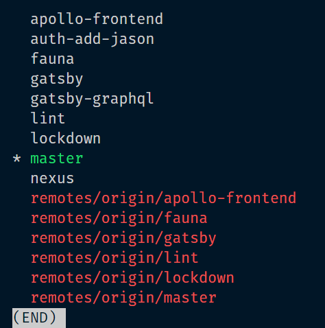

{/* Photo by Markus Spiske on Unsplash */}

After working on a [git](https://git-scm.com/) repository for a while,
chances are high the number of branches that repository has is large.
That number keeps on growing, too!

Time for some housekeeping to reduce that number.

I'm considering the branch named "master" to be the default one.
Likewise, the remote named "origin" is treated as the place where the repository lives on the internet. In my case, [GitHub](https://github.com).

The codesnippets are meant to be ran in the root of the folder which is a git repository.
Start off navigating to the repository you want to clean and switch to the "master" branch.

`git checkout master`

If this repository has a remote, make sure your local version is up to date.

`git pull`

## Overview of existing branches

Before you get started deleting branches, let's view which one there are.

To list all local branches

`git branch`

To list all remote branches

`git branch -r`

To list all branches (local and remote)

`git branch -a`

A picture of all branches in an example repository.



Not every branch that was listed above should be deleted.
The branches that already got merged are probably a good candidate to clean out.

List all local merged branches.

`git branch --merged`

List all local unmerged branches.

`git branch --no-merged`

List all remote merged branches.

`git branch -r --merged`

List all remote unmerged branches.

`git branch -r --no-merged`

## Deleting local branches

### Deleting a single local branch

`git branch -d <branchname>`

In my example project I could delete the branch named `lint` with

`git branch -d lint`

An important note is that the `lint` branch has already been **merged**.
If it wasn't, running that command would throw an error.
Good thing too! Unmerged branches could hold important work.
If you are sure you want to delete an **unmerged** branch:

`git branch -D <branch>`

In my example project I could delete the unmerged branch named `fauna` with

`git branch -D fauna`

### Deleting many local branches at once

Deleting branches one by one gets boring quickly. We're developers, we try not to do repetitive work when we can automate it!

And we can, by piping the output from one command into another.

To delete all merged local branches:

```sh
git branch --merged | egrep -v "(^\*|master|dev)" | xargs git branch -d
```

Let's break it down.

The output from a command is "piped into" the next command with the `|`.
It then serves as the input for the command after the `|`.

`git branch --merged`: Lists all local branches that have been merged.

`egrep -v "(^\*|master|dev)"`: Excludes the branches named "master" and "dev".

`xargs git branch -d`: Deletes every remaining git branch.

If you wish to completely clean house and delete unmerged branches, change `--merged` to `-no--merged` and change the lowercase `-d` to the uppercase `-D`.

```sh
# DANGER! Only run these if you are sure you want to delete unmerged branches.
# delete all local unmerged branches
git branch --no-merged | egrep -v "(^\*|master|dev)" | xargs git branch -D
# delete all local branches (merged and unmerged).
git branch | egrep -v "(^\*|master|dev)" | xargs git branch -D
```

## Deleting remote branches

### Deleting non-existent tracking branches

You might have branches locally that have since been deleted remotely.

`git remote prune <remote> --dry-run`

This command will list all branches that were set up to follow remote branches if that remote branch has been deleted.
To delete the branches it listed, leave off the `--dry-run`.

In my example project with the single remote named "origin" that becomes

`git remote prune origin`

That deleted the branches `remotes/origin/apollo-frontend` and some others for me. Those were deleted on GitHub, but not locally.

### Deleting a single remote branch

`git push <remote> --delete <branch>`

In my example project I could delete the branch `remotes/origin/lint` with

`git push origin --delete lint`

This will work for both merged and unmerged branches, but only for branches you own!

### Deleting many remote branches at once

To delete all merged remote branches:

```sh
git branch -r --merged | egrep -v "(^\*|master|dev)" | sed 's/origin\///' | xargs -n 1 git push origin --delete
```

Let's break it down.

The output from a command is "piped into" the next command with the `|`.
It then serves as the input for the command after the `|`.

`git branch -r --merged`: Lists all remote branches that have been merged.

`egrep -v "(^\*|master|dev)"`: Excludes the branches named "master" and "dev".

`sed 's/origin\///'`: The previous command returns strings of the form "origin/&lt;branch&gt;". This filters the "origin/" out.

`xargs -n 1 git push origin --delete`: Deletes every remaining git branch.

Like with local branches, if you wish to completely clean house and delete unmerged branches, change `--merged` to `--no-merged`.

```sh
# DANGER! Only run these if you are sure you want to delete unmerged branches.
# delete all remote unmerged branches
git branch -r --merged | egrep -v "(^\*|master|dev)" | sed 's/origin\///' | xargs -n 1 git push origin --delete
# delete all remote branches (merged and unmerged).
git branch -r | egrep -v "(^\*|master|dev)" | sed 's/origin\///' | xargs -n 1 git push origin --delete
```
