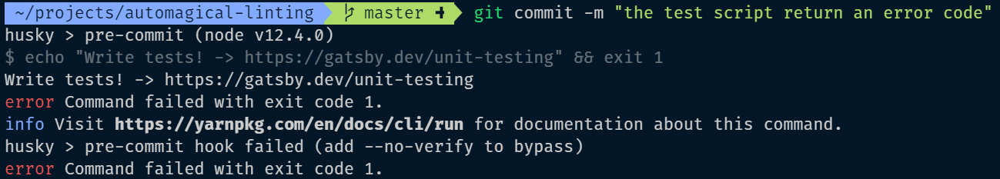
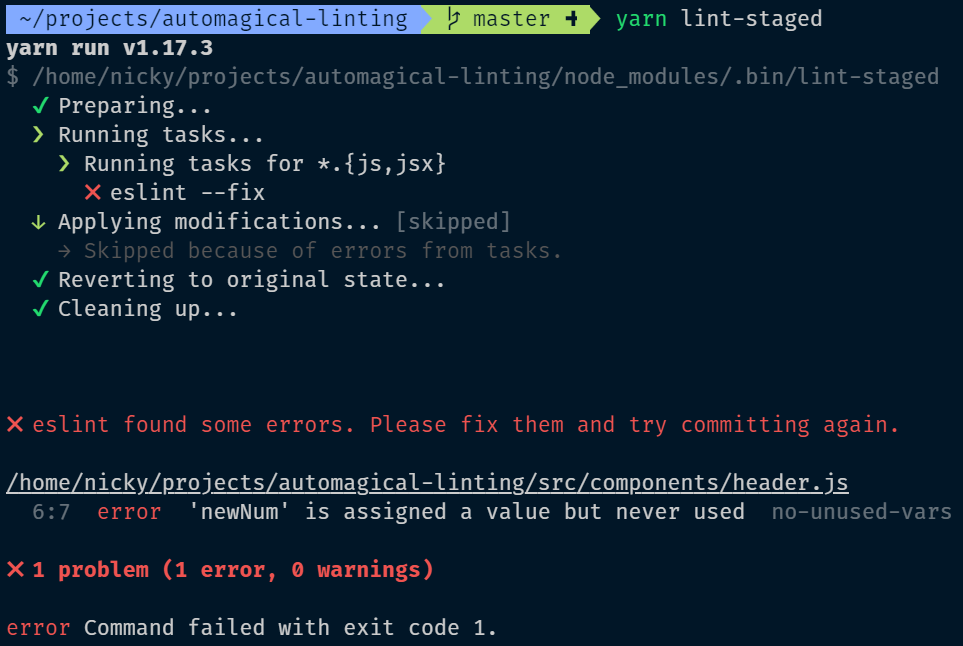
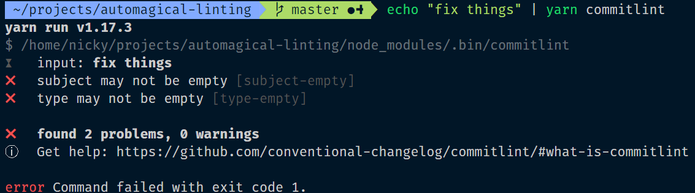

<!-- Photo by Christian Derick Fernandez on Unsplash -->

Automation shines when it's ...well... automatic.

Git hooks allow you to run some code on specific triggers.
At certain points during the git lifecycle, a trigger happens and the code associated with that trigger runs.

I think of it like automated sliding doors.
When the sensor sees you, the doors open.

For example: Running a [linting/formatting](/blog/automagically-lint) command just before you `git commit` would use the `pre-commit` git hook.

<Aside>Every project using git can take advantage of git hooks</Aside>

Those hooks are scripts located in the `.git/hooks` directory.
By default, the files there are bash scripts, but the only requirement is that the file is executable.

<Aside>
  The git documentation website lists{" "}
  <a href="https://git-scm.com/docs/githooks">all the available git hooks</a>.
</Aside>

Sharing git hooks with other people without any tools is quite cumbersome. The `.git` directory is not part of the git repository, kinda (how meta).
Making sure everyone uses the same hooks and has the required local tools to run them, quickly becomes a chore.

## Husky

[Husky](https://github.com/typicode/husky) is a tool that makes it convenient to define and share git hooks in a JavaScript project.

### Install

```bash
npm i husky -D
# or
yarn add husky -D
```

### Configure

After installing the tool, create a file called `.huskyrc.json` in the root of the project.
That file will hold the configuration for this tool.

<Aside>
  Supplying that configuration in the `package.json` file is also possible.
</Aside>

```json
{
  "hooks": {
    "pre-commit": "npm test"
  }
}
```

### Use

The `pre-commit` hook will trigger every time code is commited to the (local) repository.
The commit will only go through if the script (`npm test` in this case) returns without a failure.

When using a `pre-commit` hook, everytime you commit you can sing:
🎵 A full commitment's what I'm thinking of. 🎵

<YouTube youTubeId="dQw4w9WgXcQ" skipTo={{ h: 0, m: 0, s: 27 }} />

The image below shows the terminal output when trying to commit to a freshly bootstrapped Gatsby app.
The `test` command that is ran during `pre-commit` exits with a `1`, signalling an error.
This failure prevents the commit from being applied.



## Lint-staged

The [`lint-staged`](https://github.com/okonet/lint-staged) tool allows you to execute a script with a list of staged files as an argument.

<Aside>
  Don't let the "lint" in the name confuse you. While linting is a very popular
  usecase for this package, it certainly isn't the only one!
</Aside>

### Install

```bash
npm i lint-staged -D
# or
yarn add lint-staged -D
```

### Configure

After installing the tool, create a file called `.lintstagedrc.json` in the root of the project.
That file will hold the configuration for this tool.

<Aside>
  Supplying that configuration in the `package.json` file is also possible.
</Aside>

From the docs:

> Configuration should be an object where each value is a command to run and its key is a glob pattern to use for this command. This package uses [micromatch](https://github.com/micromatch/micromatch) for glob patterns.

```json
{
  "*.{js,jsx}": "eslint --fix"
}
```

The config above will take each staged file that ends in `.js` or `.jsx` and add them as arguments to the `eslint --fix` command.

<Aside>
  Learn how to integrate [Prettier](https://prettier.io/) into
  [ESLint](https://eslint.org/) in my [automagically
  lint](/blog/automagically-lint) blogpost.
</Aside>

If `iLikeTurtles.js` and `Boop.jsx` were changed, saved, and `git add`ed, this would result in the following command:  
`eslint --fix iLikeTurtles.js Boop.jsx`.

After that command successfully completes, the (possibly altered) files will be `git add`ed again.

### Use

```bash
npx lint-staged
# or
yarn lint-staged
```

As example, below is a (badly formatted) piece of code that was added to git before running `lint-staged`.

<!-- prettier-ignore -->
```js
var num=1
var newNum=num+5;;
```

The `eslint --fix` command that is ran during `lint-staged` exits with a `1`, signalling an error.
This failure causes `lint-staged` to fail and also exit with a `1` code.

<Aside>
  On failure, the changes were reverted, that means the piece of code was not
  formatted!
</Aside>



### Automate

This presents an ideal usecase for automation.

By combining [husky](https://github.com/typicode/husky) and [lint-staged](https://github.com/okonet/lint-staged).
Right before committing, a piece of code can be executed that is designed to run on every staged file (e.g `eslint`).

This can be done by editing `.huskyrc.json` to execute `lint-staged` on the `pre-commit` trigger.

The commit will only go through if the script (`lint-staged` in this case) returns without a failure.

```json
{
  "hooks": {
    "pre-commit": "lint-staged"
  }
}
```

This setup will only lint files that are about to be committed, saving time, as linting an entire project can take a long time.

## Commitlint

The [`commitlint`](https://github.com/conventional-changelog/commitlint) tool allows you to execute a script that checks a string and applies some rules to it.

As the name suggest, this tool is often used to check commit messages.

The tool can be used to enforce commit messages to meet the standards of the [conventional commit format](https://www.conventionalcommits.org/).
It is often recommended commit messages convey the "Why?" in the title, and the "What?" in the body. The answer to "How?" is visible by looking at the committed code.

Along with increased clarity, using a consistent commit message format [has](https://commitlint.js.org/#/concepts-commit-conventions?id=concept-commit-conventions) [many](https://www.conventionalcommits.org/en/v1.0.0-beta.2/#why-use-conventional-commits) [benefits](https://slides.com/marionebl/the-perks-of-committing-with-conventions#/).

### Install

```bash
npm i @commitlint/config-conventional @commitlint/cli -D
# or
yarn add @commitlint/config-conventional @commitlint/cli -D
```

### Configure

After installing the tool, create a file called `.commitlintrc.json` in the root of the project.
That file will hold the configuration for this tool.

<Aside>
  Supplying that configuration in the `package.json` file is also possible.
</Aside>

Similar to [ESLint](https://eslint.org/) (a linter for JavaScript code), commitlint can be extensively configured.

[Rule documentation](https://github.com/conventional-changelog/commitlint/blob/master/docs/reference-rules.md)

```json
{
  "extends": ["@commitlint/config-conventional"]
}
```

The config above will apply the rules set in [@commitlint/config-conventional](https://github.com/conventional-changelog/commitlint/blob/master/@commitlint/config-conventional/index.js) to every commit message that is checked by commitlint.

### Use / test

Testing a message to see the output can be done by piping the message into `commitlint`:

```bash
echo '<your-commit-message>' | npx commitlint
# or
echo '<your-commit-message>' | yarn commitlint
```

The image below shows the terminal output when checking a string (that does not follow the rules we set) with commitlint.



### Automate

The linting of commit messages is another ideal usecase for automation with git hooks.

By combining [husky](https://github.com/typicode/husky) and [commitlint](https://github.com/conventional-changelog/commitlint).
Right before committing, the attached commit message can be checked.

This can be done by editing `.huskyrc.json` to execute `commitlint` on the `commit-msg` trigger.

```json
{
  "hooks": {
    "commit-msg": "commitlint -E HUSKY_GIT_PARAMS"
  }
}
```

The commit will only go through if the script (`commitlint` in this case) returns without a failure.

### CLI-prompt tool

While manually authoring commit messages that adhere to the rules can be done, having a way to guide you when writing commit messages is very useful.

The commitlint CLI-prompt helps with fast authoring of commit messages and ensures they follow those rules.

#### Install

```bash
npm i @commitlint/prompt-cli -D
# or
yarn add @commitlint/prompt-cli -D
```

#### Use

```bash
npx commit
# or
yarn commit
```

To make it easier to use, add this command to the `"scripts"` key of the repository's `package.json`

```json
{
  "scripts": {
    "commit": "commit"
  }
}
```

Committing to the repository can now be done by executing that script.

The script will take you through an interactive CLI prompt with the following steps:

- type
- (optional) scope
- subject
- (optional) body
- (optional) footer

Each step will display the amount of characters that are left until the maximum length (set in the rules) will be reached.
If you type `help`, if applicaple, the available commands for that step will be listed.

e.g. typing `help` during the type step shows the correct types to choose from (chore, feat, fix, ...).
Any optional step can be skipped by typing `:skip`.

<Aside>
  An alternative to the commitlint prompt is{" "}
  <a href="https://commitizen.github.io/cz-cli/">commitizen</a>
</Aside>

## Conclusion

Git hooks are a useful method to automate workflows and enforce code standards.
All git repositories (regardless of the language they are written in) can use them.

Taking a JavaScript project as example, the [husky](https://github.com/typicode/husky) package provides a convenient way to share a specific hooks setup with everyone that clones that repository.

Code linting and formatting standards are enforced by using [lint-staged](https://github.com/okonet/lint-staged).

Commit message standards are enforced by checking the message with [commitlint](https://github.com/conventional-changelog/commitlint).

Have any ideas to further automate workflows (with git hooks)?
Please let me know [on twitter](https://twitter.com/NMeuleman)!
