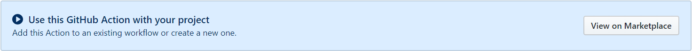
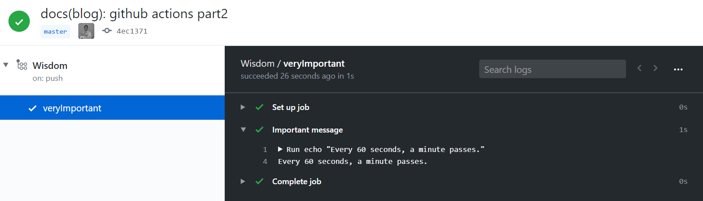
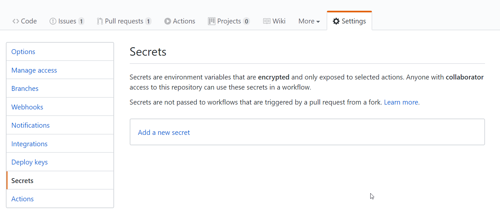

GitHub Actions provide a way to automate several workflows/tasks.

GitHub Workflows allow you to run a workflow on specific triggers.

A trigger happens, and the workflow associated with that trigger runs.
You can configure a workflow to start when a GitHub event occurs, on a schedule, or from an external event.

<Aside>
  The GitHub Action docs have a{" "}
  <a href="https://help.github.com/en/actions/reference/events-that-trigger-workflows">
    list of all triggers
  </a>
</Aside>

Like [git hooks](/blog/git-hooks), I think of it like automated sliding doors. When the sensor sees you, the doors open.

Some examples of things to do in a workflow: [deploying](https://lannonbr.com/blog/2020-03-31-github-actions-deploy-to-netlify/) a website, [testing](https://lannonbr.com/blog/2020-03-30-github-actions-ci-tests/) a codebase, [bundling/compiling](https://lannonbr.com/blog/2020-02-23-github-actions-webpack/) some sourcecode, ...

## Is it Workflows, or Actions?

While the branding focusses on the term "Actions", what the section above described were Workflows.

<Aside>TL;DR: Workflow big, Action small.</Aside>

A **workflow** is the entire process that performs certain tasks in response to a trigger.
Workflows are made up of one or more jobs.

A **job** is a named set of steps, completing all steps completes that job.

A **step** is the smallest piece in this chain.
That step executes a single (terminal) command, or an **action**.

<Aside>Actions are a collection of individual task you can combine.</Aside>

## Workflows

These workflows are described by `.yml` files located in the `.github/workflows` directory.

Those files describe exactly how that workflow runs and can contain a bunch of logic that defines when/if certain things happen.
By default, Workflows will run on a machine hosted by GitHub (called a [**runner**](https://help.github.com/en/actions/getting-started-with-github-actions/core-concepts-for-github-actions#github-hosted-runner)).

Workflows can run in Linux, macOS, Windows, and containers.
Alternatively, you can also [host your own runners](https://help.github.com/en/actions/hosting-your-own-runners/about-self-hosted-runners) to run workflows on machines you own or manage.

Using GitHub Actions is free for public repositories, private repositories include some free usage minutes by default.
For more details, check out the [pricing page](https://help.github.com/en/github/setting-up-and-managing-billing-and-payments-on-github/about-billing-for-github-actions).

<Aside>
  Workflows are specific to a repository, so forking a repository doesn't mean
  the workflows will work.
</Aside>

The [GitHub Marketplace](https://github.com/marketplace?type=actions) is a central location to find, share, and use Actions built by the GitHub community.

The [official actions](https://github.com/actions) are opensourced.
When you visit a repository for an action, a banner invites you to use it in your **Workflows**.



## First Github Workflow

Create a `.github/` folder at the root of a (GitHub) repository.
Create a `workflows/` folder inside.

YAML files inside will describe GitHub Workflows.
A repository can have more than one workflow, thus, more than one file.

The naming of this file is not important.

<Aside>

I named mine `boop.yml`, just because I could.

</Aside>

The following workflow is a fairly barebones one that doesn't use any **Actions**.
It's named `Wisdom` and executes on every push to the `master` branch.
The **Workflow** has a single **job**, which is (arbitrarily) named `veryImportant` and uses the latest version of Ubuntu as operating system by setting the value of the [`runs-on`](https://help.github.com/en/actions/reference/workflow-syntax-for-github-actions#jobsjob_idruns-on) setting for that job.
The job has a single **step**, that step is named again and executes a command in the terminal of that Ubuntu machine.

```yml title=.github/workflows/boop.yml
name: Wisdom
on:
  push:
    branches:
      - master
jobs:
  veryImportant:
    runs-on: ubuntu-latest
    steps:
      - name: Important message
        run: echo "Every 60 seconds, a minute passes."
```



## A bit more advanced (and serious)

The **Workflow** below automatically builds and deploys my website on every push to the master branch.

It uses [the `checkout` **action**](https://github.com/actions/checkout) to checkout the relevant branch of the repository (in this case, master).

To build (and afterwards deploy) the website, some tools and setup are needed.
Luckily, the GitHub-hosted **runner** comes with some [pre-installed software](https://help.github.com/en/actions/reference/software-installed-on-github-hosted-runners) so I don't have to install everything manually before using it.

<Aside>Among this pre-installed software is a version of Node, and Yarn</Aside>

Some environment variables are needed, to identify which site I'm trying to deploy to, and to determine if I even have the permission to do so.
These tokens are pulled from this repo's secret section on GitHub.

It's not a secret 🐱‍👤 section as in: _shhh, stay very quiet_

It's literally called "secrets" in the GitHub settings



Finally, this workflow uses the [`netlify-cli`](https://docs.netlify.com/cli/get-started/) package through [npx](https://medium.com/@maybekatz/introducing-npx-an-npm-package-runner-55f7d4bd282b) to publish the output from the build step to production.

```yml
name: Continuous Deployment
on:
  push:
    branches:
      - master
jobs:
  deploy:
    runs-on: ubuntu-latest
    steps:
      - uses: actions/checkout@v2
      - name: Install Deps
        run: yarn
      - name: Build Site
        run: yarn build
      - name: Deploy Site
        env:
          NETLIFY_SITE_ID: ${{ secrets.NETLIFY_SITE_ID }}
          NETLIFY_AUTH_TOKEN: ${{ secrets.NETLIFY_AUTH_TOKEN }}
        run: npx netlify-cli deploy --dir=public --prod
```

### Take it up another notch

While YAML is not a fully fledged programming language, you can use it to describe complicated logic to use inside your workflows.
By default, every **job** runs in parallel, but they can be configured to depend on another job and run in series.

[Benjamin Lannon](https://twitter.com/lannonbr) made a lightbulb change color to green or red, depending on the success of a step in a workflow.

### Create your own Action

While there are a bunch of [awesome Actions](https://github.com/sdras/awesome-actions) already out there, the best ones are always the ones you made yourself.
And, [you can totally do that](https://lannonbr.com/blog/2019-08-17-gh-actions-js-actions/)!

That lightbulb that changes color uses the [`lifx-trigger-action`](https://github.com/lannonbr/lifx-trigger-action) Benjamin wrote himself!

### Artifacts

During these workflows, some file may be created as a result of building/testing/...
For example: screenshots, a code coverage report, a `.json` file filled with links of cute puppies, you name it!

Those files are called **artifacts**
Artifacts are associated with the workflow run where they were created and can be used by another job or deployed.
They can even be [persisted](https://help.github.com/en/actions/configuring-and-managing-workflows/persisting-workflow-data-using-artifacts) and shared between workflow runs.
