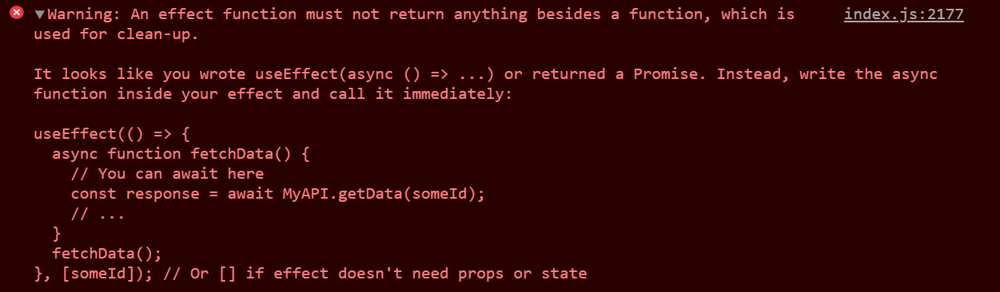

{/\* Photo by Andrea Piacquadio from Pexels \*/}

<Aside>

TL;DR: Error messages are useful. **Read them.**

</Aside>

_"Error messages are pretty scary, right?"_

If you answered with "yes", I'd like to convince you of the opposite.

## Oh, no!

Error messages were something that I did _not_ want to see.
They indicated I did something wrong, that [my code was bad and I should feel bad](https://youtu.be/jG2KMkQLZmI).

That was **wrong**.

> Your code is not garbage.
>
> <footer>
>
> [Jason Lengstorf and Chris Biscardi (on the
> LWJshow)](https://www.twitch.tv/jlengstorf/clip/KitschySteamyPicklesKippa)
>
> </footer>

While errors used to exclusively cause a sense of dread and frustration. Now they are often a source of relief, provide an answer to questions, etc.

Don't get me wrong. They're still a source of frustration sometimes, and lots of it. Especially when one error is the thing that's preventing you from making progress.

The most annoying error messages are the ones that don't tell you anything other than "stuff broke".

<Tweet tweetLink="EmmaBostian/status/1247478166777663488" theme="dark" />

## Gather information

When you see error messages, **READ THEM**.

Error messages are an invaluable tool to help you figure out what went wrong.
They are not only telling you there is an issue, they are also the first step to fixing that issue!

<Tweet tweetLink="markdalgleish/status/1162112105564143616" theme="dark" />

<Tweet tweetLink="waterproofheart/status/1298940388959490048" theme="dark" />

Error messages often contain a lot of relevant info. If they don't tell you exactly what's wrong or how to fix it. Good ones will at least point you in the right direction.

When presented with an error message, extract as much information as possible from it.
Make an effort to understand what it's telling you.

### Again, and again

You will read code more often than you write code.
For error messages, this is even more true.
(How can something be more true than true? That's not possible. These questions keep me awake at night.)

Learn by having lots of exposure to errors.
That's how I learn most about programming: by making mistakes, by deliberately breaking things.

Being perfect and following along with tutorials doesn't expose you to a wide variety of errors.
Those hold valuable [understanding](https://swizec.com/blog/why-understanding-beats-knowledge/).

### Context

Context is important.
The more context you have, the better.

- What language are you using, what framework?
- Which version of that framework?
- Are you on Windows, Mac, Linux, ...?
- Which browser are you using?
- ~~What did you eat for breakfast?~~

A lot of that information might not be relevant to the exact problem you're having. Still, having more information is often better than less.

That's why a lot of open source projects require you to provide this information when you submit a bug.
It _might_ be relevant.

If you know a lot about what you are doing, the source of an error message may be clear to you.
Whereas if you dove in without context, the error message might have been indecipherable.
This ties into the next tip, keeping the feedback loop short.

### Keep the feedback loop short

Try to keep the time between writing code, and discovering an error that code caused as short as possible.
The moment right after you write a bug, is the best moment to see the error it caused. It's the moment where you'll have the most [context](#context).

Luckily, a lot of workflows include tools to provide you with feedback as quickly as possible.

In web development, that might take the form of an automatically reloading web browser, showing you the results of the code you wrote.
It might be powered by [browsersync](https://www.browsersync.io/), or a fancy setup using [React Native fast refresh](https://reactnative.dev/docs/fast-refresh).  
What matters is the code you just wrote is getting executed and you will be presented with any errors it may cause quickly.

### Scroll up

When faced with multiple errors, the top one will usually provide you with the most relevant information.

<Aside variant="info">

The same rule of thumb often applies within a single error too, with the top lines being the most relevant ones.

</Aside>

If one thing is broken, that might cause other things to break (and show errors).
Fixing the original problem will then also solve the other errors.

Ofcourse this isn't always the case.
Even if it's not, tackling errors one at a time, starting with the oldest one is useful.

When you try to fix a lot of things at once, it becomes next to impossible to predict which impact a specific change had.
Did it fix it, or did you create a whole new problem?

Tackling one error at a time, and making small changes, can prevent that issue. While [keeping the feedback loop short](#keep-the-feedback-loop-short).

## Reading an error

Consider the following, highly sophisticated piece of code.
I'll use a JavaScript file, executed locally with [node.js](https://nodejs.org/en/)

```js title=error-testing.js numberLines
const corgi = {
  cute: true,
  bark() {
    console.log("woof");
  },
};

function squirrel() {
  console.log("The corgi sees the squirrel");
  corgi.actions.bork();
}

function walk() {
  console.log("Taking a walk, when suddenly, a squirrel appears!");
  squirrel();
}

walk();
```

It has an error, and while it might be easy to spot in this case.
I'll read the error message to figure out what happened.

The following error appeared when I tried executing this code:

```
/home/nicky/error-testing.js:10
    corgi.actions.bork()
                  ^

TypeError: Cannot read property 'bork' of undefined
    at squirrel (/home/nicky/error-testing.js:10:19)
    at walk (/home/nicky/error-testing.js:15:5)
    at Object.<anonymous> (/home/nicky/error-testing.js:18:1)
    at Module._compile (internal/modules/cjs/loader.js:774:30)
    at Object.Module._extensions..js (internal/modules/cjs/loader.js:785:10)
    at Module.load (internal/modules/cjs/loader.js:641:32)
    at Function.Module._load (internal/modules/cjs/loader.js:556:12)
    at Function.Module.runMain (internal/modules/cjs/loader.js:837:10)
    at internal/main/run_main_module.js:17:11
```

### Dissecting the error

The first line tells me 2 things. It happened in the `error-testing.js` file that's in the home folder on my computer.
This is true! I already knew this, because I just made that file and I have that piece of information as [context](#context).

The `:10` tells me this error happened on line number 10.
It shows the piece of code that triggered the error beneath it.
A caret (`^`) is pointing at the exact location the error was triggered.

`TypeError: Cannot read property 'bork' of undefined` tells me which kind of error this is. In this case, a [`TypeError`](https://nodejs.org/api/errors.html#errors_class_typeerror).
Followed by the error message.

<Aside>

The error message is usually the piece of information that'll be the most useful.

</Aside>

The next part is the [stacktrace](https://nodejs.org/api/errors.html#errors_error_stack).

For me personally.
This is what gave errors the scarefactor that made me say: _"I can't understand this, better not read it"_.
They're big, unwieldy, and if you don't know which information they convey, quite indecipherable.

```
at squirrel (/home/nicky/error-testing.js:10:19)
at walk (/home/nicky/error-testing.js:15:5)
at Object.<anonymous> (/home/nicky/error-testing.js:18:1)
at Module._compile (internal/modules/cjs/loader.js:774:30)
at Object.Module._extensions..js (internal/modules/cjs/loader.js:785:10)
at Module.load (internal/modules/cjs/loader.js:641:32)
at Function.Module._load (internal/modules/cjs/loader.js:556:12)
at Function.Module.runMain (internal/modules/cjs/loader.js:837:10)
at internal/main/run_main_module.js:17:11
```

The stacktrace holds a bunch of information about _how_ your program came across the error.
It shows different steps in the code that eventually led to the error.
Each line tracks the error one step backwards, following a chain of function calls, all the way up until the step where I ran the program with [node.js](https://nodejs.org/en/).

The first line tells us that the error was found at `/home/nicky/error-testing.js`.
The `:10:19` makes it even more specific. The error happened at line 10, column 19. In other words on the 10th line, at the 19th character.
Note this is exactly the same place as indicated by the caret (`^`) previously.

The next lines are structured identically, each tracing the error back a step.

It traces the error all the way back from the `squirrel` function, to the `walk` function, and even to the internal code that was used to make this program run.

I'm not going to pretend like I know what's going on in most of those lines, because I don't.

<Aside>

Stacktraces are useful to find out how the code got to the place that produced the error, but in the vast majority of cases you're only interested in the top line(s).

</Aside>

When using frameworks, it is common for stacktraces to filled with lines from deep within that framework.  
Most of the time, it's fine to ignore those and look for the entries that mention code you wrote.
When you need information about the lines from the framework, you'll know.

### Fixing the error

So the message was `Cannot read property 'bork' of undefined`.

Ok, the location pointed me to `corgi.actions.bork()`

The message means `corgi.actions` is `undefined`.
Upon checking, there is no such thing as `actions` on the `corgi` object (and thus, it's `undefined`).

I changed `corgi.actions.bork()` to `corgi.bork()` and ran the code again.

Oh, no! Error again! Another one though. Progress!
This time the error message reads `corgi.bork is not a function`.

Silly me, I made a typo.
There is no `bork` on the corgi object, that's why it's `undefined`! No borking corgis here!

Another change to `corgi.bark()`, no errors, 🎉.

## Google for errors

The error messages alone won't always be enough to figure out what is going on.
Time to consult the biggest repository of knowledge there is, the internet.

[Swyx](https://twitter.com/swyx) shared some of his knowledge and wrote about how to [search for your errors](https://www.swyx.io/writing/how-to-google-your-errors-2l6o).

## TypeScript

[Typescript](https://www.typescriptlang.org/) has an incredibly high spooky-factor 👻.
I avoided seriously trying it for a long time because I was scared.
When I tried it out, it bombarded me with cryptic errors I couldn't understand, and I ran away.
When I tried it again, the same thing happened.
This cycle repeated a few times.

The language [continued growing in popularity](https://2018.stateofjs.com/javascript-flavors/typescript/) and it kept getting better.
One of the big bullet points for a major version release was ["better error experience"](https://devblogs.microsoft.com/typescript/announcing-typescript-3-0/#improved-errors-and-ux).

<Tweet tweetLink="typescript/status/1023972234015076352" theme="dark" />

I tried again, and this time I stuck with it and made effort to understand what errors meant.

I still thought many TypeScript errors were terrible.
Not because of their content, but because of how they are formatted when you see them.

I really liked the promise that you'll see more errors during development, before you even run your code, and less during runtime.

<Tweet tweetLink="swyx/status/1236438657269194753" theme="dark" />

## Examples

### React

[React](https://reactjs.org/) has some really helpful errors.

If you try to pass an asynchronous function to `useEffect`, a helpful error message will tell you exactly what's wrong and even tell you how to achieve what you are trying to do.



Another example is an error that appears when trying to use a [`ref`](https://reactjs.org/docs/refs-and-the-dom.html).

> That big fat error is really helpful:  
> `Warning: Function components cannot be given refs. Attempts to access this ref will fail. Did you mean to use React.forwardRef()?`
>
> <footer>
>
> My [refs in React blogpost](https://nickymeuleman.netlify.app/blog/react-refs#referring-to-a-dom-element-inside-a-react-component)
>
> </footer>

### A pseudo-element

While working on my blog, specifically on the block quotes, the following error messages popped up:

<Aside variant="danger">

<details>

<summary>A long error</summary>

```error
You seem to be using a value for 'content' without quotes, try replacing it with `content: '"'\02014\000A0' "'`
    at render
    at BlockQuote (http://172.30.97.12:8000/commons.js:90414:23)
    at render
    at http://172.30.97.12:8000/commons.js:8083:30
    at wrapper (http://172.30.97.12:8000/commons.js:8078:25)
    at http://172.30.97.12:8000/commons.js:8083:30
    at MDXContent (eval at _construct (http://172.30.97.12:8000/commons.js:4898:21), <anonymous>:33:25)
    at MDXRenderer (http://172.30.97.12:8000/commons.js:32822:20)
    at article
    at render
    at div
    at render
    at main
    at render
    at render
    at Main (http://172.30.97.12:8000/commons.js:9565:23)
    at div
    at render
    at render
    at Layout (http://172.30.97.12:8000/commons.js:91049:23)
    at BlogPostPage (http://172.30.97.12:8000/commons.js:8944:19)
    at BlogPostTemplate (http://172.30.97.12:8000/commons.js:11921:19)
    at AppContainer (eval at ES6ProxyComponentFactory (http://172.30.97.12:8000/commons.js:80179:10), <anonymous>:14:7)
    at HotExportedBlogPostTemplate (eval at ES6ProxyComponentFactory (http://172.30.97.12:8000/commons.js:80179:10), <anonymous>:14:7)
    at PageRenderer (eval at ES6ProxyComponentFactory (http://172.30.97.12:8000/commons.js:80179:10), <anonymous>:14:7)
    at PageQueryStore (eval at ES6ProxyComponentFactory (http://172.30.97.12:8000/commons.js:80179:10), <anonymous>:14:7)
    at RouteHandler
    at div
    at FocusHandlerImpl (eval at ES6ProxyComponentFactory (http://172.30.97.12:8000/commons.js:80179:10), <anonymous>:14:7)
    at FocusHandler (http://172.30.97.12:8000/commons.js:16975:19)
    at RouterImpl (eval at ES6ProxyComponentFactory (http://172.30.97.12:8000/commons.js:80179:10), <anonymous>:14:7)
    at Location (http://172.30.97.12:8000/commons.js:16715:23)
    at Router
    at ScrollHandler (eval at ES6ProxyComponentFactory (http://172.30.97.12:8000/commons.js:80179:10), <anonymous>:14:7)
    at RouteUpdates (eval at ES6ProxyComponentFactory (http://172.30.97.12:8000/commons.js:80179:10), <anonymous>:14:7)
    at EnsureResources (eval at ES6ProxyComponentFactory (http://172.30.97.12:8000/commons.js:80179:10), <anonymous>:14:7)
    at LocationHandler (eval at ES6ProxyComponentFactory (http://172.30.97.12:8000/commons.js:80179:10), <anonymous>:14:7)
    at LocationProvider (eval at ES6ProxyComponentFactory (http://172.30.97.12:8000/commons.js:80179:10), <anonymous>:14:7)
    at Location (http://172.30.97.12:8000/commons.js:16715:23)
    at Root
    at MDXProvider (http://172.30.97.12:8000/commons.js:8068:46)
    at MDXScopeProvider (http://172.30.97.12:8000/commons.js:32388:25)
    at http://172.30.97.12:8000/commons.js:33047:37
    at http://172.30.97.12:8000/commons.js:8051:48
    at MDXProvider (http://172.30.97.12:8000/commons.js:8068:46)
    at MdxEmbedProvider (http://172.30.97.12:8000/commons.js:13194:23)
    at MDXProvider (http://172.30.97.12:8000/commons.js:8068:46)
    at MDXProvider$1 (http://172.30.97.12:8000/commons.js:20426:24)
    at ColorModeProvider (http://172.30.97.12:8000/commons.js:19277:22)
    at BaseProvider (http://172.30.97.12:8000/commons.js:20108:21)
    at ThemeProvider (http://172.30.97.12:8000/commons.js:20120:19)
    at ThemeProvider$1 (http://172.30.97.12:8000/commons.js:23331:19)
    at StaticQueryStore (eval at ES6ProxyComponentFactory (http://172.30.97.12:8000/commons.js:80179:10), <anonymous>:14:7)
    at _default
```

</details>

</Aside>

This time, the first line did not immediately point me to the correct location.

The stacktrace, tracing the error back, says the fauly code passed by `commons.js` at line 90414.
That can't be right. I don't have any file that long.

That incredibly long file is not the code I wrote, but the result of it that runs in the browser.
[Source maps](https://developer.mozilla.org/en-US/docs/Tools/Debugger/How_to/Use_a_source_map) are often used for this reason. They translate the locations in that resulting file back to the original _source_, to the files you wrote.

Luckily, the stacktrace also mentioned `BlockQuote`.

```js hl=8 title=BlockQuote.js
footer: {
    fontSize: 1,
    fontWeight: "bold",
    fontStyle: "normal",
    "::before": {
    // make sure mdash is on same line as footer
    float: "left",
    content: "'\\02014\\000A0' ",
    },
},
```

Oopsie, a space where there shouldn't be one!
Removing that extra space at the end of the value for `content` made the pages using this code render again!

### Styling

Working on my blog again, I was presented with these error messages:

<Aside variant="danger">

<details>

<summary>5 errors</summary>

```error
theme/src/components/BlogPostListPage.tsx:54:15 - error TS2322: Type 'string' is not assignable to type 'SystemStyleObject'.

54 gridTemplateColumns: `1fr`,
~~~~~~~

theme/src/components/BlogPostListPage.tsx:55:15 - error TS2322: Type 'number' is not assignable to type 'SystemStyleObject'.

55 gridGap: 4,
~~~~~~~

theme/src/components/BlogPostListPage.tsx:56:15 - error TS2322: Type 'number' is not assignable to type 'SystemStyleObject'.

56 marginBottom: 3,
~~~~~~~

theme/src/components/BlogPostListPage.tsx:57:15 - error TS2322: Type 'string' is not assignable to type 'SystemStyleObject'.

57 listStyle: `none`,
~~~~~~~

theme/src/components/BlogPostListPage.tsx:58:15 - error TS2322: Type 'number' is not assignable to type 'SystemStyleObject'.

58 padding: 0,
~~~~~~~

Found 5 errors.
```

</details>

</Aside>

At first sight, those messages were quite the unhelpful.
I'm styling lots of things on my site in the same way, and this is wrong. Why?

The error pointed me this this piece of code: an `<ul>` tag styled with [`theme-ui`](https://theme-ui.com/sx-prop/).

```jsx title=BlogPostListPage.tsx numberLines=51
<ul
    sx={{
        display: `grid`,
        gridTemplateColumns: `1fr`,
        gridGap: 4,
        marginBottom: 3,
        listStyle: `none`,
        padding: 0,
    }}
>
```

The problem ended up being the `gridGap`.
It turns out that `gridGap` was not a valid option for the `sx`-object (aka. the `SystemStyleObject` the error mentioned), but `gap` was.

After changing the `gridGap` to `gap`, all was well again.

## Bonus: make errors better

While teaching about [compound components](https://kentcdodds.com/blog/compound-components-with-react-hooks), [Kent C. Dodds](https://twitter.com/kentcdodds) shared an incredibly useful tip.

He made a lot future errors easier to understand by [throwing](https://developer.mozilla.org/en-US/docs/Web/JavaScript/Reference/Statements/throw) an error in the code he wrote.

As a result, a very helpful error message will be shown if the component he wrote is used incorrectly.
If he didn't do this, the resulting error message would be very cryptic and probably cause a lot of frustration for anyone that came across it.

<Tweet tweetLink="NMeuleman/status/1228339002517966849" theme="dark" />

In a different post Kent explained how to make [Jest](https://jestjs.io/) testing errors more useful by [manipulating the stacktrace](https://kentcdodds.com/blog/improve-test-error-messages-of-your-abstractions).
