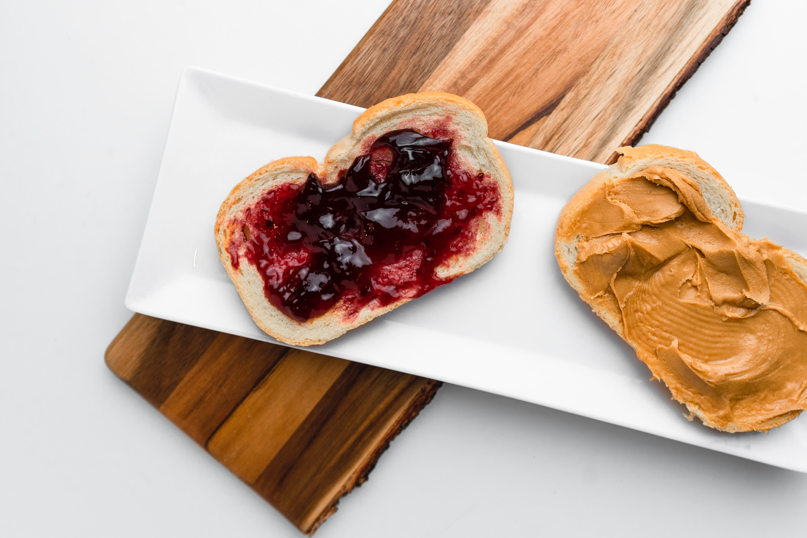
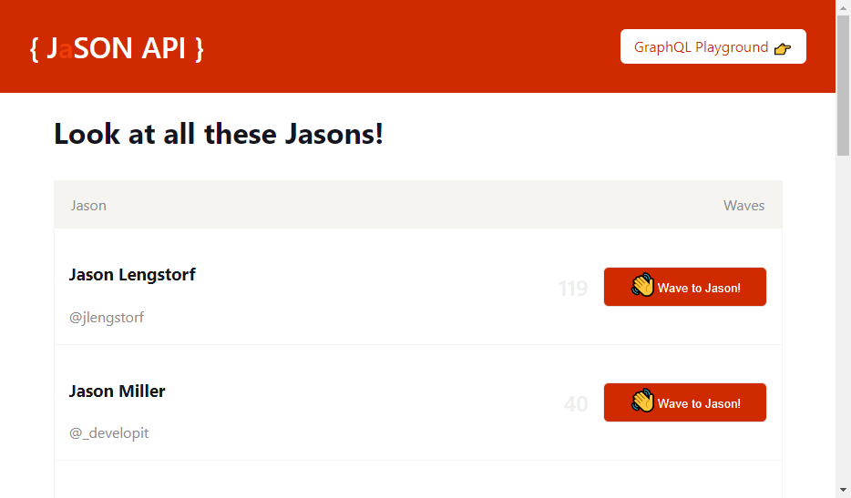

<!-- Photo by Viktor Forgacs on Unsplash -->

The JAMstack has seen a strong [rise in popularity](https://trends.google.nl/trends/explore?date=today%205-y&q=JAMstack).
That term is a way to refer to a certain type of _websites_.
The popularity has risen to the point that there are now [entire conferences](https://jamstackconf.com/) devoted to this method of building websites.

## What is the JAMstack?

The **JAM** acronym stands for **J**avaScript, **A**PIs, and **M**arkup.

JavaScript is the programming language of choice to handle any dynamic programming needs.
APIs are the kind your website talks to over the internet to get a wide variety of tasks done. From gathering data to sending an email.
Markup usually refers to <abbr title="HyperText Markup Language">HTML</abbr>.

### JAMstack is a bad name!?

JAM doesn't mention many of the important/exciting parts.
One of the typical signs of the JAMstack is that there are **no servers**.

The **M**arkup is often **prerendered** during a build step.

<!-- There are loads of tools involved, but ultimately it comes down to HTML, CSS, and JavaScript.
JAMstack embraces those 3. In fact, static generation linked. -->

Before your website is put onto the worldwide web, a process runs that turns your site into a bunch of **static files**.
Those files are then hosted on a <abbr title="Content delivery network">**CDN**</abbr> and served to the world.

Most of those aren't hard requirements for your site to be considered a JAMstack site.
A site that consist entirely out of fully filled-out HTML pages is very JAMstack-y, but HTML that's less filled out is still JAMstack.

<Aside>

The JAMstack is a sliding scale.

</Aside>

Taking that to the extreme. Chris Coyier points out that an HTML document that contains `<div id="root"></div>` and some JavaScript also fits into the JAMstack.

<Tweet tweetLink="chriscoyier/status/1130999825078657024" theme="dark" />

As with many things in life, the answer to the majority of your questions is "it depends".

The same criticism is applicable to the term [serverless](https://css-tricks.com/psa-yes-serverless-still-involves-servers/), that term is also... not great.
JAMstack and serverless are often used together, by the way - like peanut butter and jelly. They each stand well on their own, but are often used together.
More on that below.



<!-- Photo by Freddy G on Unsplash -->

Before I list some advantages and disadvantages. I'd like to qualify all of them with an "It depends" statement. Because the JAMstack is so flexible, many of them might be more/less severe for your specific usecase.

## Upsides

- Performance

Your website is turned into a bunch of static files.
Once the browser receives those files, they turn into a website.
Browsers are good at this, it's what they do.
Those files are typically hosted on a CDN.
That means they are distributed all over the world, ready to go.
If you are in Belgium and visit a site made by someone in the USA, no requests and responses need to travel across the Atlantic ocean.
Chances are those files are available much closer to you.
The combination on files that are **ready to go** with the **proximity** of those files leads to better performance.

- Security

The JAMstack often doesn't use a traditional server.
You don't need to worry about the security of something that doesn't exist.
The use of APIs instead means most of the security concerns lay with the creators of the APIs you consume.

- (Lack of) cost

Hosting is cheap (or even free), if you use the type of JAMstack that prerenders as much as possible, and does the rest of the work on your visitor's machine.

- Scalability

Closely tied to the previous point.
If hosting boils down to getting a collection of files to visitors, scaling becomes a much simpler issue.
Usually, as the developer, you don't even have to care about this. You upload those files to a CDN and sit back while your website about corgis blows up overnight.

- Developer eXperience

Because the JAMstack is so flexible, that comes with a lot of freedom to choose the tools you want to use.
At the end of the ride, a website is made out of JavaScript, CSS, HTML, and media. How you get there is up to you.

- Much more...

<abbr title="Search engine optimization">SEO</abbr> is often very good as a result
of the static nature of many JAMstack sites.

<!-- the hosting part is usually very easy too, example: Netlify -->

## Downsides

It's not all (corgi-)puppies and rainbows.

_If there is such a high emphasis on static files, doesn't that, by definition, prevent **dynamic content**/dynamic behaviour?_
Well, not necessarily. One type of those files are JavaScript files. The **A**PIs in the JAM are a fine way to add a bit of dynamism into the mix.
The degree to which you add that dynamism to the statically hosted assets is up to you.

Many [static site generators](https://serverless.css-tricks.com/services/ssgs/) handle the dynamic behaviour part for you by using popular frameworks.
You get to write in the framework you prefer, and the static generator handles turning your framework code into filled out static files.
On top of that, by using JavaScript, once you open those files in a browser, a process called hydration happens and PRESTO. It's like it isn't a static site at all, but a fully-fledged framework site.
[Gatsby](https://www.gatsbyjs.org/) for [React](https://reactjs.org/) and [Gridsome](https://gridsome.org/) for [Vue](https://vuejs.org/) are two of the most popular <abbr title="static site generators">SSGs</abbr> backed by a framework.
Recently [Scully](https://github.com/scullyio/scully) joined the party as <abbr title="static site generator">SSG</abbr> for [Angular](https://angular.io/).
[Shawn Wang](https://twitter.com/swyx) is working on one for [Svelte](https://svelte.dev/), cleverly named [SSG](https://github.com/sw-yx/ssg).

The generation of the static files has to be repeated when you make a change to the source files.
The **long build times** caused by regenerating those files for an entire site excludes that type of static generation for many large sites.
Imagine if the entirety of amazon.com had to be rebuilt after correcting a spelling error in a single product description somewhere.
[Incremental builds](https://www.netlify.com/blog/2019/01/17/how-to-scale-massive-react-static-sites-with-incremental-builds/) is one way of reducing that pain. It's still very much in the early stages or not available for many <abbr title="static site generators">SSGs</abbr>.

## Overcoming the downsides

This is where serverless shines. Since there is no traditional server, many holes exist that can be plugged by the addition of some serverless functions.

A serverless function is not hosted in a single location.
They complement the JAM. They _pump up_ the JAM.

🎵 Serverless functions don't want a place to stay. 🎵  
🎵 They just get their booty on the floor tonight and make my day. 🎵  
🎵 Make my day, make my, make my, make, make my day. 🎵

<YouTube youTubeId="9EcjWd-O4jI" />

### The data debacle (alliterations are fun)

A specific painpoint I'd like to higlight concerns data.

Consider these two options:

- You use entirely pregenerated data.
- You fetch data when someone visits your site, during client time.

For the first one, the data is right there, ready to go, but it might be stale/outdated by the time anyone views it.

For the second one, the data will be up to date, but during the time it is being fetched your users have to look at a spinner.
If you put in some extra effort they might have to look at a [skeleton state](https://uxdesign.cc/what-you-should-know-about-skeleton-screens-a820c45a571a) instead.

Both outcomes are not ideal.
If your data is entirely static, however, the first option is the obvious best choice.
If you are dealing with (almost) entire dynamic data, the second one is better.

#### Do both

For data where only a part of it changes often, and the rest stays static. Asking for it during both build and client time may be a suiting solution.

When someone visits your website, the data gathered during build time is already there. This results in a smooth and snappy experience where users aren't looking at a circle on their screen, but actual, useful, data.
A part of that data might be stale by the point the user sees it (and this may be represented, for example by a number being grayed out).

That's why that same data is being requested again when you visit the website. As soon as the updated data arrives, it may be swapped out with the (possibly stale) data gathered during build time.

### An example: the JaSON API

The [JaSON API](https://jason-api.netlify.com/) is a joke site I used to explore some exciting JAMstack technologies.

It's a [Gatsby](https://www.gatsbyjs.org/) site that uses the technique described above to fetch data.
That data comes from a [serverless GraphQL](https://nickymeuleman.netlify.com/blog/serverless-graphql/) endpoint.

It lists some people named Jason, optionally displays their twitter handle, and shows the amount of times visitors to the site clicked a button to "wave" to them.
The first two parts of that data rarely change (if at all) and are ideal candidates for static generation.
The amount of waves, however, changes often and should be fetched when a user visits the site.

A React component is responsible for showing the list of Jasons when given an array of data.

```js
<JasonList jasons={jasonArray} />
```

To get the `jasonArray` during build time, the data is gathered from the GraphQL endpoint.

Using [gatsby-source-graphql](https://www.gatsbyjs.org/packages/gatsby-source-graphql/), that query looks like this:

```js
export const GATSBY_QUERY = graphql`
  {
    JasonAPI {
      allJasons {
        id
        name
        twitter
        likes
      }
    }
  }
`;
```

Exactly the same data is requested as soon as someone visits the homepage.

Using [Apollo GraphQL](https://www.apollographql.com/), that query looks like this:

```js
const APOLLO_QUERY = gql`
  {
    allJasons {
      id
      name
      twitter
      likes
    }
  }
`;
```

Notice the resulting data from these queries is _exactly the same_.
The two queries request the same data, and the only difference is _when_ that data is requested.
Be careful the data gathered at client time differs from the data gathered at build time _only a little_.
Otherwise, the experience of swapping the (possibly stale) build data for the up to date client time data might change from smooth and snappy to jarring and flashy.

In the example, the data returned from the GraphQL endpoint always returns in the same order and the only thing that changed is the amount of `likes`.

Because React is smart, it will only update the parts of the <abbr title="Document Object Model">DOM</abbr> that changed.

This is the entire Gatsby page component, where the data gathered by the `GATSBY_QUERY` during build is available on the `data` prop.
The gathering of the data specified by the `APOLLO_QUERY` at client time is handled by `useQuery` from [Apollo hooks](https://www.apollographql.com/docs/react/api/react-hooks/).

```js
const IndexPage = (props) => {
  const allBuildTimeJasons = props.data.JasonAPI.allJasons;
  const { loading, data: apolloData } = useQuery(APOLLO_QUERY);
  const allClientTimeJasons = apolloData.allJasons;
  return (
    <div>
      <h1>Look at all these Jasons!</h1>
      {loading ? (
        <JasonList grayOutWaveCount jasons={allBuildTimeJasons} />
      ) : (
        <JasonList jasons={allClientTimeJasons} />
      )}
    </div>
  );
};
```




### RE:JAMstack

I call this the RE:JAMstack, for Realtime Enhanced JAMstack.

This is a misnomer!
Like every square is a rectangle, but not every rectangle is a square. The pattern doesn't mean the term JAMstack is no longer applicable.

Also, I wanted to annoy anyone screaming _"but that's still JAMstack"_ and am happy to take any opportunity to name a "new" stack, that seems to be a hot trend.

<Tweet tweetLink="GrantGlidewell/status/1198645016509341696" theme="dark" />
