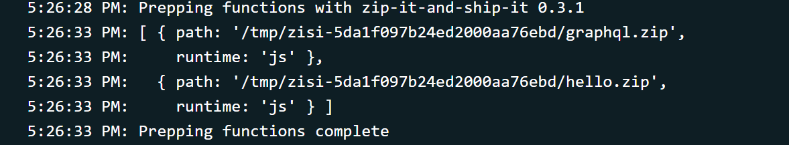

<!-- Photo by Guillaume Bolduc on Unsplash -->

This is a continuation of [From zero to a serverless GraphQL endpoint in a flash](/blog/serverless-graphql). Please read that post first to get up to speed.

Ready? Let's go! 🚀

## Serverless GraphQL using multiple files

We left off at a point where the entire serverless GraphQL endpoint was contained in one file.

That's cool, but a larger API than we have currently would cause that file to become absolutely colossal. Let's split our singular `graphql.js` file into multiple files. Each with their own concern.

Each serverless function file that gets sent to Netlify should include everything it needs, since it is going to run on [AWS Lambda](https://aws.amazon.com/lambda/) as its own, self-contained thing.

Combining that with the fact I told you every `.js` file inside the `functions` folder would become a serverless function. How do we split the logic of a serverless function over multiple files? 🤔

It turns out Netlify supports another method of creating a serverless function.

It might not surprise you, but it's a folder... The solution is a folder.

Only the `.js` file inside that folder with the same name as the folder will become a serverless function. The rest of the folder can be filled with supporting files the function can use.

Following that logic, move `functions/graphql.js` to `functions/graphql/graphql.js`

It's time to start pulling parts from that file and placing them in their own file.

First is the schema, or our `typeDefs` variable.
Move it to `functions/graphql/schema.js` and export that variable.

```js
const { gql } = require("apollo-server-lambda");

exports.typeDefs = gql`
  type Query {
    hello: String!
    allPokemon: [Pokemon]!
    pokemonById(id: ID!): Pokemon
    pokemonByName(name: String!): Pokemon
  }
  type Mutation {
    createPokemon(id: ID!, name: String!, isVeryBest: Boolean!): Pokemon
    deletePokemon(id: ID!): Pokemon
    updatePokemon(id: ID!, name: String, isVeryBest: Boolean): Pokemon
  }
  type Pokemon {
    id: ID!
    name: String!
    isVeryBest: Boolean!
  }
`;
```

Repeat the same step for `pokemons` (which I moved to `functions/graphql/db.js`) and `resolvers`.

When you are done, the folder structure should look like this


### Using `context` to access the database

You can use a neat feature to access the database.
Instead of directly referencing the `pokemons` array, we'll add the array to the _context_ of our GraphQL server and talk to our database that way.

Make sure, at the top of `functions/graphql/graphql.js`, to import the variables from all the files you just created.

Add a `context` key to the object you pass to `ApolloServer`.
That key will hold a function that returns an object.

That _context_ object will be available in every resolver function as a parameter.

<Aside variant="info">

Reminder of the resolver function signature:  
`fieldName(obj, args, context, info) { result }`

</Aside>

The `functions/graphql/graphql.js` file now looks like this:

```js
const { ApolloServer } = require("apollo-server-lambda");
const { typeDefs } = require("./schema.js");
const { resolvers } = require("./resolvers.js");
const { pokemons } = require("./db.js");

const server = new ApolloServer({
  typeDefs,
  resolvers,
  context: function () {
    return { db: pokemons };
  },
  playground: true,
  introspection: true,
});

exports.handler = server.createHandler();
```

### Editing our resolvers

The change required to take advantage of what we just did is very straightforward.

In `functions/graphql/resolvers.js`  
Find all instances of `pokemons` and replace them with `context.db`

### The `isVeryBest` conundrum

Right now, multiple Pokemon can have their `isVeryBest` field set to `true`.

That doesn't make any logical sense! Only ONE Pokemon _-Mr. Mime-_ can be the very best.

We are storing the `isVeryBest` field in our database for every individual Pokemon. That's not needed.
Let's remove that field from the database, while keeping it available in our GraphQL endpoint.

How will we do that? By adding a resolver that will be called every time we ask for that field on a Pokemon.

After removing the `isVeryBest` key from every pokemon in `db.js`, move to the `resolvers.js` file.

There, next to the top level `Query` and `Mutation` objects, add an object named `Pokemon`.
This object will hold the resolvers you want to run whenever something about a Pokemon is asked in your GraphQL endpoint.

The `isVeryBest` field no longer holds any data.
Returning a boolean for that field based on whether or not a Pokemon is Mr. Mime seems ideal.

That logic will happen in the `isVeryBest` resolver in our newly created `Pokemon` object.

The resolvers `obj` parameter holds the result that is returned from the resolver of the parent field.

<Aside variant="info">

The [Apollo docs for resolvers](https://www.apollographql.com/docs/graphql-tools/resolvers/#resolver-function-signature)

</Aside>

Sound confusing? It did to me.  
In practice what that means is if you query for

```graphql
{
  allPokemon {
    id
    name
    isVeryBest
  }
}
```

Every time that query finds a Pokemon the information for that single Pokemon is sent along for the ride to the `isVeryBest` resolver.
If that Pokemon is Mr. Mime, the `obj` parameter will be `{ id: "122", name: "Mr. Mime" }`

That checking whether or not a Pokemon is Mr. Mime now seems easy, since the `id` is available at `obj.id`.

Also remove all the other references to `isVeryBest` from your resolvers!

```js
exports.resolvers = {
  Query: {
    hello: (obj, args, context) => {
      return "Hello, file-seperated world!";
    },
    allPokemon: (obj, args, context) => {
      return context.db;
    },
    pokemonById: (obj, args, context) => {
      return context.db.find((pokemon) => pokemon.id === args.id);
    },
    pokemonByName: (obj, args, context) => {
      return context.db.find((pokemon) => pokemon.name === args.name);
    },
  },
  Mutation: {
    createPokemon: (obj, args, context) => {
      const pokemon = { id: args.id, name: args.name };
      context.db.push(pokemon);
      return pokemon;
    },
    updatePokemon: (obj, args, context) => {
      const pokemon = context.db.find((pokemon) => pokemon.id === args.id);
      pokemon.name = args.name;
      return pokemon;
    },
    deletePokemon: (obj, args, context) => {
      const index = context.db.findIndex((pokemon) => pokemon.id === args.id);
      const pokemon = context.db[index];
      context.db.splice(index, 1);
      return pokemon;
    },
  },
  Pokemon: {
    isVeryBest: (obj, args, context) => {
      // is it Mr. Mime?
      return obj.id === "122";
    },
  },
};
```

Congratulations! 🎉 Our GraphQL server is now broken! 😢

Caught why?

Our **resolvers** and our **schema** are no longer **in sync**

That means some adjusting in `schema.js` to reflect the changes we made in `resolvers.js`, removing the mentions of `isVeryBest` from our Mutations (but not our Pokemon!).

## Next steps

The next step will be to replace our JavaScript array database.

For this we'll use [FaunaDB](https://fauna.com/).
The database will finally be populated with more pokemon, without doing a bunch of manual data entry, using the [PokeAPI](https://pokeapi.co/)

For a sneak peak of what the next blogpost will contain, feel free to look at [the code for the examples](https://github.com/NickyMeuleman/serverless-graphql).

If you can't wait for FaunaDB content, [Chris :party-corgi: Biscardi](https://twitter.com/chrisbiscardi) has some very useful content in his [The Complete Guide to FaunaDB](https://egghead.io/playlists/the-complete-guide-to-faunadb-74bef44b) course on Egghead.

If you can wait, I highly encourage you to check it out anyway. Did I mention it's free? 🆓

As something to look forward to, a _little_ ~~birdie~~ corgi told me more content is coming to that course!

Get it? Corgi? That's Chris. Chris is tall 🙈

## Optional explanation

Did you try to include files from outside of the `functions` directory into your serverless function?

That won't work, at least not without some extra effort.

Earlier in this blogpost, I mentioned every `.js` file that turns into a serverless function should include everything it needs.
Without that extra effort, _everything it needs_ should live in the `functions` directory.

The `.js` files we created in our `functions` directory turning into a working serverless function has a layer of _magic_ to it.

On Netlify, that layer is called [zip it and ship it](https://github.com/netlify/zip-it-and-ship-it).
Netlify runs it before publishing your site, to package up _everything it needs_ and put it in a neat `.zip` archive 📦.

When you look at the Deploys log when Netlify builds your site, you'll see it in action.



### Build step

The extra effort mentioned above is a build step.
That build step will gather the _everything it needs_.

That's not all it can do for you.
If configured correctly, that build step can also convert languages that normally wouldn't be supported.

[Netlify Lambda](https://github.com/netlify/netlify-lambda) is a package that can perform such a build step for you.

For the [JaSON API](https://github.com/NickyMeuleman/jason-api), the source code for the functions lives in `src/lambda` and is written in TypeScript.  
Before Netlify publishes the site, the build step runs and eventually writes out `.js` files that include _everything they need_.

Those `.js` files then get picked up by [zip it and ship it](https://github.com/netlify/zip-it-and-ship-it), and off to [AWS Lambda](https://aws.amazon.com/lambda/) they go 🚀.

Edit: [part 3](/blog/serverless-graphql-part-3) is now available!
