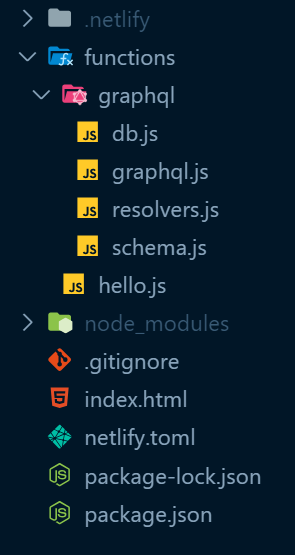
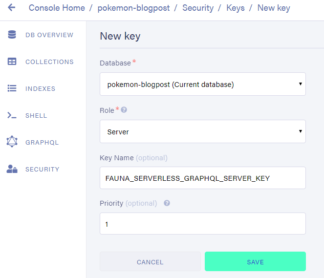

{/* Photo by frank mckenna on Unsplash */}

This is the third post in a series of blogposts about serverless GraphQL. It is not strictly necessary to read the previous parts to follow along with this blogpost.

That being said, I would appreciate it if you checked them out first.
To get up to speed completely, please start at [From zero to a serverless GraphQL endpoint in a flash](/blog/serverless-graphql).

_Ok, but show me the code up front, please._

https://github.com/NickyMeuleman/serverless-graphql

Ready? Let's go! 🚀

## A real database

Up until this point, the database was a literal JavaScript array.
That's neat, but far from optimal. Aside from the scaling issues, every change made would disappear after a while, once the serverless-function shuts down.

Keeping a database working, let alone working _efficiently_ is a LOT of work.
Not having much knowledge in the realm of databases and [DevOps](https://en.wikipedia.org/wiki/DevOps) complicates this even further.

Is it even possible to have a database if I'm not equipped to do all that work? To pile on even more requirements, I don't want to have a machine running 24/7 _at all_.

Yes! Serverless databases exist and they check all of those boxes!

[Chris Coyier](https://twitter.com/chriscoyier) created a great site that houses a [compilation of serverless resources](https://serverless.css-tricks.com/services/data/). And it just happens to have an orderly list of databases.
By using a serverless-database, I just ensured my database is working as well as possible, as consistently as possible.

I chose [Fauna](https://fauna.com/).

Fauna is both fast _and_ accurate. They can [scientifically back this up](https://fauna.com/blog/faunadbs-official-jepsen-results).  
[Their documentation](https://docs.fauna.com/) combined with [Chris Biscardi](https://twitter.com/chrisbiscardi) talking about it, and even making an [Egghead course](https://egghead.io/playlists/the-complete-guide-to-faunadb-74bef44b) about Fauna pushed me towards picking it.

## Adding the database connection to the GraphQL context

As a quick reminder, this is the folder structure we are working with.



Fauna has a handy way to interact with the database in many coding languages, their [drivers](https://docs.fauna.com/fauna/current/drivers/). Our serverless-function is written in [node.js](https://nodejs.org/en/), which is essentially JavaScript, so for our purposes the [JavaScript driver](https://docs.fauna.com/fauna/current/drivers/javascript) is the one we want.

```bash
npm install --save faunadb
```

Instead of storing the entire database in the GraphQL context, like we did with the `pokemons` array, we will store the database connection, and interaction methods instead.

> I know the plural is Pokémon, don't judge me.

### Preparation

After creating a [Fauna](https://fauna.com/) account, log into their dashboard and create a database.


Our data will consist of a bunch of Pokémon so create a [collection](https://docs.fauna.com/fauna/current/concepts/glossary#Collection) called `Pokemon`.


Leave all the default options and save.

The `Pokemon` collection will hold all our individual Pokémon.

An example of a single, _very interesting_, Pokémon:

```json
{
  "id": "122",
  "name": "mr-mime"
}
```

When creating that collection, something called a [collection index](https://docs.fauna.com/fauna/current/concepts/glossary#Index) was also created if you left the defaults.

That collection index helps you browse all the Pokémon inside that collection.

By default, Fauna uses [snake_case](https://en.wikipedia.org/wiki/Snake_case) to name things.
That's perfectly fine. To keep things uniform with the JavaScript code, my first order of business was to rename the created `all_pokemon` Index to `allPokemon` by going to Settings after selecting that index.


### Connecting to the database

To make the connection to the database using that [JavaScript driver](https://docs.fauna.com/fauna/current/drivers/javascript), Fauna requires us to provide a secret key.
In the Fauna dashboard, add a new key.

This is found under the security tab.
Here, we want to create a key with a role of "Server".
This key will allow us to manipulate the database we just created, but not other ones.



Save this key somewhere safe as it will only be shown once!

You could absolutely provide this key as a literal string whenever it is required.

It is considered good practice, however, to store secrets like this in a `.env` file and reference them from there.

This will allow the code in which those secrets are used to be public, while the actual secrets are not shared and kept private.

Create a new file called `.env` and add the key you just created under a descriptive name.

```
FAUNADB_SERVER_SECRET=fnADcc6pGYACAkNS77iyW0_3LRlgTj-jq7pkZli1
```

> Don't get any ideas about using this particular key; it's already been revoked

<Aside variant="info">

If using `git`, add `.env` to the `.gitignore` file to prevent uploading that file! Keep your secrets, secret 👮

</Aside>

To reference that secret key in our code, we'll use a small package called [dotenv](https://github.com/motdotla/dotenv)

```bash
npm install dotenv
```

Time to finally write some code.

In `db.js`, we will export our connection to the database, our `client`, and all the functions we will use to communicate over that connection, the `query`.

```js
require("dotenv").config();
const faunadb = require("faunadb");

const query = faunadb.query;

function createClient() {
  if (!process.env.FAUNADB_SERVER_SECRET) {
    throw new Error(
      `No FAUNADB_SERVER_SECRET in environment, skipping client creation`
    );
  }
  const client = new faunadb.Client({
    secret: process.env.FAUNADB_SERVER_SECRET,
  });
  return client;
}

exports.client = createClient();
exports.query = query;
```

The next step is to add these things to our GraphQL context. That way, they will be easily accessible from our resolvers.

```js title=graphql.js
const { ApolloServer } = require("apollo-server-lambda");
const { typeDefs } = require("./schema.js");
const { resolvers } = require("./resolvers.js");
const { client, query } = require("./db.js");

const server = new ApolloServer({
  typeDefs,
  resolvers,
  context: function () {
    return { client, query };
  },
  playground: true,
  introspection: true,
});

exports.handler = server.createHandler();
```

## Populating the database for the first time

Let's take a small step back before changing the GraphQL-resolvers to talk to the database.

Our placeholder database only had a couple of manually entered Pokémon.
Let's fill our database with a lot more. For this example, the [first generation](https://en.wikipedia.org/wiki/List_of_generation_I_Pok%C3%A9mon) Pokémon. All 151 of them.

The [PokéAPI](https://pokeapi.co/) provides convenient access to that information.

To get all those Pokémon into the database, I created a file meant to be used a single time.

It requests the first 151 Pokémon from the PokeAPI.
The received data is then lightly adjusted and each individual Pokémon is stored in our database, under our `Pokemon` collection.

```js
// This file was run once (using node) to populate the fauna database
// Be sure to install node-fetch first!

const fetch = require("node-fetch");
const { client, query } = require("./functions/graphql/db");
const q = query;
const pokeAPI = "https://pokeapi.co/api/v2/pokemon?limit=151";

fetch(pokeAPI)
  .then((res) => res.json())
  .then((res) => {
    const pokemonArr = res.results.map((pokemon, index) => ({
      id: (index + 1).toString(),
      name: pokemon.name,
    }));

    client
      .query(
        q.Map(
          pokemonArr,
          q.Lambda(
            "pokemon",
            q.Create(q.Collection("Pokemon"), { data: q.Var("pokemon") })
          )
        )
      )
      .then(console.log("wrote Pokemon to FaunaDB"))
      .catch((error) =>
        console.log("Failed to save Pokemon to FaunaDB", error)
      );
  });
```

Alright, that's a lot to take in all at once. Let's break it down.

I created a file called `seed.js` in the root of the project, then ran `npm install node-fetch`.


Because we will use the functions under `query` often, I renamed that variable to `q` for optimal #lazyDev benefits. Have to save those precious keystrokes somehow 🤷‍♂. [Missing the point](https://keysleft.com/) of the [KeysLeft idea](https://www.hanselman.com/blog/DoTheyDeserveTheGiftOfYourKeystrokes.aspx).

Speaking of those functions on the `q` variable, that funky-looking piece of code inside `client.query()` is called [Fauna Query Language, or FQL](https://docs.fauna.com/fauna/current/api/fql/). FQL is an [embedded domain-specific language (or, eDSL)](https://en.wikipedia.org/wiki/Domain-specific_language), which means it is a _domain-specific_ language (in this case, used for querying, like SQL) that is _embedded_ in a more general-purpose programming language (in this case, the JavaScript driver).

FQL is the way we are going to construct the instructions to send to our Fauna database.
You can [compare it](https://docs.fauna.com/fauna/current/start/fql_for_sql_users) to how you talk to many relational databases using SQL, kinda.

While FQL is not a general-popose programming language (like Python, or JavaScript), it is possible to do many things that you would use these languages for, like [adding two numbers together](https://docs.fauna.com/fauna/current/api/fql/functions/add).

Every function on the `q` variable returns a value. That value can then be used in another function, which can then be used in another function, until we arrive at the completed instruction we want to send to Fauna. [It's functions all the way down](<https://en.wikipedia.org/wiki/Turtles_All_the_Way_Down_(novel)>).

The Fauna documentation has an [overview of the available FQL commands](https://docs.fauna.com/fauna/current/api/fql/functions/). This has been, without a doubt, the most visited page of their entire documentation site for me.

Back to our one-off file that fills the database for the first time.

After sending a `fetch` request to the PokéAPI and constructing an array of Pokémon objects, we send our request to the database using `client.query`.
All methods on `client` return [Promises](https://developer.mozilla.org/en-US/docs/Web/JavaScript/Reference/Global_Objects/Promise), so we print something to the console when it's done.

Directing our attention to the FQL inside of `client.query`, we loop over every single Pokémon in the `pokemonArr` (using [Map](https://docs.fauna.com/fauna/current/api/fql/functions/map)). We execute a [Lambda](https://docs.fauna.com/fauna/current/api/fql/functions/lambda) (which is an anonymous function) for every item in that array (we named a single item `"pokemon"`). Inside that function, we [Create](https://docs.fauna.com/fauna/current/api/fql/functions/create) a new [document](https://docs.fauna.com/fauna/current/concepts/glossary#Document) in the `"Pokemon"` [collection](https://docs.fauna.com/fauna/current/concepts/glossary#Collection). Specifically, we store the data we received in that function under the `data` key in that new document we create.

<Aside variant="info">

Note that to turn the `"pokemon"` we passed to the Lambda back into the object our database will store and not the string "pokemon", we used the [Var](https://docs.fauna.com/fauna/current/api/fql/functions/var) function.

</Aside>

Running this one-off file can be done from the command line

```bash
node seed.js
```

## Adjusting our resolvers

The time has come to change the resolvers to use the variables we stored in the GraphQL context.

I'm not going to lie. Spending a lot of time on the Fauna documentation, especially on the [FQL Overview Page](https://docs.fauna.com/fauna/current/api/fql/functions/) was part of this process.

This is how the `resolvers.js` file eventually looked:

```js
exports.resolvers = {
  Query: {
    hello: (obj, args, context) => {
      return "Hello, FaunaDB world!";
    },
    allPokemon: (obj, args, context) => {
      const { client, query: q } = context;
      return client
        .query(
          q.Map(
            q.Paginate(q.Match(q.Index("allPokemon")), {
              size: 256,
            }),
            q.Lambda("ref", q.Select(["data"], q.Get(q.Var("ref"))))
          )
        )
        .then((result) => result.data);
    },
    pokemonById: (obj, args, context) => {
      const { client, query: q } = context;
      return client
        .query(q.Get(q.Match(q.Index("pokemonById"), args.id)))
        .then((result) => result.data);
    },
    pokemonByName: (obj, args, context) => {
      const { client, query: q } = context;
      return client
        .query(q.Get(q.Match(q.Index("pokemonByName"), args.name)))
        .then((result) => result.data);
    },
  },
  Mutation: {
    createPokemon: (obj, args, context) => {
      const { client, query: q } = context;
      return client
        .query(
          q.Create(q.Collection("Pokemon"), {
            data: { id: args.id, name: args.name },
          })
        )
        .then((result) => result.data);
    },
    updatePokemon: (obj, args, context) => {
      const { client, query: q } = context;
      return client
        .query(
          q.Update(
            q.Select(["ref"], q.Get(q.Match(q.Index("pokemonById"), args.id))),
            { data: { name: args.name } }
          )
        )
        .then((result) => result.data);
    },
    deletePokemon: (obj, args, context) => {
      const { client, query: q } = context;
      return client
        .query(
          q.Delete(
            q.Select(["ref"], q.Get(q.Match(q.Index("pokemonById"), args.id)))
          )
        )
        .then((result) => result.data);
    },
  },
  Pokemon: {
    isVeryBest: (obj, args, context) => {
      // is it Mr. Mime?
      return obj.id === "122";
    },
  },
};
```

The file uses some [indexes](https://docs.fauna.com/fauna/current/concepts/glossary#Index) to query for a Pokémon by `name` or by `id` that do not exist yet.

An Index is like a filtered view of your data that can be used to [get a lot of work done](https://docs.fauna.com/fauna/current/api/fql/indexes), like looking up a Pokémon by their `id`.

Indexes can be created via FQL or using the graphical interface on the Fauna dashboard.

Let's use both, just to get a feel for the possibilities.

We'll use the graphical interface to create the Index that will allow us to search for a Pokémon using its `id`.


As a name for this index, I chose `pokemonById`. The `terms` (aka "Lookup terms") are fields by which you want to search the documents in a collection.

Enter `id` for "field".

Notice how it automatically changed to `data.id`? The Document for a single Pokémon can be thought of as a JavaScript object. It has a few fields. Like the `ref` one, that stores an identifier to that specific document. The data we stored lives under the `data` key.

Since, in this app, every Pokémon in the `Pokemon` collection has a unique `id`. Check the box that marks this index as unique.
This enforces a uniqueness constraint on the entries of this index.

<Aside variant="info">

If you mark an index as unique, it will not remove existing duplicates, only prevent future ones.

</Aside>

Next up is the index that allows us to search for a Pokémon by their `name`. Let's create this index via FQL.

The Fauna dashboard has an area called "shell" where you can enter FQL queries and see the results.

The [CreateIndex](https://docs.fauna.com/fauna/current/api/fql/functions/createindex) function is what we used before. Only we used it through the <abbr title="Graphical User Interface">GUI</abbr>.

```
CreateIndex({
  name: "pokemonByName",
  source: Collection("Pokemon"),
  unique: true,
  terms: [{ field: ["data", "name"] }]
})
```

All done! 🎉
Time to check out the endpoint again at `/.netlify/functions/graphql`
after running

```bash
netlify dev
```

## Bonus: Sorting the `allPokemon` query

Keen-eyed people who are following along might have noticed our Pokémon don't return in order when we query for `allPokemon`.

Guess what can be used to rectify that?

One imaginary internet cookie for you if you guessed an index! 🍪

<Tweet tweetLink="NMeuleman/status/1182020349866762240" theme="dark" />

Instead of specifying the `terms`, we will create an index (remember, that's a filtered view of data) with `values` of `id` and the `ref`. The `id` will be sorted from low to high. The `ref` can be used to retrieve the Pokémon with that `id` from the database.

In the FQL shell, run the following query:

```
CreateIndex({
  name: "allPokemonSortById",
  source: Collection("Pokemon"),
  values: [
    { field: ["data", "id"] },
    { field: ["ref"] }
  ]
})
```

And in the `allPokemon` resolver

```js
exports.resolvers = {
  Query: {
    allPokemon: (obj, args, context) => {
      const { client, query: q } = context;
      return client
        .query(
          q.Map(
            q.Paginate(q.Match(q.Index("allPokemonSortById")), {
              size: 256,
            }),
            q.Lambda(["id", "ref"], q.Select(["data"], q.Get(q.Var("ref"))))
          )
        )
        .then((result) => result.data);
    },
  },
};
```
