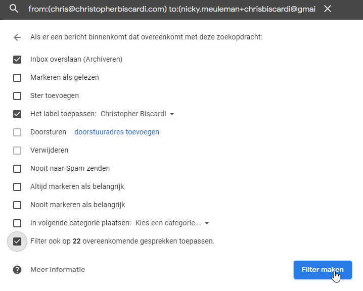

I've had my Gmail email address for years.
A lot of time went by where I didn't pay much attention to keeping it clean. This led to well over 20.000 emails sitting in my inbox.
All of those were read, mind you.

They might have all been "read", however.
I've been clicking the "mark as read" button without actually reading emails for months.

So, I decided to clean up all the emails that were currently sitting in my inbox.
Either by deleting them, or archiving them.

I would archive every email that was still valuable today, while deleting the ones that were merely taking up space.

That distinction is quite subjective and will vary for everyone. The sentiment was: archive receipts and send old pricing catalogues to [the shadow realm](https://yugioh.fandom.com/wiki/Shadow_Realm).

No third party tools were used to do this, only the gmail webapp, and lots, _lots_ of time.

After I got the number of emails sitting in my inbox down to 0, I wanted to reduce the amount of emails coming in.

The eventual goal was that **every email in my inbox brings value**.

## Preparation

I was about to deal with _a lot_ of emails.
I wanted to display as much information as possible on a single screen.

To the settings! To set the display density to compact and the amount of emails per page to 100.

## Get that number down

Getting from an overloaded inbox to an empty one is no small task, but certainly doable.
This doesn't need to happen all at once, I did it over the span of 4 weeks. Chipping away at that huge number every time I checked my email.

Because Gmail's standard sorting if fairly good, I left the standard [tabs at the top](https://lifehacker.com/everything-you-need-to-know-about-gmails-new-super-co-511765933) of the inbox.

<Aside>

I definitely only left the standard tabs because the sorting is good. Not because I was lazy when it came to email, nuh-uh.

</Aside>

This often resulted in selecting all 100 mails on the current page of the promotions tab, followed by clicking the delete button.
In the other tabs (social, updates, and forums), progress was slightly slower. With a bit more emails being archived instead of deleted.

Around the 5.000 emails left point is when I switched strategies.

I identified senders that sent me a lot of email and started searching for those emails using [search operators](https://support.google.com/mail/answer/7190?hl=en).
This made deciding to archive or delete emails less of a chore compared to going through emails one by one. I could often fall back on the trusted "select all and delete everything" tactic, cathartic.

An example of one of those filters would be `from:github in:inbox`.
That would list all emails I got from GitHub that weren't already archived or deleted.

<Aside variant="info">

Search terms that resulted in a lot of ready-to-be-deleted emails were "free", and "win".

</Aside>

As time went on and that number decreased, those searches resulted in less and less results.

## Slow the stream

All that work would be for nothing if emails continued to pour in at the same speed.

**Unsubscribe**. That's the number one method to reduce the amount of incoming emails.
Do it often and without guilt.

It's a value judgement whether or not you would like to continue receiving emails from an email list.
I found that I unsubscribed from most of the automated mail I came across.

Gmail surfaces an unsubscribe link at the top of an opened email, making unsubscribing easy.
Sometimes, it won't be there, so look for it inside the email.
More often than not, it's at the bottom of the email in a tiny fontsize and a color that barely contrasts with the background.
If I couldn't find that link and deemed all the mails from that source as unwanted, off to the spam folder they went.

It turns out I unsubscribed from lists that go out of their way to hide the unsubscribe link more often than the ones that surface it clearly.

> Who would've thought?
>
> \- Sean Evans

<YouTube url="https://www.youtube.com/watch?v=0BtOY3Wr2LU" />

_But email lists sometimes have sweet deals._

True, some list cross the line from noise to signal. Most of them only sometimes.

### Making a filter

Labels, combined with filters are very useful here.
They let you have your cake and eat it too!

A lot of newsletters, I wanted to continue getting but read them at my own leisure.  
Other ones I wanted to continue getting because they held sweet deals, but not clog up my inbox.

To put it differently: I wanted emails to stop coming _at me_. I wanted to flip it around and come _at them_.

In the image above I filtered every email from [Chris Biscardi](https://www.christopherbiscardi.com/).
All emails from that address will now skip the inbox and get a label applied to them.

That label will show up in the left navigation bar.

The mails keep their (un)read status.
That way, I'll know when a new one arrives by the number next to the label indicating the unread count!

Every time you get an email that is labeled and automatically archived, it won't take up space in your inbox.
That means you can stay subscribed to a bunch of email lists, read them at your own leisure, or search for things in them when you need it.

#### General

I used the following method the most when I wanted to create a filter.

- Expand the searchbar at the top and enter a query like you would before.
- Click "make filter" and select what actions should apply to new emails match the searchquery.
- Confirm your selection by clicking the "make filter" button on the page.

#### Specific email

Another convenient way to create a filter is by selecting an email as a starting point, and filter similar emails.

- Select an email by activating the checkbox.
- Click the three vertical dots at the top to reveal more options (on the same row as archive/delete/...).
- Choose "filter messages like these".

This will open the same modal described in [general](#general), but with one or more fields filled in.

## Maintaining the low number

With a clean inbox and armed with the tools of "labels and filters", I now deal with every email that comes in.

This further reduces the amount of emails that come in, creating less work in the future 🎉.
