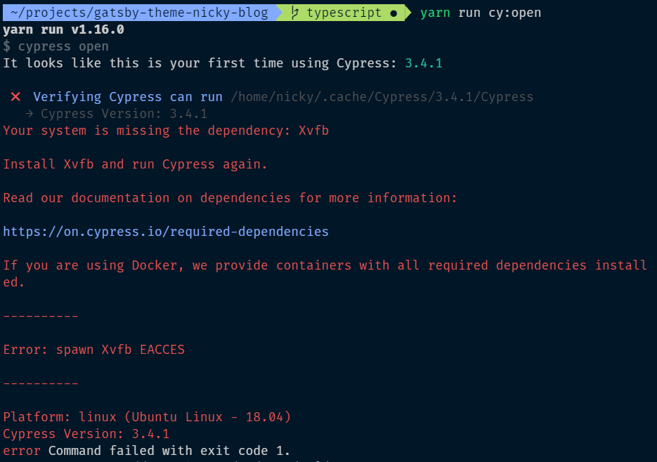
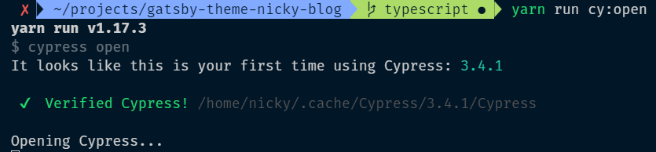
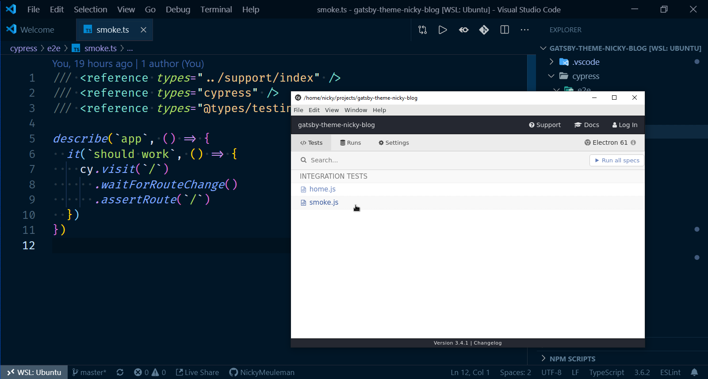

The Window Subsystem for Linux is very powerful.
After [exploring it for a bit](/blog/linux-on-windows-wsl2-zsh-docker/), I wanted to push it even further.

Wouldn't it be cool to run <abbr title="Graphical User Interfaces">GUIs</abbr> natively inside of Linux, on your computer running Windows? 🤯

<Tweet tweetLink="NMeuleman/status/1173619206358753282" theme="dark" />

## Prerequisites

Let's get the obvious one out of the way first: <abbr title="Window Subsystem for Linux, version 2">WSL2</abbr>.

I wrote [a guide](/blog/linux-on-windows-wsl2-zsh-docker) detailing how to take it from 0 to awesome in a short time.
Now, it's time to [turn that dial to 11](https://youtu.be/4xgx4k83zzc).

For good measure, update that linux install

```bash
sudo apt update
sudo apt upgrade
```

### VcXsrv

You can use something called an [X-server](https://en.wikipedia.org/wiki/X.Org_Server) to display what is going on in the Linux side of the computer.

For this I used the free program [VcXsrc](https://sourceforge.net/projects/vcxsrv/).

The first time you run that program, allow "Public networks, such as those in airports and coffee shops" when the Windows firewall pops up.

To display programs that launch on the WSL side of the machine as seperate windows. I chose the options "Multiple windows" and "Start no client".

On the page that lets you enable extra settings, be sure to disable access control.
By default it only allows the local IP 127.0.0.1.
Since WSL has its own IP address, which changes often, allow connections from all clients.


### Cypress

You can replace this with whatever GUI you would like to run.
In my case, it was [Cypress](https://www.cypress.io/), so I made sure to set it up.

After installing Cypress in a project, I added a way to launch it in `package.json`.

```json
{
  "scripts": {
    "cy:open": "cypress open"
  }
}
```

There were a bunch of errors greeting me when I tried to run `cy:open`



Luckily, it was a helpful error message that points to [a docs page with the solution](https://on.cypress.io/required-dependencies).

```bash
sudo apt install libgtk-3-dev libnotify-dev libgconf-2-4 libnss3 libxss1 libasound2
```

After installing those packages, trying to run `cy:open` doesn't error anymore.
It doesn't do anything else either, only show the `Opening Cypress` message forever.



## Bash config

### The `DISPLAY` variable

In order for Linux GUI apps to connect to our X-server, a [`DISPLAY` environment variable](https://askubuntu.com/questions/432255/what-is-the-display-environment-variable) has to be set.

In your `.bashrc` (or `.zshrc` if you are using ZSH)

```bash
# set DISPLAY variable to the IP automatically assigned to WSL2
export DISPLAY=$(cat /etc/resolv.conf | grep nameserver | awk '{print $2; exit;}'):0.0
```

When you start WSL2, it gets its own IP address.
That long command will evaluate to the IP that WSL2 set.
The `DISPLAY` variable has the format `<host>:<display>.<screen>`.  
Both `<display>` and `<screen>` are set to 0 here so that line will evaluate to something like `export DISPLAY=172.17.224.1:0.0`, with the `<host>` changing to the correct IP.

To confirm this worked, print out the variable you just set in the terminal.

```bash
echo $DISPLAY
# 172.17.224.1:0.0
```

### Automatically start `dbus`

A lot of GUI apps use [D-Bus](https://en.wikipedia.org/wiki/D-Bus) to internally communicate.

In `.bashrc` (or `zshrc`), under to previous line, add

```bash
sudo /etc/init.d/dbus start &> /dev/null
```

<Aside variant="info">

This file can be reloaded by running `source ~/.bashrc` (or `source ~/.zshrc`) in your terminal.

</Aside>

## Grant passwordless access for `dbus`

We need a `soduers` file to grant our linux user access to `dbus` without a password.

To accomplish this, use the [`visido` command](http://manpages.ubuntu.com/manpages/precise/en/man8/visudo.8.html).  
This best practice will ensure you don't lock yourself out of the system. The `sudoers` file doesn't play around, like the `README` in `/etc/sudoers.d/README` will tell you.

```bash
sudo visudo -f /etc/sudoers.d/dbus
```

A Nano editor will launch. Enter the following line, where `<your_username>` is replaced by -🥁drumroll please🥁- _your username_.

If you aren't sure what the name of your linux user is, running `whoami` in the terminal will tell you.

```bash
<your_username> ALL = (root) NOPASSWD: /etc/init.d/dbus
```

Writing a file in the Nano editor is almost as hard as quitting VIM.
Press `CTRL+O` to save, then press `Enter` to confirm. Finally, press `CTRL+X` to close the editor.

## Launch your GUI app

Close your terminal and open up a new one in the location you want to open the GUI app.

Open the VcXsrv program in Windows (called XLaunch).
Be sure to disable access control.

Launch the program in Linux.

```bash
# in the directory I installed Cypress and set up the command to launch it
yarn run cy:open
```

<Aside variant="success">

BOOM, a window opens running a Linux app, on Windows 🎉

</Aside>


