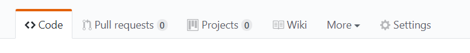
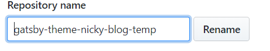
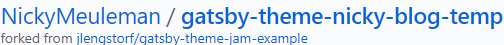
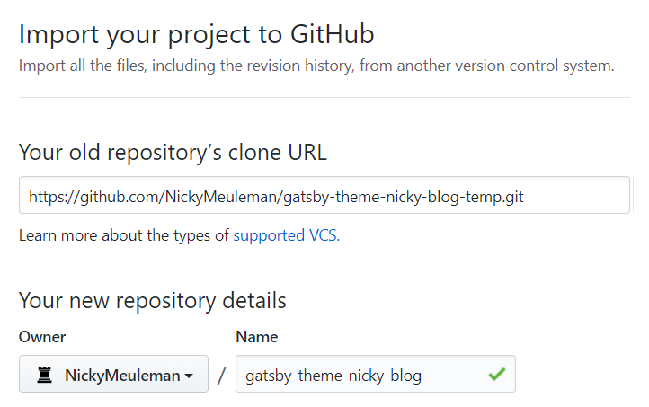
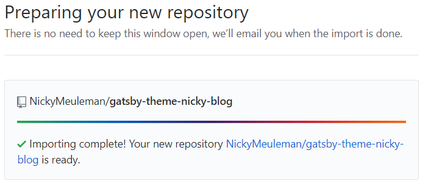
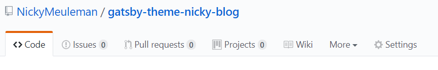
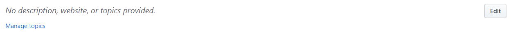

<Aside>

TL;DR: **2 steps**: Rename the repository. Import the renamed repository under the original name.

</Aside>

Sometimes a repository on GitHub started off as a fork.  
You now want to break that connection.

Forks on GitHub come with a few special behaviours, like the issues tab not being enabled by default.

## 1. Rename your repository on GitHub

Go to the repository on GitHub, find the **Settings** page and rename your repository. (Don't worry, you'll get to keep the original name.)

This freshly renamed repository is still marked as a fork!

## 2. Import the repository

GitHub provides a way to import repositories.

Grab the link to clone the repository you just renamed and enter it.

<Aside variant="danger">

Provide the https link, the SSH one won't work

</Aside>

For the name, enter the **original name** of your repository.

After a while the "new" repository will be ready.
If there is an e-mail address linked to that GitHub account, an e-mail will also notify you of success.

## Enjoy your unforked repository

The git history is still there. 👍

The locally cloned project does not have to be touched.  
Pushing a change should work without intervention, since the remote url is the same as before.

Since this is technically a brand new repository, some things (specific to the GitHub web UI) were lost.
For example: pull requests, a description, the provided website url.

