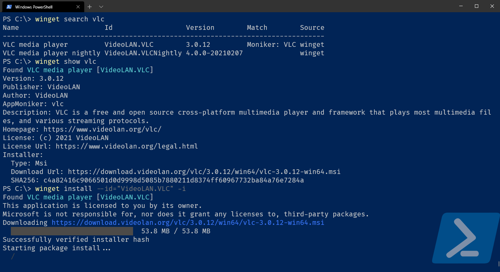

import Sound from "$components/Sound.tsx";

Microsoft is working on a package manager for Windows, called [winget](https://docs.microsoft.com/en-us/windows/package-manager/winget/).

You might want to compare it to other package managers.
Perhaps to a really to popular one on Linux.
An <Sound fileName="rimshot.mp3" label="Rimshot sound effect">apt</Sound> comparison, if you will.

The command line tool enables you to install, update, remove and configure applications.

Programs installed via the command line interface will be available everywhere you expect them to be, like in the Windows control panel.

The project is open-source. Take a look at the &mdash; mainly C++ &mdash; [repository](https://github.com/microsoft/winget-cli).

The CLI uses small pieces of data (called manifest files) to enable a lot of its features.
They're [`YAML`](https://en.wikipedia.org/wiki/YAML) files that contain a bunch of information about a package.
They follow a rigid [structure](https://github.com/microsoft/winget-cli/blob/master/doc/ManifestSpecv0.1.md).

Those files are hosted on an other public [GitHub repository](https://github.com/microsoft/winget-pkgs).
This method of supplying information to the CLI tool is used to keep more packages up to date.
It encourages outside contributions by keeping the barrier to add/modify a package reasonably low.
Proposing a change to the information of a package is the result of submitting a pull request to that repository with a manifest file.

<Aside variant="info">

Because the CLI executes the installation file from a package's manifest, it might need administrator privileges to install that file.
If you aren't using an elevated command prompt,
you might see a [UAC](https://en.wikipedia.org/wiki/User_Account_Control) prompt asking you to confirm first.

</Aside>

## Installation

While it is going to be a part of Windows 10 by default, `winget` isn't released as a stable version yet.
Until that happens, installing it means jumping through some hoops.

There are 2 options: to Microsoft store, or not to Microsoft store.

### Either: via the Microsoft store

The command line interface is distributed via the [App Installer package](https://www.microsoft.com/en-us/p/app-installer/9nblggh4nns1) on the Microsoft store.
To get access to it before the release of `winget`, you can do 2 things:

1. Become part of the [Windows Insider program](https://insider.windows.com/en-us/) (and run a prerelease a version of Windows).

2. [Sign up to the winget specific preview program](http://aka.ms/winget-InsiderProgram).

### Or: Manual install

It can be manually installed by downloading and executing a `.appxbundle` attached to a release from the [GitHub releases page](https://github.com/microsoft/winget-cli/releases).

<Aside variant="danger">

If you install `winget` manually:

- You won't get automatic updates to `winget`.
- You may need the [VC++ v14 Desktop Framework Package](https://docs.microsoft.com/en-us/troubleshoot/cpp/c-runtime-packages-desktop-bridge#how-to-install-and-update-desktop-framework-packages)

</Aside>

Because the project is open-source: the last, and most time/resource intensive option is [building your own](https://github.com/microsoft/winget-cli#building-the-client) version.

## Features

During development, a lot of features are added and tweaked.
You can take a look at what to expect for the initial release on the [v1 roadmap](https://github.com/microsoft/winget-cli/blob/master/doc/windows-package-manager-v1-roadmap.md).

They are publically [tracking work on requested features](https://github.com/microsoft/winget-cli/projects/1).
You can follow along with, or contribute to the development of the `winget` tool.

## Configuration

Configuration is done via a `setting.json` file.
It uses a JSON-schema, and [I think JSON-schema's are awesome](/blog/json-schema)!

Opening the file in your standard editor via the CLI:

```powershell
winget settings
```

### Enable experimental features

To get access to some features that aren't stable yet early, you'll have to opt-in.
You can see a list of them, and their current status by executing:

```powershell
winget features
```

At the time of writing, a lot of functionality is considered experimental, like the ability to uninstall, or to upgrade packages.

Here, I enabled a few of these features by turning the boolean flag associated with them on:

```json title=settings.json
{
  "$schema": "https://aka.ms/winget-settings.schema.json",
  "experimentalFeatures": {
    "uninstall": true,
    "upgrade": true,
    "list": true,
    "experimentalMSStore": true
  }
}
```

The `experimentalMSStore` one is nice, it allows you in install apps from the Microsoft store.
I imagine that for a lot of readers, that'll be the primary &mdash; if not only &mdash; way they'll interact with it.

## Usage

`winget` can be accessed via Powershell, or via the good ol' cmd prompt.

<Aside>

<Sound client:visible fileName="psst.mp3" label="attention grabbing whisper">
  Pssst
</Sound>

Whichever option you choose, I recommend using [the Windows Terminal](/blog/windows-terminal)
to access that shell.

</Aside>

To search for an application, you can use (part of) its name after the `search` command.
Here, I want to know if `winget` has a popular video player, vlc:

```powershell
winget search vlc
```

If a result shows up, it's available for download using `winget`!
If you like, you can look at the manifest file for a package:

```powershell
winget show vlc
```

Installing it can be done via the `install` command:

```powershell
winget install --id="VideoLAN.VLC" -i
```

While `winget install vlc` would have worked here,
I opted to be more specific and use the `id` the `show` command returned.

The `-i` flag is shorthand for `--interactive`.
It will pop up the visual installer, the kind many people know and ~~love~~ despise.



To get a list of all applications that are currently installed:

```powershell
winget list
```

Uninstalling programs supports packages that weren't installed by `winget` too.
I grabbed the `id` for 7-zip from the `winget list` output.
Then, I uninstalled it using that id:

```powershell
winget uninstall --id="7-Zip"
```

<Aside>

Both the `list`, and `uninstall` commands are experimental features,
and need to be [enabled via the settings](#enable-experimetal-features) first.

</Aside>

### A graphical interface

[Winstall](https://winstall.app/) is a website that shows the info in those manifest files.
It allows you to select the programs you want to install, and generates the appropriate line to enter in the command line.

In the following snippet, I install 7-zip, Firefox, and AIM via winget using powershell.

```powershell
winget install 7zip.7zip  ; winget install AIMP.AIMP  ; winget install Mozilla.Firefox
```

<Aside variant="info">

`winget` also works via `cmd`.
The site provides the option to display the command for that shell instead.
There the `;` to seperate commands would be replaced by `&&`:

```cmd
winget install 7zip.7zip  && winget install AIMP.AIMP  && winget install Mozilla.Firefox
```

</Aside>

If you're uncomforable entering that line into the appropriate shell,
the site provides the option to download a `.ps1` or `.bat` file.
Running that will execute that command for you via respectively powershell or cmd.
