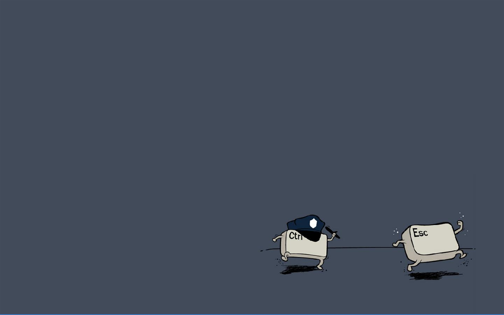

[internal link](/about)

[external link](https://www.google.com)

```js
exports.onCreateNode = ({ node, getNode, boundActionCreators }) => {
  const { createNodeField } = boundActionCreators;
  if (node.internal.type === 'MarkdownRemark') {
    const slug = createFilePath({ node, getNode, basePath: 'pages' });
    createNodeField({
      node,
      name: 'slug',
      value: slug,
    });
  }
};
```

# Now, look here, my good man.

But you are dressed as one… The Knights Who Say Ni demand a sacrifice! It's only a model. Why? I'm not a witch.

Well, I didn't vote for you. I am your king. Ni! Ni! Ni! Ni! No, no, no! Yes, yes. A bit. But she's got a wart. __Listen.__ *Strange women lying in ponds distributing swords is no basis for a system of government.* Supreme executive power derives from a mandate from the masses, not from some farcical aquatic ceremony.

## I'm not a witch.

Bloody Peasant! Well, I got better. How do you know she is a witch? The swallow may fly south with the sun, and the house martin or the plover may seek warmer climes in winter, yet these are not strangers to our land.

1. Be quiet!
2. How do you know she is a witch?
3. The Knights Who Say Ni demand a sacrifice!

### Bring her forward!

I don't want to talk to you no more, you empty-headed animal food trough water! I fart in your general direction! Your mother was a hamster and your father smelt of elderberries! Now leave before I am forced to taunt you a second time! I dunno. Must be a king.

* Shut up! Will you shut up?!
* Knights of Ni, we are but simple travelers who seek the enchanter who lives beyond these woods.
* But you are dressed as one…

The Knights Who Say Ni demand a sacrifice! Well, we did do the nose. How do you know she is a witch? Who's that then? Well, we did do the nose. We want a shrubbery!!

I don't want to talk to you no more, you empty-headed animal food trough water! I fart in your general direction! Your mother was a hamster and your father smelt of elderberries! Now leave before I am forced to taunt you a second time! Ah, now we see the violence inherent in the system!

You can't expect to wield supreme power just 'cause some watery tart threw a sword at you! We shall say 'Ni' again to you, if you do not appease us. I'm not a witch. What a strange person.

Shh! Knights, I bid you welcome to your new home. Let us ride to Camelot! We want a shrubbery!! Did you dress her up like this? Well, how'd you become king, then?

I'm not a witch. But you are dressed as one… And this isn't my nose. This is a false one. I dunno. Must be a king. What a strange person.

I have to push the pram a lot. And the hat. She's a witch! No, no, no! Yes, yes. A bit. But she's got a wart. Shh! Knights, I bid you welcome to your new home. Let us ride to Camelot!

Shut up! The nose? Well, we did do the nose. Bloody Peasant!

I dunno. Must be a king. Camelot! Who's that then? On second thoughts, let's not go there. It is a silly place. We shall say 'Ni' again to you, if you do not appease us.

Bring her forward! No, no, no! Yes, yes. A bit. But she's got a wart. You don't frighten us, English pig-dogs! Go and boil your bottoms, sons of a silly person! I blow my nose at you, so-called Ah-thoor Keeng, you and all your silly English K-n-n-n-n-n-n-n-niggits!

You can't expect to wield supreme power just 'cause some watery tart threw a sword at you! Ah, now we see the violence inherent in the system! But you are dressed as one… We want a shrubbery!! Well, Mercia's a temperate zone!

A newt? What a strange person. Burn her anyway! Look, my liege! Shut up! Will you shut up?!
