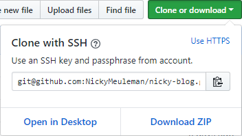

Sometimes you just want to start from a clean slate.

Starting fresh can be very re*fresh*ing (_I'm sorry_). It also means there are a lot of things to do before you get your environment setup just the way you want.
I just reïnstalled my laptop (Windows10 machine) and will write down what steps I went through to get things just right again. I'm going to set up this machine for JavaScript development, but a lot of this is universal.

## Initial steps

Starting from scratch means you have to take care of the basics first before you can start finetuning your setup.

Things I installed:

1.  [Node.js](https://nodejs.org/)
2.  [Git](https://git-scm.com/)
3.  [Visual Studio Code](https://code.visualstudio.com/)

When you are done your terminal should successfully return the versions of what you just installed when you ask for them.

```sh
node --version
# v8.11.1
npm --version
# 5.6.0
git --version
# git version 2.17.0.windows.1
code --version
# 1.22.2
# 3aeede733d9a3098f7b4bdc1f66b63b0f48c1ef9
# x64
```

## A bit of VSCode configuration

This text editor is already quite nice out of the box. We'll add some configuration to make it conform to our preferences.

As with everything in the guide, I'll post my settings here, feel free to change them, add more/less.

I'm not a witch. Why? Camelot! Well, I got better.

### Editing settings.json

Go to `file>preferences>settings`or open the settings file directly with `ctrl + ,`

The integrated terminal is a handy feature. Let's change it to a console we prefer over the standard configuration (on Windows that's Powershell).
I'll use the `git bash` I installed along with git previously.

```json
{
  "terminal.integrated.shell.windows": "C:\\Program Files\\Git\\bin\\bash.exe"
}
```

You can toggle the integrated terminal by going to `view>integrated terminal` or with the bound shortcut: `ctrl + ù` (azerty keyboard)

The standard font-size is a bit small to my liking on this screen.
In the editor itself and in the integrated terminal.
I also like to see the whitespace characters in my code.

```json
{
  "editor.fontSize": 18,
  "terminal.integrated.fontSize": 18,
  "editor.renderWhitespace": "all"
}
```

To hide the menu-bar and be able to toggle it:

```json
{
  "window.menuBarVisibility": "toggle"
}
```

While the standard font is quite great, I'm a fan of [Fira Code](https://github.com/tonsky/FiraCode) and its ligatures.

This step required a bit more work and that link has great installation instructions for various operating systems/editors.

Installation for Windows:

1.  Download the `.zip` and extract it
2.  Open the ttf folder, select all files, right click and press install

With the font installed we can use it in the editor, add these lines to your settings to use the font and the ligatures

```json
{
  "editor.fontFamily": "Fira Code",
  "editor.fontLigatures": true
}
```

I'll be writing a lot of [React](https://reactjs.org/) so having the pre-installed version of [Emmet](https://emmet.io/) active in `.js` files is preferrable.

```json
{
  "emmet.includeLanguages": { "javascript": "javascriptreact" }
}
```

Now Emmet will expand snippets correctly `.js` files

```jsx
// div.wrapper>(ul#react>li*5{React item $})+(ul#vue>li*5{Vue item $})
// turns in to this after expanding (press tab or click on the emmet-suggestion)
<div className="wrapper">
  <ul id="react">
    <li>React item 1</li>
    <li>React item 2</li>
    <li>React item 3</li>
    <li>React item 4</li>
    <li>React item 5</li>
  </ul>
  <ul id="vue">
    <li>Vue item 1</li>
    <li>Vue item 2</li>
    <li>Vue item 3</li>
    <li>Vue item 4</li>
    <li>Vue item 5</li>
  </ul>
</div>
```

## Setting up SSH and Github

Along with using git locally, I'm saving my codebase (repository) online on [Github](https://github.com/)
We will set up a way to securely communicate with Github via the command line.
I'll follow [this guide](https://help.github.com/articles/connecting-to-github-with-ssh/) on how to set up an SSH keypair with Github.

The short version of the information there, for Windows (OSX and Linux have their own entries in the guide):
in git-bash:

```bash
ssh-keygen -t rsa -b 4096 -C "your_email@example.com"
```

on completion, you should be able to see the keys you just created by entering

```bash
ls -a ~/.ssh
```

If you chose the standard names by entering through the first prompt after the previous step
they will be called `id_rsa` for the private one and `id_rsa.pub` for the public one.

Next we'll configure which SSH-key to use when communicating with Github

* Start the SSH-agent.
  This command will start it if it's not already running (which it isn't, I'm on a fresh install)

```bash
eval $(ssh-agent -s)
```

* Add your private key

```bash
ssh-add ~/.ssh/id_rsa
```

Now we can give our public key to Github.
First copy the contents of the public key to the clipboard.
On Windows:

```bash
clip < ~/.ssh/id_rsa.pub
```

* Go to your Github settings.
* Choose the SSH and GPG keys option
* Click add a new SSH key
* Enter a title for the key and paste what you just copied into the key area

After clicking the big green Add SSH key button you are ready to comunicate with Github through SSH!

Let's test it out!

```bash
ssh -T git@github.com
```

It will ask you to connect since it's doesn't know this domain yet, type yes and enter.
You should now see your personal equivalent of this message:

```bash
# Hi NickyMeuleman! You've successfully authenticated, but GitHub does not provide shell access.
```

Success!

### Cloning a repository from Github

Let's use our brand spanking new SSH-keys to clone a repo we own from github and set it up to receive changes we made locally.

* Open your terminal in the directory you want the repository to be saved
* Go to the Github repo you want to clone and copy the SSH-link
  
* clone the link you just copied

```bash
git clone git@github.com:Username/Reponame.git
```

If you don't already have a git remote set up in the project, you will need to add one.
You can check the remotes by entering this in the console.

```bash
git remote -v
# origin  git@github.com:Username/Reponame.git (fetch)
# origin  git@github.com:Username/Reponame.git (push)
```

if nothing shows up, we will add the `origin` remote to the repository

```bash
git remote add origin git@github.com:Username/Reponame.git
```

After making some changes and committing them, we can now push our commits up to Github!
The very first time we push, we need to pass the `-u` flag. This will create the association between our local code and the repository on Github.

```bash
git push -u origin master
```

Our changes are now also on Github, hooray!

More in [part 2](/blog/fresh-development-environment-part-2)
