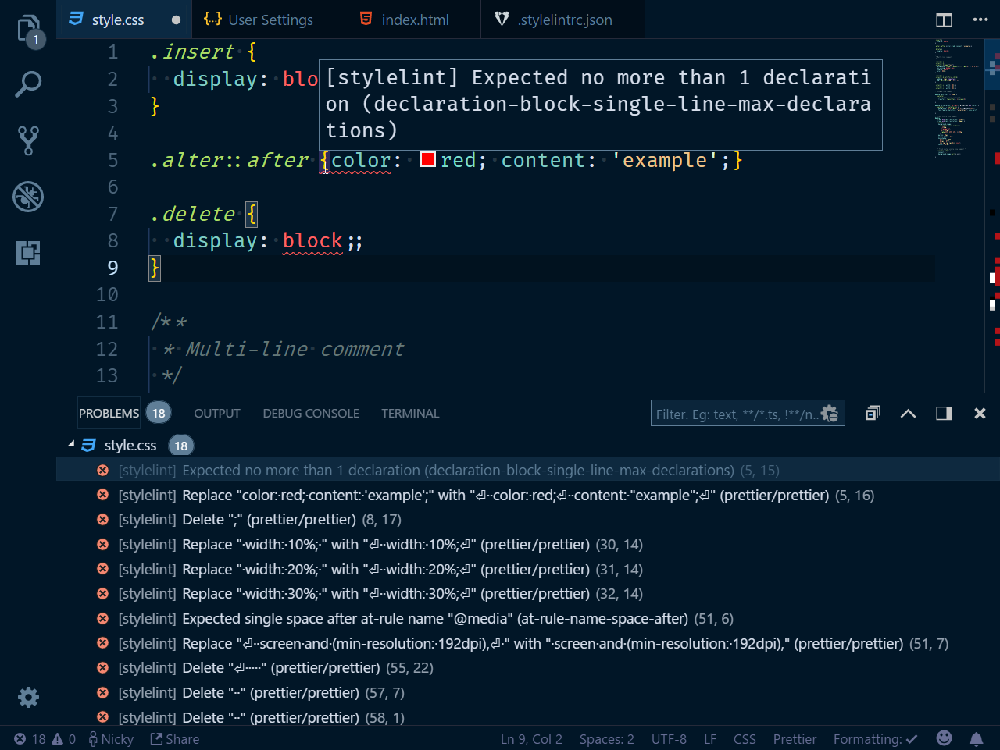

# THIS IS A DRAFT, it's already online, but not finished yet

We'll set up linting and formatting for our styles.

In a previous post I went over [how to lint and format you JavaScript](/blog/automagically-lint). Now, we'll obtain similar superpowers for our styles (CSS, SCSS, Less, sss, ...).
We'll use [Stylelint](https://stylelint.io) as our linting tool and [Prettier](https://prettier.io) as our (main) formatting tool.

## Initial Setup

You don't need any fancy setup to start linting your styles.
The tools we'll use are on [npm](https://www.npmjs.com/), so we'll define those in a `package.json` file, that's it. The rest of the demo-application consists of a single `index.html`, a `styles.css` file and a configuration file for Stylelint.

We'll generate a basic `package.json` so we can install the tools we want to use.

```sh
npm init -y
```

```sh
npm i -D stylelint prettier
```

We'll install with a [popular set of rules for stylelint](https://github.com/stylelint/stylelint-config-standard)

```sh
npm i -D stylelint-config-standard
```

To configure StyleLint to use there rules,
create a `.stylelintrc.json` file in the root directory and tell it to use the package you just installed.

```json
{
  "extends": ["stylelint-config-standard"]
}
```

It works! 🎉
Don't take my word for it, let's see.
Add this line to you `package.json`

```json{3}
  "scripts": {
    "test": "echo \"Error: no test specified\" && exit 1",
    "lint:css": "stylelint *.css"
  }
```

You can now run `npm run lint:css` in the terminal and stylelint will run for every `.css` file it finds.
If it finds errors, you will see a bunch of `npm ERR!`s in the console, don't worry, that's expected, the linting errors it found are above them.
If you would prefer not the have all those npm errors, you could also run that command without using that script we just declared.

```sh
./node_modules/.bin/stylelint *.css
```

## Add Prettier

Our styles should have consistent formatting, that will make them easier to read.
We'll set up Stylelint to report formatting issues that Prettier picks up.
[stylelint-prettier](https://github.com/BPScott/stylelint-prettier) does exactly that.

```sh
npm i -D stylelint-prettier
```

We can now add it to our `.stylelintrc`

```json{2-5}
{
  "plugins": ["stylelint-prettier"],
  "rules": {
    "prettier/prettier": true
  },
  "extends": ["stylelint-config-standard"]
}
```

When you run `lint:css` now you'll see additional errors reported by the `prettier/prettier` rule.

It's possible that the rules inside your `extends` array, or rules you define explicitly conflict with Prettier, causing a catch-22 situation.

We'll turn off all Stylelint rules specific to formatting and let Prettier handle them by adding [`stylelint-config-prettier`](https://github.com/prettier/stylelint-config-prettier).

```sh
npm i -D stylelint-config-prettier
```

```json{6}
{
  "plugins": ["stylelint-prettier"],
  "rules": {
    "prettier/prettier": true
  },
  "extends": ["stylelint-config-standard", "stylelint-config-prettier"]
}
```

## Displaying those errors in your editor (in realtime!)

Everybody loves red squiggly lines in their code editor (somewhere else, and you probably typed a word your dictionary doesn't know. Like "hello" or something stupid like that.)

Install a [Stylelint plugin for your editor](https://stylelint.io/user-guide/complementary-tools/#editor-plugins).
I'm using VSCode, so I picked [the aptly named sylelint](https://marketplace.visualstudio.com/items?itemName=shinnn.stylelint) one.

You will now see the errors listed inside the PROBLEMS tab and there will be red lines underneath each one right in your code.



## Automatically fix problems

Many issues (especially the formatting ones) are able to be fixed automatically.
The only thing that's needed is to add the `--fix` flag to our script.

```json{3}
"scripts": {
    "test": "echo \"Error: no test specified\" && exit 1",
    "lint:css": "stylelint *.css --fix"
  }
```

When we run `npm run lint:css` now, stylelint will automatically try to fix every issue it can.
This won't result in that PROBLEMS tab being empty now, but the list or problems will be much smaller.

While it absolutely isn't, to me this feels like

.
